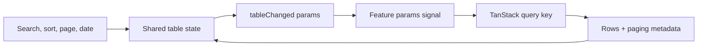

# Admin forms, tables, and CRUD

The admin already contains reusable primitives and large domain-shaped forms. Use those seams, but do not assume every current type or interaction is the final standard. Several components still carry permissive migration-era types and mock operations that should be tightened as real contracts arrive.

## Shared table responsibilities

The shared table currently coordinates:

- debounced search;
- page size and page number;
- sort field and direction;
- optional date-range filters;
- checkbox selection and bulk-item output;
- row-action output;
- rating/date/currency presentation;
- loading-state resets;
- permission-shaped action visibility; and
- confirmation/delete modal hooks.

Feature components should provide table configuration and translate emitted table parameters into a query. They should not duplicate pagination/search state unless their workflow genuinely differs.

## Table request lifecycle

## Forms

Large forms such as product editing combine:

- reactive `FormGroup`, `FormControl`, and `FormArray` structures;
- route-derived create/edit mode;
- query-backed dropdowns;
- category, tag, store, attribute, and tax data;
- rich-text editing;
- date ranges;
- image/media selection;
- product-type and variation logic; and
- tab/accordion presentation.

That complexity makes separation important. A form component may coordinate the form, but mapping, validation, variant generation, and mutation payload construction should move into small typed helpers when they become independently testable concerns.

## Validation layers

| Layer               | Responsibility                                            |
| ------------------- | --------------------------------------------------------- |
| Angular form        | Immediate operator guidance and interaction state         |
| Shared zod contract | Trust boundary for outgoing command and incoming response |
| API use case        | Business invariants and authorization                     |
| Persistence adapter | Storage mapping and database constraints                  |

Client validation improves the experience. It never replaces API validation.

## CRUD state model

Every real mutation UI should make these states explicit:

1. **Idle** — safe to edit or invoke.
2. **Submitting** — duplicate submission prevented.
3. **Succeeded** — cache and navigation updated intentionally.
4. **Field validation failed** — errors mapped to controls where possible.
5. **Conflict** — stale version, duplicate slug/SKU, or changed inventory explained.
6. **Forbidden** — action rejected without leaking restricted data.
7. **Unexpected failure** — recovery and retry are clear.

## Bulk actions

Bulk delete, approval, publish, and status actions require more than a selected-ID array:

- explicit scope and item count;
- confirmation for destructive operations;
- authorization for every target;
- partial-failure semantics;
- progress and completion feedback;
- cache invalidation; and
- an audit trail where required.

## Known improvement boundaries

- Replace permissive `any` and unchecked casts as touched code moves onto shared contracts.
- Fix assignments embedded in conditions rather than copying them into new features.
- Avoid mutating table configuration objects as an authorization strategy.
- Keep destructive actions recoverable or explicitly confirmed.
- Do not add backend-looking success messages to no-op methods.
