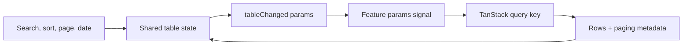

# Admin forms, tables, and CRUD

This page describes the shared tables and forms in the admin application and how to use them. Prefer these components to building new ones.

## Shared table responsibilities

The shared table coordinates:

- debounced search;
- page size and page number;
- sort field and direction;
- optional date-range filters;
- checkbox selection and bulk-item output;
- row-action output;
- rating/date/currency presentation;
- loading-state resets;
- permission-shaped action visibility; and
- confirmation/delete modal hooks.

Feature components should provide table configuration and translate emitted table parameters into a query. They should not duplicate pagination/search state unless their workflow genuinely differs.

## Table request lifecycle

```mermaid
flowchart LR
    Input["Search, sort, page, date"] --> Table["Shared table state"]
    Table --> Event["tableChanged params"]
    Event --> Feature["Feature params signal"]
    Feature --> Query["TanStack query key"]
    Query --> Result["Rows + paging metadata"]
    Result --> Table
```

## Forms

Large forms such as product editing combine:

- reactive `FormGroup`, `FormControl`, and `FormArray` structures;
- route-derived create/edit mode;
- query-backed dropdowns;
- category, tag, store, attribute, and tax data;
- rich-text editing;
- date ranges;
- image selection, where the media modal uploads directly to Spaces and shows the preview once the worker finishes;
- a YouTube video field that validates the link through the API before the form can submit;
- product-type and variation logic; and
- tab/accordion presentation.

That complexity makes separation important. A form component may coordinate the form, but mapping, validation, variant generation, and mutation payload construction should move into small typed helpers when they become independently testable concerns.

## Validation layers

| Layer               | Responsibility                                            |
| ------------------- | --------------------------------------------------------- |
| Angular form        | Immediate operator guidance and interaction state         |
| Shared zod contract | Trust boundary for outgoing command and incoming response |
| API use case        | Business invariants and authorization                     |
| Persistence adapter | Storage mapping and database constraints                  |

Client validation improves the experience. It never replaces API validation.

## CRUD state model

Every real mutation UI should make these states explicit:

1. **Idle** — safe to edit or invoke.
2. **Submitting** — duplicate submission prevented.
3. **Succeeded** — cache and navigation updated intentionally.
4. **Field validation failed** — errors mapped to controls where possible.
5. **Conflict** — stale version, duplicate slug/SKU, or changed inventory explained.
6. **Forbidden** — action rejected without leaking restricted data.
7. **Unexpected failure** — recovery and retry are clear.

## Bulk actions

Bulk delete, approval, publish, and status actions require more than a selected-ID array:

- explicit scope and item count;
- confirmation for destructive operations;
- authorization for every target;
- partial-failure semantics;
- progress and completion feedback;
- cache invalidation; and
- an audit trail where required.

## Coding rules

- Replace permissive `any` and unchecked casts when you move code onto shared contracts.
- Do not copy assignments embedded in conditions into new features.
- Do not use table configuration as an authorization mechanism.
- Keep destructive actions recoverable or explicitly confirmed.
- Do not show a success message for a method with no backend.

## Product form rules

The product form writes through `POST /admin/catalog/products/:idOrSlug`.

- Product status is `live` or `disabled` here. Discontinuing is a separate action that writes a `410`, or a `301` when a live replacement is named.
- A product that has ever been live keeps its SKUs.
- Changing the address writes a redirect from the old one.
- A made-to-order product must be live and needs a lead time.
- A badge cannot be both pinned and hidden.
- A selling price cannot exceed the MRP.
- Related, upsell and cross-sell lists hold up to 12 products.
- A live FAQ entry needs both English and French text.

## Banner rules

Each banner has one record per position and slot, keyed as `{ownerType}:{ownerId}:{position}:{slot}`. The home hero has four layouts, chosen in one setting: `hero_full`, `hero_main_side`, `hero_main_stack` and `hero_center_sides`. Each layout sets its own slots. Every image must be a processed banner upload, and an active banner needs alt text in every active locale.

A slot takes a desktop image, with optional tablet and phone images. Phone applies below 768 px, tablet from 768 to 1199 px, and desktop from 1200 px. Images are not cropped. When the art contains text, the live-text fields are ignored and the alt text must repeat the words. A wide slot with text in its art needs a phone image.

## Customer screens

Customer list, create and edit (`/customer`, `/customer/create`, `/customer/edit/:id`) and the customer ledger read `/admin/customers/**`. A soft delete hides a customer from the default list. Operators holding `customer.restore` get a Live and Deleted filter in the header. The Deleted view offers only Restore, behind the confirmation modal. If another customer holds the email or phone, the server's message appears in the global error toast.

## Phone dial selects

Phone dial selects use HTML labels from `shared/data/country-code.ts` and the local sprite `/assets/images/flags/flags.png`, with `flags@2x.png`. Use the shared `.country` and `.iti-flag` markup.
