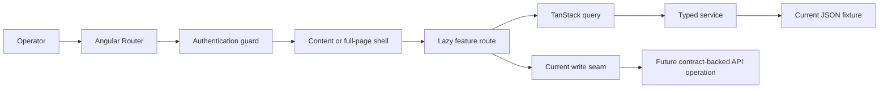

# Admin orientation

The admin application is the private operator workspace for catalogue, orders, customers, promotions, content, configuration, and reporting. It is an Angular 21 single-page application with a broad lazy-loaded feature tree.

The routed UI surface is substantial. Auth, Account Security, idle soft-lock, roles/operators, notification settings, and CRM customers are live against the API; most other domain reads still come from static JSON and many writes remain explicitly unwired. Treat the admin as a mature UI scaffold with selected live operator workflows—not as a fully operational commerce back office.

## Recommended reading sequence

1. [Application atlas](./application-atlas) — filter features by current implementation status.
2. [Routing and shell](./routing-and-shell) — follow a URL through guards, layouts, and lazy feature routes.
3. [State and data](./state-and-data) — understand query, store, interceptor, and fixture ownership.
4. [Forms, tables, and CRUD](./forms-tables-and-crud) — use the established admin interaction patterns safely.
5. [Contributor recipes](./contributor-recipes) — add a feature without bypassing architecture or evidence boundaries.

## Mental model

## Current implementation snapshot

| Concern             | Current evidence                                                                                                                                                         | Status      | Important boundary                                                                          |
| ------------------- | ------------------------------------------------------------------------------------------------------------------------------------------------------------------------ | ----------- | ------------------------------------------------------------------------------------------- |
| Route graph         | Authentication, two shells, fallback, and roughly 30 lazy feature families                                                                                               | Implemented | A routed screen is not proof of a connected backend workflow.                               |
| Admin shell         | Header, sidebar, footer, loader, and page wrapper exist                                                                                                                  | Implemented | Menu badges/account initialization still depend on transitional readers.                    |
| Authentication      | Cookie-session gateway, guarded shells, password/PIN/recovery, Account Security at `/account`, idle soft-lock resume, first-admin bootstrap, role/authority and CRM APIs | Scaffolded  | Real-browser PIN-login proof coverage remains open; OAuth remains credential-blocked.       |
| Server-state reads  | TanStack Query + typed gateways for roles, operators, customers, notifications; other features still mix fixtures                                                        | Scaffolded  | Not every feature family is contract-backed yet.                                            |
| Cart/order creation | Classic NgRx cart and checkout composition exist                                                                                                                         | Scaffolded  | Order placement and authoritative totals are not connected.                                 |
| Forms               | Reactive forms exist for major catalogue/content/settings features; CRM and Account Security use live mutations                                                          | Scaffolded  | Many catalogue/content submission paths still stop at no-op methods or navigation.          |
| Tables              | Shared search, pagination, selection, date, action, and permission UI exists; CRM soft-delete hides deleted by default                                                   | Scaffolded  | Backend filtering/bulk mutations are not generally operational; revive blocked on DEC gate. |
| Authorization       | Permission-shaped UI directives against the live **89-code** registry                                                                                                    | Scaffolded  | UI visibility is not a security boundary; API authorization must enforce every operation.   |
| Dial / flags        | Country dial labels are HTML in `country-code.ts`; sprites at `/assets/images/flags/flags.png`                                                                           | Implemented | Reuse shared dial markup; do not invent alternate flag assets.                              |

## Feature families

The content shell lazy-loads dashboard, account, role, user, attribute, tag, blog, page, tax, store, category, shipping, media, coupon, product, currency, **customer** (`/customer`, `/customer/create`, `/customer/edit/:id`), customer ledger, points, settings, order status, orders, theme options, reviews, FAQs, notifications, refunds, and questions/answers.

CRM soft-delete hides deleted customers by default; revive/ops rules remain open on `DEC-CUSTOMER-SOFT-DELETE-OPS`.

Several families also expose create/edit routes. Orders add details, create-order, and checkout routes; blog adds category and tag subflows.

## Directory ownership

| Directory                   | Owns                                                | Should not own                 |
| --------------------------- | --------------------------------------------------- | ------------------------------ |
| `routes/` and `*.routes.ts` | URL composition and lazy boundaries                 | Domain rules                   |
| `layout/`                   | Admin chrome and page shells                        | Feature CRUD logic             |
| `features/`                 | Operator workflows and feature presentation         | Hard-coded transport details   |
| `data-access/queries/`      | Remote cache keys and read lifecycles               | Form-local state               |
| `data-access/services/`     | Typed transport methods                             | Authorization policy           |
| `core/state/`               | Session, menu, settings, loader, and cart state     | Duplicate remote collections   |
| `shared/ui/`                | Tables, fields, upload controls, modals, pagination | Feature-specific orchestration |
| `shared/directives/`        | Reusable presentation behavior                      | Backend access control         |

:::danger UI permissions are not authorization

Hiding an action in a table or menu improves usability, but it does not secure the operation. The API must authenticate the actor and authorize the specific resource/action on every request.

:::

## Before making an admin change

- Identify the feature route and its owning shell.
- Trace every displayed record to its query and service.
- Confirm whether the action is a real mutation or an unwired seam.
- Reuse shared table/form/upload primitives when they fit.
- Do not preserve weak typing or placeholder behavior merely because it already exists.
- Design API-backed writes around shared contracts, error recovery, and operator auditability.
