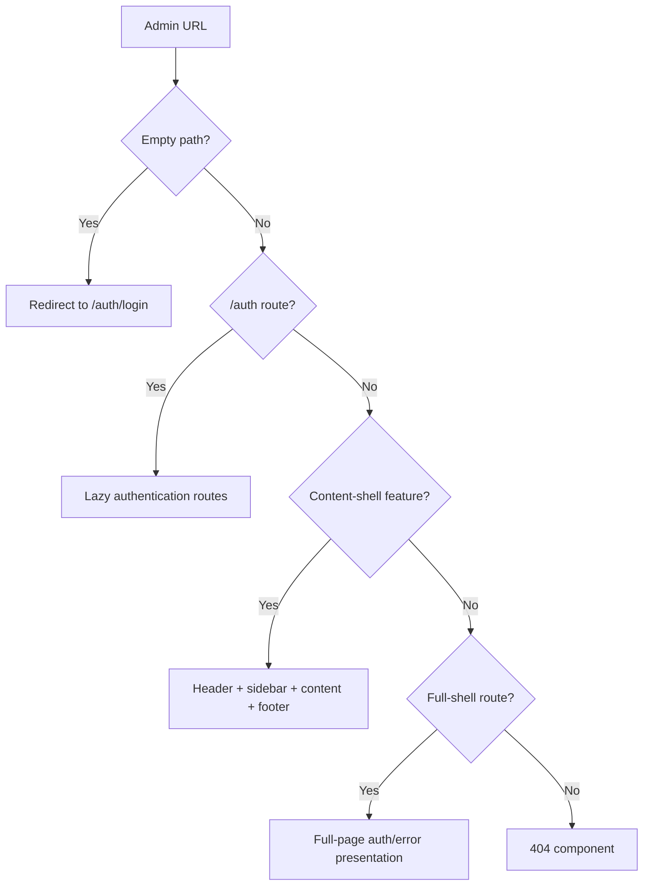
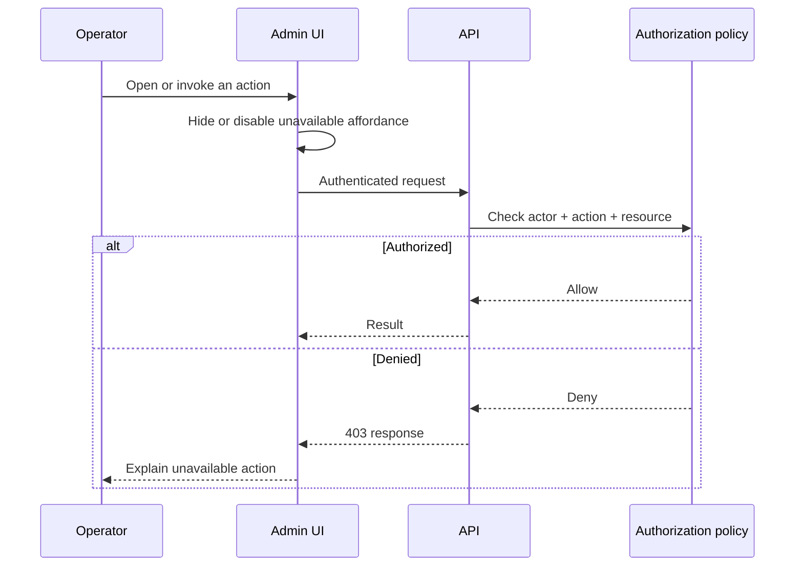

# Admin routing and shell

The admin uses an explicit Angular route graph. The root configuration delegates to two layout shells and lazy-loads feature-specific route arrays.

## Root route order

Route order matters because both shells use an empty parent path. The feature child arrays decide which shell claims a URL.

## Shell responsibilities

### Content shell

Used for the operator workspace. It composes navigation, header, content outlet, footer, loader, and page-level wrapper behavior.

### Full shell

Used for full-page experiences such as authentication and errors where admin navigation should not appear.

## Guard behavior today

`AuthGuard` checks the sanitized session state resolved from `/auth/admin/me`. The `/auth` family stays unguarded so login, PIN login and recovery are reachable; both back-office shells use `canActivate` and `canActivateChild`, redirecting anonymous navigation to `/auth/login`. On success the content shell initializes menu badges and account details.

Important boundaries:

- The guard is presentation and navigation policy, not API authorization.
- `canActivateChild()` inherits authentication from the protected shell; it does not implement route-level permissions.
- Permissions held in the store shape UI only. The API rechecks audience, role, declared permission and current versions.
- The admin idle-lock overlay is still absent even though the store and API expose PIN resume.

## Feature route convention

Most feature families follow a recognizable shape:

| Path                | Purpose                |
| ------------------- | ---------------------- |
| `/feature`          | List or landing screen |
| `/feature/create`   | Creation form          |
| `/feature/edit/:id` | Edit form              |

Orders add `/order/details/:id`, `/order/create`, and `/order/checkout`. Blog adds category and tag management routes. Shipping and category currently expose narrower route subsets.

## Add a route safely

1. Confirm which shell owns the experience.
2. Create or extend the feature’s local `*.routes.ts` file.
3. Lazy-load the standalone component.
4. Reuse the established list/create/edit naming unless the workflow needs a different model.
5. Add authentication and authorization requirements explicitly.
6. Verify deep-link refresh, browser back/forward, invalid IDs, and missing permissions.
7. Keep data loading in query/service layers rather than a route file.

## Future authorization shape

The UI permission layer is an affordance. The API policy is the security boundary.
