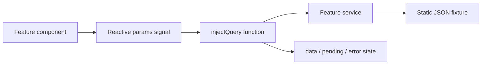
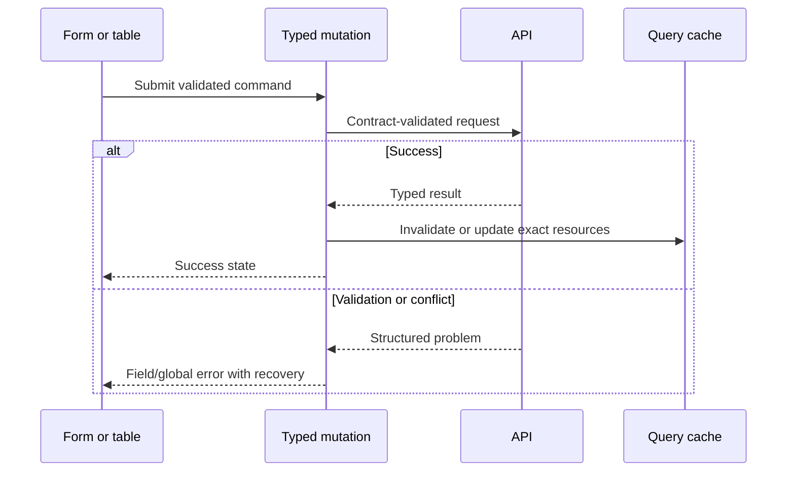

# Admin state and data

The admin combines server-state queries, application stores, a client cart workflow, and local reactive forms. Most current services read JSON fixtures, so the architectural seams are more mature than the integrations.

## Ownership map

| Concern                      | Current owner                  | Examples                                                       |
| ---------------------------- | ------------------------------ | -------------------------------------------------------------- |
| Remote list/detail lifecycle | TanStack Angular Query         | Products, categories, orders, roles, users, dashboard data     |
| Transport                    | Angular `HttpClient` service   | `ProductService`, `OrderService`, `DashboardService`           |
| Session/shell state          | NgRx SignalStore               | Auth, account, menu, loader, settings                          |
| Create-order cart            | Classic NgRx                   | Cart reducer and effects                                       |
| Form interaction             | Angular reactive forms/signals | Product, coupon, user, role, blog, settings forms              |
| Cross-cutting HTTP behavior  | Interceptors                   | Authentication header, loader, error handling, SSR placeholder |

## Read path today

Query keys commonly include the full parameter object. Preserve stable serializable parameters and avoid recreating semantically different shapes for the same resource.

## Write path today

Many feature list components contain explicit comments that status toggles, delete, bulk delete, approve, export, replicate, refund updates, or settings updates have no backend yet. Some forms load existing fixture records and then navigate without a real write.

These explicit gaps prevent a mock interaction from being mistaken for a backend capability. When implementing a mutation, replace the seam deliberately rather than layering a success message over a no-op.

## Migrating a reader to the API

1. Confirm the request/response schema in `packages/contracts`.
2. Replace the fixture URL inside the service, not inside the component.
3. Preserve or intentionally migrate the query key.
4. Map pagination/filter semantics explicitly.
5. Handle API validation and authorization failures.
6. Add query tests and feature-level states.
7. Remove the obsolete fixture and update the atlas.

## Implementing a mutation

Do not optimistically remove or approve records unless rollback behavior is defined. High-impact catalogue, refund, permission, and configuration changes should favor correctness and clear operator feedback.

## Runtime configuration

The admin loads `public/config.json` at boot (via `provideAppInitializer` in `core/config/runtime-config.ts`), filling the mutable `environment` object with `apiUrl` and other non-secret values. The committed file holds localhost defaults; deployments overwrite it. The auth interceptor sends `withCredentials: true` for the API cookie session and echoes the readable `st_csrf` cookie as `x-csrf-token` on unsafe methods. It holds no credential of its own. `@saha-textile/http-transport` supplies per-tab refresh single-flight, audience-specific Web Locks across tabs, fresh-CSRF replay, loop prevention, request-id/error mapping, and stable handling for unrecoverable session refusals. Repository lint guards fail if bearer/browser tokens, browser session persistence or cross-audience gateway calls return.

## Security boundary

- Never treat a menu, directive, hidden button, or guard as authorization.
- Never ship secrets or privileged runtime configuration to the admin bundle.
- Validate all API payloads with shared zod contracts.
- Handle 401 and 403 differently: unauthenticated and unauthorized are not the same operator state.
- Do not persist production access tokens in browser storage; the ratified architecture uses secure API-issued cookie sessions.
