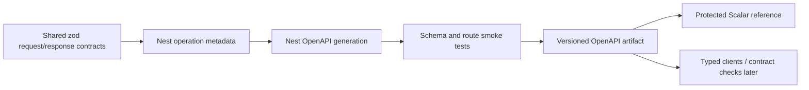

# OpenAPI and Scalar reference

The API-reference standard is ratified:

- OpenAPI is the machine-readable API source of truth.
- Scalar is the single human reference and approved interactive client.
- Do not maintain parallel long-term API-reference or separate console surfaces.

## Current state

NestJS creates one OpenAPI document through `apps/api/src/openapi.ts`. The API exposes it at `/openapi.json`, and the portal build now generates the same document without a MongoDB connection, publishes it at `/api/openapi.json`, and renders it through Scalar at `/api/reference/`.

The surface is deliberately labelled **scaffolded**. The document contains the current controller routes; the evidence base includes split storefront/admin cookie-auth families, email verification, admin recovery/invites/resume, privacy routes, the admin role/permission/user-authority family, health probes, and the backwards-compatible `/health` alias. The public `GET /catalog/products` operation has `page`, `pageSize`, `categoryId`, `tag`, and `search` query parameters—**not `status`**. Scalar makes the current evidence navigable; it does not repair or conceal its omissions.

Scalar’s **Test Request** control is enabled. Authentication is not persisted by Scalar, no external request proxy is configured, and the generated document declares `https://localhost:4000` so Test Request can present `__Host-` session cookies against the same origin the local apps use. CORS, CSRF, audience, ownership, and rate-limit controls still apply; Test Request does not bypass them.

Session establishment and refresh write a readable, session-bound CSRF cookie alongside the httpOnly access and refresh cookies. For an unsafe request carrying that session:

1. retain the readable CSRF cookie written by signup finalisation, login, OTP verification, or refresh;
2. copy that cookie value into the `x-csrf-token` request header; and
3. send the unsafe request with the access/refresh and CSRF cookies.

Missing, mismatched, or cross-session values fail with `403`. The CSRF token does not create a session, grant a role, prove object ownership, or increase the caller’s rate-limit allowance.

`GET /auth/csrf` works both before and during a session. For an active session, Policy B preserves a still-valid bound token; if the readable cookie is missing or desynchronized, the session service atomically rotates `csrfSecretHash` before issuing the replacement. Anonymous callers receive an unbound pre-session token. The route grants no identity or authorization by itself.

## Current authentication and authorization boundary

The authentication and authorization implementation is **partial**, not absent and not complete. Cookie sessions use tested Mongo repositories backed by separated customer and operator populations; access and opaque rotating refresh tokens live only in httpOnly cookies, refresh reuse revokes the family, CSRF is checked against the current session, and storefront/admin audiences are isolated. Storefront verified-before-creation signup, pending-signup resume/discard, password and OTP login by email or phone, Google and Facebook token verification, identity linking, password management, sessions, profile/address/contact self-service, guest-cart adoption, and `me` are implemented. Customer, credential, and provider-identity creation commit as one transaction; contact-change proof consumption, identifier replacement, and audit recording also commit together. Admin recovery, password/PIN login, PIN setup, invites, HTTP resume, Account Security, the 15-minute idle soft-lock, the closed **89-code** permission registry, assignment resolution, deny-by-default administration, operator bootstrap, CRM, consent/privacy, and ownership checks are also implemented.

The remaining boundary is explicit:

- Cookie session issue/refresh/revoke is implemented, with reuse-triggered family revocation, session-bound CSRF, and storefront/admin audience guards.
- Storefront signup creates no customer until both email and phone are verified. The pending flow can be resumed after reload and explicitly discarded after in-app abandonment. Google and Facebook verifier adapters, provider-neutral identity links, step-up connect/disconnect, login-method discovery, session management, and authenticated password setup are implemented. Real provider use still depends on credentials, approved origins, provider-console configuration, and a complete browser/account round trip.
- Admin password recovery, PIN login/setup/lockout, invites, HTTP resume, Account Security client, idle soft-lock orchestration, audience guards, active assignment-based permission resolution, role/permission/user-authority APIs, no-delegation, last-admin protection, offboarding, permission-version invalidation, and operator-only first-admin bootstrap are implemented; real-browser PIN-login proof coverage remains open.
- Consent/privacy seams, order BOLA, cart Principal/`st_guest` ownership, order-create cart adoption, and signup/social-login guest-cart adoption are implemented; pending-intent continuation and checkout idempotency remain open work. Soft-delete revive/ops rules remain gated by `DEC-CUSTOMER-SOFT-DELETE-OPS`.

Scalar must distinguish these active controls from the residual gaps. A route appearing in OpenAPI is not proof that its request/response/security semantics are fully documented.

## Generated evidence snapshot

| Measurement                              | Generated result                                         | Meaning                                                                                                                                           |
| ---------------------------------------- | -------------------------------------------------------- | ------------------------------------------------------------------------------------------------------------------------------------------------- |
| Paths / operations                       | **96 paths / 113 operations**                            | Current controller routes, including pending-signup resume/discard, storefront identity/account self-service and admin operations, are published. |
| Declared servers                         | One: `https://localhost:4000`                            | Matches local `__Host-` cookie topology. Test Request has no production target or proxy.                                                          |
| Operation tags                           | 113 / 113 operations; 9 declared tags                    | Operations are grouped under the governed tag vocabulary.                                                                                         |
| Explicit operation security              | 0 / 113 operations                                       | The document declares `sessionCookie`, but no operation attaches security or its audience/permission rules.                                       |
| Request bodies / component schemas       | 0 / 0                                                    | Controller-local zod bodies are not represented as reusable OpenAPI request contracts.                                                            |
| Responses with content schemas           | 0 / 113 operations                                       | Runtime response values—including `ApiErrorResponse`—are not yet represented as generated response schemas.                                       |
| Explicit non-success operation responses | 1 / 113 operations (`GET /health/ready` documents `503`) | Operation-specific error documentation is still almost entirely absent.                                                                           |

Two generation runs produced byte-identical output without opening a MongoDB connection. That proves the current source generator is deterministic in this environment; it is not yet the required CI generation and drift gate.

:::warning OpenAPI security gap

The document declares the cookie-based `sessionCookie` scheme, but no operation attaches a security requirement. It therefore cannot teach Scalar which routes require a storefront/admin cookie audience, roles, ownership, or CSRF.

:::

## Promotion-gate status

The stable portal publication path and source-only generation without production secrets are real. The runtime platform also now returns one safe `ApiErrorResponse` envelope for every failure and correlates it with the `x-request-id` response header. However, that runtime error behavior is not encoded into operation response components or examples in the generated document.

Scalar therefore remains **scaffolded**. Promotion is still blocked by:

- complete request and response schemas;
- cookie-session, CSRF, storefront/admin audience, role and ownership semantics in the document;
- documentation of the implemented assignment, permission, no-delegation, last-admin, offboarding, bootstrap, Account Security, storefront identity/account, and idle-lock/resume semantics, plus real-browser provider and PIN-login proof coverage;
- documentation of cart guest/user ownership, order-create adoption, guest-cart adoption during authentication, and pending-intent continuation;
- route-specific rate-limit semantics in the document;
- operation-specific error and idempotency examples;
- transactional, audit, outbox, notification, and provider side-effect documentation;
- CI generation plus required-path/tag/security and breaking-drift tests; and
- an approved non-production interaction target and policy.

## Target portal routes

```text
/api/reference/     Scalar reference + approved interactive requests
/api/openapi.json   Machine-readable OpenAPI contract
```

The API may continue generating its internal `/openapi.json`; the portal build publishes or securely proxies the verified artifact at the stable portal route.

## Operation completeness

Every operation must document:

- purpose and owning audience;
- authentication and token/cookie audience;
- CSRF requirements;
- roles, permissions, ownership, or provider-signature policy;
- path/query/header/body schemas;
- response schemas by status;
- validation and business error codes;
- rate-limit behavior;
- idempotency/version requirements;
- pagination/filter/sort semantics;
- collections or external systems affected;
- audit/outbox/notification/provider side effects;
- examples that contain no secrets or real PII.

## Source pipeline



Do not manually maintain a second OpenAPI file that can drift from controllers/contracts.

## Contract-completeness promotion gate

The scaffold must not be promoted to an implemented/complete contract until all of these are true:

1. the API emits OpenAPI during CI without requiring production secrets;
2. core route families have explicit request/response schemas;
3. auth, CSRF, audience, permission, error and idempotency semantics are represented;
4. smoke tests assert required paths/tags/security schemes;
5. the artifact has a stable portal publication path;
6. approved development/staging server URLs and CORS/CSRF behavior are defined;
7. production interaction is disabled or protected with the complete private portal;
8. no secrets/default credentials are embedded in examples or configuration.

## Interactive-request security

The API client must obey the same controls as a real frontend:

- approved development/staging origins only;
- normal cookie behavior for the current browser client class;
- CSRF on unsafe cookie requests;
- server-side authorization and rate limits;
- no production secret storage;
- no auth bypass, privileged default token, or “try it” production mutation surface;
- sanitised saved examples and history.

Private portal authentication does not replace API authorization.

## Environment selector policy

The current scaffold shows its local-development server from the document itself. Before adding another environment, show an explicit badge/selector with an approved safe base URL. Prefer read-only or development fixtures by default. Dangerous operations require the same application permissions and should be visibly identified; the portal must not invent a separate superuser channel.

## Contract drift gates

- Generate the document in CI.
- Fail if required route/tag/security schemes disappear unexpectedly.
- Diff breaking changes deliberately.
- Run example/schema validation.
- Link operation changes to frontend/backend work.
- Update human guidance for business semantics the schema cannot express alone.

## Current limitations to fix before contract promotion

- controller-local zod body schemas do not automatically become complete OpenAPI component schemas;
- many response types are inferred from implementation rather than declared DTOs;
- query/path validation is incomplete;
- the shared runtime error envelope exists, but operation-specific errors, ownership, permissions, CSRF, rate limits, idempotency and side effects are still sparsely represented in OpenAPI;
- public versus admin tag/route segregation is incomplete;
- the cookie component exists, but no operation declares its cookie-session, audience, permission, ownership, or CSRF requirements.

## Umbrella placement

Scalar is one generated surface under Docusaurus. The portal provides onboarding, architecture, workflows, failure recovery, database mappings, and operational context around it. Scalar owns operation-level API reading/execution; it does not replace those narrative responsibilities.
