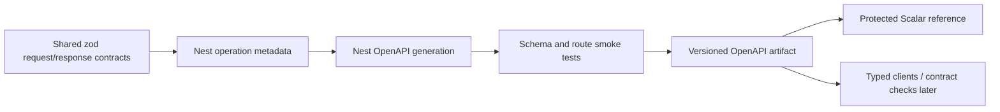

# OpenAPI and Scalar reference

The decision is locked:

- OpenAPI is the machine-readable API source of truth.
- Scalar is the single human reference and approved interactive client.
- Do not maintain parallel long-term Swagger UI, Redoc, or separate console surfaces.

## Current state

NestJS creates an OpenAPI document and exposes it at `/openapi.json`. A transitional framework UI is mounted at `/docs`.

Scalar remains **deferred** because the current document is not yet a complete, reliable operation contract. Installing a polished viewer would not repair missing schemas, security semantics, errors, authorization, idempotency, or side-effect documentation.

The new shared auth/session/consent/audit/notification schemas are useful inputs to this future pipeline, but they are not yet wired to controllers or emitted as complete OpenAPI operations/components. Their presence does not satisfy the Scalar integration trigger.

## Target portal routes

```text
/api/reference      Scalar reference + approved interactive requests
/api/openapi.json   Machine-readable OpenAPI contract
```

The API may continue generating its internal `/openapi.json`; the portal build publishes or securely proxies the verified artifact at the stable portal route.

## Operation completeness

Every operation must document:

- purpose and owning audience;
- authentication and token/cookie audience;
- CSRF requirements;
- roles, permissions, ownership, or provider-signature policy;
- path/query/header/body schemas;
- response schemas by status;
- validation and business error codes;
- rate-limit behavior;
- idempotency/version requirements;
- pagination/filter/sort semantics;
- collections or external systems affected;
- audit/outbox/notification/provider side effects;
- examples that contain no secrets or real PII.

## Source pipeline



Do not manually maintain a second OpenAPI file that can drift from controllers/contracts.

## Scalar integration trigger

Integrate Scalar only after all of these are true:

1. the API emits OpenAPI during CI without requiring production secrets;
2. core route families have explicit request/response schemas;
3. auth, CSRF, audience, permission, error and idempotency semantics are represented;
4. smoke tests assert required paths/tags/security schemes;
5. the artifact has a stable portal publication path;
6. approved development/staging server URLs and CORS/CSRF behavior are defined;
7. production interaction is disabled or protected with the complete private portal;
8. no secrets/default credentials are embedded in examples or configuration.

## Interactive-request security

The API client must obey the same controls as a real frontend:

- approved development/staging origins only;
- normal cookie/bearer behavior for the selected client class;
- CSRF on unsafe cookie requests;
- server-side authorization and rate limits;
- no production secret storage;
- no auth bypass, privileged default token, or “try it” production mutation surface;
- sanitised saved examples and history.

Private portal authentication does not replace API authorization.

## Environment selector policy

When the reference becomes interactive, show an explicit environment badge/selector with safe base URLs. Prefer read-only or development fixtures by default. Dangerous operations require the same application permissions and should be visibly identified; the portal must not invent a separate superuser channel.

## Contract drift gates

- Generate the document in CI.
- Fail if required route/tag/security schemes disappear unexpectedly.
- Diff breaking changes deliberately.
- Run example/schema validation.
- Link operation changes to frontend/backend work.
- Update human guidance for business semantics the schema cannot express alone.

## Current limitations to fix before integration

- controller-local zod body schemas do not automatically become complete OpenAPI component schemas;
- many response types are inferred from implementation rather than declared DTOs;
- query/path validation is incomplete;
- errors, ownership, permissions, CSRF, rate limits, idempotency and side effects are sparsely represented;
- public versus admin tag/route segregation is incomplete;
- current bearer security scheme is transitional.

## Future umbrella placement

Scalar is one generated surface under Docusaurus. The portal provides onboarding, architecture, workflows, failure recovery, database mappings, and operational context around it. Scalar owns operation-level API reading/execution; it does not replace those narrative responsibilities.
