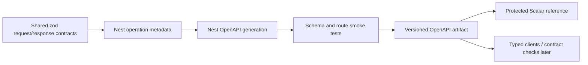

# OpenAPI and Scalar reference

The decision is locked:

- OpenAPI is the machine-readable API source of truth.
- Scalar is the single human reference and approved interactive client.
- Do not maintain parallel long-term API-reference or separate console surfaces.

## Current state

NestJS creates one OpenAPI document through `apps/api/src/openapi.ts`. The API exposes it at `/openapi.json`, and the portal build now generates the same document without a MongoDB connection, publishes it at `/api/openapi.json`, and renders it through Scalar at `/api/reference/`.

The surface is deliberately labelled **scaffolded**. The document regenerated on 2026-08-01 contains **25 paths and 27 operations**. `/health/live`, `/health/ready`, and `/auth/csrf` are present, `/health` remains the backwards-compatible liveness alias, and the public `GET /catalog/products` operation has `page`, `pageSize`, `categoryId`, `tag`, and `search` query parameters—**not `status`**. Scalar makes the current evidence navigable; it does not repair or conceal its omissions.

Scalar’s **Test Request** control is enabled. Authentication is not persisted by Scalar, no external request proxy is configured, and the generated document declares only the approved local API server (`http://127.0.0.1:4000`). Normal API security controls remain in force: Test Request does not bypass authentication, CSRF, CORS, role or ownership authorization, or rate limits.

For an unsafe request carrying a session cookie:

1. send `GET /auth/csrf` through the same API origin;
2. retain the readable CSRF cookie set by that response;
3. copy the returned `csrfToken` value into the `x-csrf-token` request header; and
4. send the unsafe request with the session and CSRF cookies.

Missing or mismatched double-submit values fail with `403`. The CSRF token does not create a session, grant a role, prove object ownership, or increase the caller’s rate-limit allowance.

## Current Chunk D boundary

Chunk D is **partial**, not absent and not complete. D1 has delivered tested MongoDB persistence for auth sessions, challenges, single-use tokens, admin invites, and auth rate limits. Its repository tests prove atomic refresh rotation, replay lookup, family revocation, one-active OTP handling, single-use consumption, concurrency-safe rate-limit counts, secret-field exclusion, and TTL policy. The current API auth controller/service does **not** use those repositories yet: it still returns transitional bearer tokens in JSON, has no logout or password-reset/email-verification routes, and its OTP operations remain stubs.

The remaining boundary is explicit:

- **D2:** issue/refresh/revoke through httpOnly cookies, reuse-triggered family revocation, CSRF bound to `authSessions.csrfSecretHash`, and storefront/admin audience guards;
- **D3:** storefront register/login/logout/me/refresh, password reset, email verification, and OTP with generic anti-enumeration responses;
- **D4:** admin invite acceptance, PIN setup/login/lockout/quick-resume, and RBAC with permission-version invalidation; and
- **D5:** consent/privacy seams plus cart/order ownership (BOLA) authorization.

Those passes belong to the owning API worker after portal reconciliation. Scalar must not imply their semantics are already active merely because D1 persistence exists.

## Generated evidence snapshot

| Measurement                              | Generated result                                        | Meaning                                                                                                                          |
| ---------------------------------------- | ------------------------------------------------------- | -------------------------------------------------------------------------------------------------------------------------------- |
| Paths / operations                       | 25 / 27                                                 | The new health and CSRF routes are published; two paths expose two methods.                                                      |
| Declared servers                         | One: `http://127.0.0.1:4000`                            | Test Request has no production target or proxy.                                                                                  |
| Operation tags                           | 27 / 27 operations                                      | Operations are grouped for navigation.                                                                                           |
| Explicit operation security              | 5 / 27 operations                                       | Transitional bearer metadata exists on order operations and `GET /auth/me`; complete cookie/audience/permission detail does not. |
| Request bodies / component schemas       | 0 / 0                                                   | Controller-local zod bodies are not represented as reusable OpenAPI request contracts.                                           |
| Responses with content schemas           | 0 / 27 operations                                       | Runtime response values—including `ApiErrorResponse`—are not yet represented as generated response schemas.                      |
| Explicit non-success operation responses | 1 / 27 operations (`GET /health/ready` documents `503`) | Operation-specific error documentation is still almost entirely absent.                                                          |

Two generation runs produced byte-identical output without opening a MongoDB connection. That proves the current source generator is deterministic in this environment; it is not yet the required CI generation and drift gate.

:::warning Known source defect

The generated summaries for `POST /auth/otp/request` and `POST /auth/otp/verify` still say “pending Brevo credentials.” That text comes directly from the current auth controller, and the matching service exceptions carry the same stale provider name. It conflicts with the locked MSG91-primary notification design and active configuration. The portal generator does not rewrite machine truth to hide the defect; the API metadata/service text must be corrected by the owning Chunk D implementation.

:::

## Promotion-gate status

The stable portal publication path and source-only generation without production secrets are real. The runtime platform also now returns one safe `ApiErrorResponse` envelope for every failure and correlates it with the `x-request-id` response header. However, that runtime error behavior is not encoded into operation response components or examples in the generated document.

Scalar therefore remains **scaffolded**. Promotion is still blocked by:

- complete request and response schemas;
- D2 cookie-session/reuse detection, session-bound CSRF, and storefront/admin audience semantics in runtime and in the document;
- D3/D4 storefront/admin endpoint contracts, generic anti-enumeration behavior, RBAC, and permission-version invalidation;
- D5 consent/privacy and cart/order ownership (BOLA) enforcement and documentation;
- route-specific rate-limit semantics in the document;
- operation-specific error and idempotency examples;
- transactional, audit, outbox, notification, and provider side-effect documentation;
- CI generation plus required-path/tag/security and breaking-drift tests; and
- an owner-approved non-production interaction target and policy; and
- removal of the stale Brevo OTP labels from API source metadata and runtime exceptions.

## Target portal routes

```text
/api/reference/     Scalar reference + approved interactive requests
/api/openapi.json   Machine-readable OpenAPI contract
```

The API may continue generating its internal `/openapi.json`; the portal build publishes or securely proxies the verified artifact at the stable portal route.

## Operation completeness

Every operation must document:

- purpose and owning audience;
- authentication and token/cookie audience;
- CSRF requirements;
- roles, permissions, ownership, or provider-signature policy;
- path/query/header/body schemas;
- response schemas by status;
- validation and business error codes;
- rate-limit behavior;
- idempotency/version requirements;
- pagination/filter/sort semantics;
- collections or external systems affected;
- audit/outbox/notification/provider side effects;
- examples that contain no secrets or real PII.

## Source pipeline



Do not manually maintain a second OpenAPI file that can drift from controllers/contracts.

## Contract-completeness promotion gate

The scaffold must not be promoted to an implemented/complete contract until all of these are true:

1. the API emits OpenAPI during CI without requiring production secrets;
2. core route families have explicit request/response schemas;
3. auth, CSRF, audience, permission, error and idempotency semantics are represented;
4. smoke tests assert required paths/tags/security schemes;
5. the artifact has a stable portal publication path;
6. approved development/staging server URLs and CORS/CSRF behavior are defined;
7. production interaction is disabled or protected with the complete private portal;
8. no secrets/default credentials are embedded in examples or configuration.

## Interactive-request security

The API client must obey the same controls as a real frontend:

- approved development/staging origins only;
- normal cookie/bearer behavior for the selected client class;
- CSRF on unsafe cookie requests;
- server-side authorization and rate limits;
- no production secret storage;
- no auth bypass, privileged default token, or “try it” production mutation surface;
- sanitised saved examples and history.

Private portal authentication does not replace API authorization.

## Environment selector policy

The current scaffold shows its local-development server from the document itself. Before adding another environment, show an explicit badge/selector with an approved safe base URL. Prefer read-only or development fixtures by default. Dangerous operations require the same application permissions and should be visibly identified; the portal must not invent a separate superuser channel.

## Contract drift gates

- Generate the document in CI.
- Fail if required route/tag/security schemes disappear unexpectedly.
- Diff breaking changes deliberately.
- Run example/schema validation.
- Link operation changes to frontend/backend work.
- Update human guidance for business semantics the schema cannot express alone.

## Current limitations to fix before contract promotion

- controller-local zod body schemas do not automatically become complete OpenAPI component schemas;
- many response types are inferred from implementation rather than declared DTOs;
- query/path validation is incomplete;
- the shared runtime error envelope exists, but operation-specific errors, ownership, permissions, CSRF, rate limits, idempotency and side effects are still sparsely represented in OpenAPI;
- public versus admin tag/route segregation is incomplete;
- current bearer security scheme is transitional.

## Umbrella placement

Scalar is one generated surface under Docusaurus. The portal provides onboarding, architecture, workflows, failure recovery, database mappings, and operational context around it. Scalar owns operation-level API reading/execution; it does not replace those narrative responsibilities.
