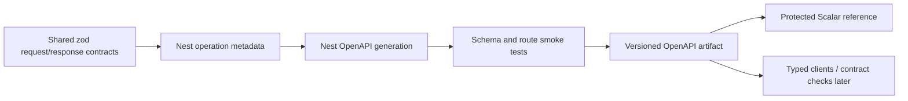

# OpenAPI and Scalar reference

The decision is locked:

- OpenAPI is the machine-readable API source of truth.
- Scalar is the single human reference and approved interactive client.
- Do not maintain parallel long-term API-reference or separate console surfaces.

## Current state

NestJS creates one OpenAPI document through `apps/api/src/openapi.ts`. The API exposes it at `/openapi.json`, and the portal build now generates the same document without a MongoDB connection, publishes it at `/api/openapi.json`, and renders it through Scalar at `/api/reference/`.

The surface is deliberately labelled **scaffolded**. The source route set has moved since the last generated artifact: `/health/live`, `/health/ready`, and `/auth/csrf` now exist, while the public product-list operation no longer accepts a `status` query. Pass 2 regenerates and measures the document rather than carrying the former 22-path count. Many operations still lack reliable request/response components, security semantics, authorization, idempotency, and side-effect documentation. Scalar makes the current evidence navigable; it does not repair or conceal those omissions.

Scalar’s **Test Request** control is enabled. Authentication is not persisted by Scalar, no external request proxy is configured, and the generated document declares only the approved local API server (`http://127.0.0.1:4000`). Normal API security controls remain in force. When an unsafe request carries a session cookie, first call `GET /auth/csrf`, retain its readable CSRF cookie, and echo the returned token through `x-csrf-token`; missing or mismatched pairs fail with `403`.

One completeness trigger has materially advanced: every API failure now uses the shared `ApiErrorResponse` envelope and carries the same request id emitted in `x-request-id`. This is runtime evidence, but Scalar remains scaffolded because operation-specific response components/examples, cookie-session and audience/permission semantics, idempotency and side effects, CI drift proof, and an approved non-production target remain incomplete.

## Target portal routes

```text
/api/reference/     Scalar reference + approved interactive requests
/api/openapi.json   Machine-readable OpenAPI contract
```

The API may continue generating its internal `/openapi.json`; the portal build publishes or securely proxies the verified artifact at the stable portal route.

## Operation completeness

Every operation must document:

- purpose and owning audience;
- authentication and token/cookie audience;
- CSRF requirements;
- roles, permissions, ownership, or provider-signature policy;
- path/query/header/body schemas;
- response schemas by status;
- validation and business error codes;
- rate-limit behavior;
- idempotency/version requirements;
- pagination/filter/sort semantics;
- collections or external systems affected;
- audit/outbox/notification/provider side effects;
- examples that contain no secrets or real PII.

## Source pipeline



Do not manually maintain a second OpenAPI file that can drift from controllers/contracts.

## Contract-completeness promotion gate

The scaffold must not be promoted to an implemented/complete contract until all of these are true:

1. the API emits OpenAPI during CI without requiring production secrets;
2. core route families have explicit request/response schemas;
3. auth, CSRF, audience, permission, error and idempotency semantics are represented;
4. smoke tests assert required paths/tags/security schemes;
5. the artifact has a stable portal publication path;
6. approved development/staging server URLs and CORS/CSRF behavior are defined;
7. production interaction is disabled or protected with the complete private portal;
8. no secrets/default credentials are embedded in examples or configuration.

## Interactive-request security

The API client must obey the same controls as a real frontend:

- approved development/staging origins only;
- normal cookie/bearer behavior for the selected client class;
- CSRF on unsafe cookie requests;
- server-side authorization and rate limits;
- no production secret storage;
- no auth bypass, privileged default token, or “try it” production mutation surface;
- sanitised saved examples and history.

Private portal authentication does not replace API authorization.

## Environment selector policy

The current scaffold shows its local-development server from the document itself. Before adding another environment, show an explicit badge/selector with an approved safe base URL. Prefer read-only or development fixtures by default. Dangerous operations require the same application permissions and should be visibly identified; the portal must not invent a separate superuser channel.

## Contract drift gates

- Generate the document in CI.
- Fail if required route/tag/security schemes disappear unexpectedly.
- Diff breaking changes deliberately.
- Run example/schema validation.
- Link operation changes to frontend/backend work.
- Update human guidance for business semantics the schema cannot express alone.

## Current limitations to fix before contract promotion

- controller-local zod body schemas do not automatically become complete OpenAPI component schemas;
- many response types are inferred from implementation rather than declared DTOs;
- query/path validation is incomplete;
- the shared runtime error envelope exists, but operation-specific errors, ownership, permissions, CSRF, rate limits, idempotency and side effects are still sparsely represented in OpenAPI;
- public versus admin tag/route segregation is incomplete;
- current bearer security scheme is transitional.

## Umbrella placement

Scalar is one generated surface under Docusaurus. The portal provides onboarding, architecture, workflows, failure recovery, database mappings, and operational context around it. Scalar owns operation-level API reading/execution; it does not replace those narrative responsibilities.
