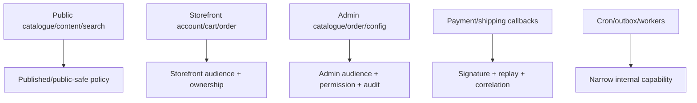

# Current API route inventory

This inventory describes controller code reviewed on 2026-08-01. It is not a production API promise. “Present control” means code exists; “missing guarantee” names the proof still required.

## Runtime and contract routes

| Method | Route           | Present behavior                                      | Missing guarantee                                                 |
| ------ | --------------- | ----------------------------------------------------- | ----------------------------------------------------------------- |
| `GET`  | `/health/live`  | Dependency-free process liveness                      | Orchestrator/deployment consumption                               |
| `GET`  | `/health/ready` | Mongo-aware readiness; returns `503` when unavailable | Additional required dependencies as their adapters land           |
| `GET`  | `/health`       | Backwards-compatible alias of `/health/live`          | Callers should migrate to the explicit probe                      |
| `GET`  | `/openapi.json` | Generated by NestJS Swagger integration               | Complete schemas/security/errors/side effects and CI smoke proof  |
| `GET`  | `/docs`         | Transitional framework API UI                         | Deprecated as a portal surface; Scalar is the long-term reference |

## Authentication routes

| Method | Route               | Present control                                         | Current boundary/gap                                                                                           |
| ------ | ------------------- | ------------------------------------------------------- | -------------------------------------------------------------------------------------------------------------- |
| `POST` | `/auth/register`    | Zod body; argon2id password hash                        | Returns tokens in JSON; min length 8; no session/CSRF/anti-abuse policy                                        |
| `POST` | `/auth/login`       | Zod body; generic invalid-credential response           | Returns access/refresh JWTs in JSON; no rotation/reuse family                                                  |
| `POST` | `/auth/refresh`     | Verifies signed refresh JWT                             | No server-side rotation, revocation, or reuse detection                                                        |
| `GET`  | `/auth/me`          | Bearer guard                                            | No cookie/audience/session-version model                                                                       |
| `POST` | `/auth/otp/request` | Email body validation                                   | Always throws not implemented; provider/policy config now exists (MSG91, `OTP_TTL_SECONDS`/`OTP_MAX_ATTEMPTS`) |
| `POST` | `/auth/otp/verify`  | Email/code validation                                   | Always throws not implemented; no challenge lifecycle                                                          |
| `GET`  | `/auth/csrf`        | Issues a 32-byte CSPRNG token in body + readable cookie | D1 stores `csrfSecretHash`; D2 must bind issuance/validation to the active session                             |

The CSRF guard is registered globally: safe methods pass; an unsafe request with a session cookie must echo the matching token in `x-csrf-token`. Locked target route families still separate storefront/admin auth, add logout, and implement secure cookie sessions. OAuth remains an unexposed service stub.

Chunk D1 added tested MongoDB persistence for sessions, challenges, OAuth state, password-reset/email-verification tokens, admin invites, and auth rate limits. It added no HTTP routes, and its repositories are not bound into the current auth service. D2–D5 still own cookie issuance/rotation/revocation, session-bound CSRF and audiences; storefront auth endpoints and anti-enumeration; admin invite/PIN/RBAC flows; and consent/privacy plus cart/order ownership authorization.

The generated OTP operation summaries and matching service exceptions still say “pending Brevo credentials.” That is a current API-source defect: locked notification policy and active configuration use MSG91. The portal records the mismatch and does not rewrite generated machine truth; the owning Chunk D implementation must correct the controller metadata and runtime messages.

## Public catalogue routes

| Method | Route                         | Present behavior                                         | Current boundary/gap                                               |
| ------ | ----------------------------- | -------------------------------------------------------- | ------------------------------------------------------------------ |
| `GET`  | `/catalog/categories`         | Returns sorted category records                          | Current shape is simplified tree, not locked multi-placement model |
| `GET`  | `/catalog/categories/:slug`   | Lookup by slug                                           | No SEO route/redirect/retired behavior contract                    |
| `GET`  | `/catalog/products`           | Pagination/category/tag/search; repository forces `live` | Regex search remains transitional; no complete target response DTO |
| `GET`  | `/catalog/products/:idOrSlug` | Lookup by id then slug; hidden statuses return 404       | No complete target public response DTO                             |

### Critical public-visibility rule

The server, not the caller, enforces public visibility. **Fixed 2026-07-31:** the earlier implementation applied a status clause only when the list caller supplied one and applied none to single-product lookup, exposing drafts/disabled records. Public repository calls now default to the `public` audience, resolve visibility centrally to `live`, reject attempts to widen the status set, and return 404 for hidden direct reads. The public controller no longer accepts a `status` query parameter.

## Currency and promotion routes

| Method | Route                  | Present behavior                   | Current boundary/gap                                           |
| ------ | ---------------------- | ---------------------------------- | -------------------------------------------------------------- |
| `GET`  | `/currency`            | Lists enabled currency records     | No freshness/FX provider/staleness evidence                    |
| `GET`  | `/currency/convert`    | Converts INR with stored rate      | Query parsing is manual; no complete pricing/commission policy |
| `GET`  | `/promotions/active`   | Repository time-window query       | Incomplete applicability/stacking/priority engine              |
| `POST` | `/promotions/validate` | Zod coupon code, time-window check | No actor/cart/applicability/usage/first-order enforcement      |

These endpoints must not be used as proof that client-calculated checkout totals are authoritative.

## Cart routes

| Method   | Route                     | Present behavior                           | Critical missing guarantee                                         |
| -------- | ------------------------- | ------------------------------------------ | ------------------------------------------------------------------ |
| `POST`   | `/cart`                   | Creates user-id or guest-token-shaped cart | Trusts supplied ownership inputs; no cookie identity/token hashing |
| `GET`    | `/cart/:id`               | Fetches by id                              | No authentication/guest proof/ownership check                      |
| `POST`   | `/cart/:id/lines`         | Appends a line                             | No ownership, product/configuration/price/stock validation         |
| `PATCH`  | `/cart/:id/lines/:lineId` | Updates positive quantity                  | No ownership/stock/version/concurrency policy                      |
| `DELETE` | `/cart/:id/lines/:lineId` | Removes a line                             | No ownership/idempotency policy                                    |

Target cart routes resolve “my cart” from secure identity rather than accepting arbitrary ownership. Guest-cart merge and offline sync are separate transactional use cases.

## Order routes

| Method  | Route                | Present control                   | Critical missing guarantee                                                     |
| ------- | -------------------- | --------------------------------- | ------------------------------------------------------------------------------ |
| `POST`  | `/orders`            | Bearer guard, zod body            | No cart ownership, quote, idempotency, transaction, stock/payment/shipping/tax |
| `GET`   | `/orders`            | Bearer guard and user-scoped list | Pagination bounds/response DTO/security tests                                  |
| `GET`   | `/orders/:id`        | Bearer guard                      | **No object ownership check**                                                  |
| `PATCH` | `/orders/:id/status` | Bearer + admin/staff role         | No admin audience, permission, CSRF, transition policy, version, audit         |

The current order service deletes the cart after a separate order save. A failure between those operations can leave inconsistent state. This route must not be connected to live checkout as a production place-order operation.

## Current global controls

`main.ts` currently registers:

- Helmet;
- one global Fastify rate limit keyed by the safely resolved client IP;
- strict credentialed CORS using configured origins, explicit methods and allowed/exposed headers;
- per-request correlation ids echoed through `x-request-id`;
- adapter-level pino redaction for credentials and sensitive body fields;
- the global shared `ApiErrorResponse` filter; and
- cookie parsing plus a global double-submit CSRF guard;
- shutdown hooks;
- OpenAPI generation with bearer auth metadata.

Still required: route-class-specific limits, the complete cookie-session/audience/permission model, consistent request and response schema mapping, production CSP policy verification, and OpenAPI completeness. Proxy trust, client-IP resolution, request ids, redaction, the safe error envelope, cookie parsing, CSRF foundation, and split health probes are present and tested.

## Target route ownership

Do not place public and privileged mutations behind one ambiguous controller merely to reduce file count.

## Adding a route

Before implementation, record:

1. owning bounded context and actor;
2. method/path and request contract;
3. authentication/audience/CSRF;
4. ownership/permission/resource policy;
5. use case and ports;
6. transaction/idempotency/version needs;
7. response and error contracts;
8. side effects/audit/outbox;
9. rate limit and privacy/logging constraints;
10. tests and OpenAPI evidence.
