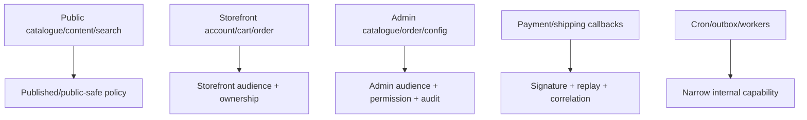

# Current API route inventory

This inventory describes controller code reviewed on 2026-08-11. It is not a production API promise. “Present control” means code exists; “missing guarantee” names the proof still required.

## Runtime and contract routes

| Method | Route           | Present behavior                                      | Missing guarantee                                                 |
| ------ | --------------- | ----------------------------------------------------- | ----------------------------------------------------------------- |
| `GET`  | `/health/live`  | Dependency-free process liveness                      | Orchestrator/deployment consumption                               |
| `GET`  | `/health/ready` | Mongo-aware readiness; returns `503` when unavailable | Additional required dependencies as their adapters land           |
| `GET`  | `/health`       | Backwards-compatible alias of `/health/live`          | Callers should migrate to the explicit probe                      |
| `GET`  | `/openapi.json` | Generated by NestJS Swagger integration               | Complete schemas/security/errors/side effects and CI smoke proof  |
| `GET`  | `/docs`         | Transitional framework API UI                         | Deprecated as a portal surface; Scalar is the long-term reference |

## Storefront authentication routes

| Method | Route                                      | Present control                                                            | Current boundary/gap                                  |
| ------ | ------------------------------------------ | -------------------------------------------------------------------------- | ----------------------------------------------------- |
| `POST` | `/auth/storefront/register`                | Generic duplicate response; argon2id; session cookies; verification issued | Provider delivery remains an adapter seam             |
| `POST` | `/auth/storefront/login/password`          | Generic credentials; rate limits; storefront cookie audience               | OpenAPI does not declare cookie security              |
| `POST` | `/auth/storefront/login/email-otp/request` | Generic accepted response; rate limits; atomic challenge issuance          | Provider delivery still uses the current adapter seam |
| `POST` | `/auth/storefront/login/email-otp/verify`  | Attempt-capped consume; storefront cookie session                          | OpenAPI omits request/response/security schemas       |
| `POST` | `/auth/storefront/refresh`                 | Atomic rotation; replay revokes refresh family; rotates CSRF               | OpenAPI omits cookie/CSRF semantics                   |
| `POST` | `/auth/storefront/logout`                  | Revokes current session and clears cookies                                 | OpenAPI omits cookie/CSRF semantics                   |
| `POST` | `/auth/storefront/password/forgot`         | Generic accepted response                                                  | No operation-specific rate-limit/error schema         |
| `POST` | `/auth/storefront/password/reset`          | Single-use token; token-version bump; revokes all sessions                 | OpenAPI omits side effects                            |
| `GET`  | `/auth/storefront/me`                      | Global session guard + storefront audience                                 | OpenAPI declares no security requirement              |
| `POST` | `/auth/storefront/email/verify`            | Single-use token completion with generic outcome                           | OpenAPI omits body and side-effect schemas            |
| `POST` | `/auth/storefront/email/verify/resend`     | Generic resend acknowledgement and token rotation                          | Provider delivery remains an adapter seam             |

## Admin authentication routes

| Method   | Route                         | Present control                                                              | Current boundary/gap                               |
| -------- | ----------------------------- | ---------------------------------------------------------------------------- | -------------------------------------------------- |
| `POST`   | `/auth/admin/login`           | Generic password credentials; non-customer role; admin cookie audience       | OpenAPI omits cookie security                      |
| `POST`   | `/auth/admin/login/pin`       | Six-digit PIN; five-failure/15-minute lockout; password fallback             | Real-browser PIN-login proof coverage remains open |
| `POST`   | `/auth/admin/pin`             | Admin/staff session, current-password proof, optional preferred login method | OpenAPI omits role and CSRF requirements           |
| `POST`   | `/auth/admin/refresh`         | Admin-audience rotation; session `device.label` from UA on establish/refresh | OpenAPI omits cookie semantics                     |
| `POST`   | `/auth/admin/logout`          | Revokes admin session                                                        | OpenAPI omits cookie/CSRF semantics                |
| `GET`    | `/auth/admin/me`              | Admin audience, staff/admin role, sanitized response and current permissions | OpenAPI declares no security requirement           |
| `POST`   | `/auth/admin/password/forgot` | Generic recovery acknowledgement                                             | Provider delivery remains an adapter seam          |
| `POST`   | `/auth/admin/password/reset`  | Single-use reset; version bump and session revocation                        | OpenAPI omits side effects                         |
| `POST`   | `/auth/admin/invites`         | Privileged invite issue with transactional audit evidence                    | Still role-gated rather than granular              |
| `GET`    | `/auth/admin/invites`         | Privileged sanitized invite inventory                                        | Pagination is not yet represented                  |
| `DELETE` | `/auth/admin/invites/:id`     | Privileged revocation                                                        | OpenAPI omits permission/error schemas             |
| `POST`   | `/auth/admin/invites/accept`  | Single-use invite acceptance and credential establishment                    | Provider delivery remains an adapter seam          |
| `POST`   | `/auth/admin/resume`          | Current admin session plus PIN or password revalidation                      | Live admin idle-lock modal consumes this route     |

Access and refresh credentials are cookie-only. The global `SessionGuard` protects by default, checks audience plus token/permission versions, and routes opt out explicitly with `@Public()`. Session establishment/refresh writes the readable CSRF cookie whose value must be echoed in `x-csrf-token` for unsafe cookie requests; the guard also verifies its hash belongs to that session.

`GET /auth/csrf` returns a 32-byte token in the body and readable cookie. For an active session it preserves a valid bound token or atomically rotates `csrfSecretHash` to recover a missing/desynchronized cookie; before login it issues an unbound acquisition token. OpenAPI declares the cookie scheme but still omits per-operation security requirements.

### Admin authorization routes

Every route below requires an admin-audience session and a named registry permission. Effective permissions are resolved from the transitional embedded grants plus active role assignments, capped by the account's coarse role tier.

| Method   | Route                                | Present control                                                                  | Current boundary/gap                                 |
| -------- | ------------------------------------ | -------------------------------------------------------------------------------- | ---------------------------------------------------- |
| `GET`    | `/admin/permissions`                 | `permission.index`; publishes the closed 103-code registry                       | OpenAPI omits the permission requirement             |
| `GET`    | `/admin/roles`                       | `role.index`; lists role definitions                                             | OpenAPI omits the permission requirement             |
| `GET`    | `/admin/roles/:id`                   | `role.index`; reads one role                                                     | OpenAPI omits response/error schemas                 |
| `POST`   | `/admin/roles`                       | `role.create`; validates registry grants and audits creation                     | OpenAPI omits body/CSRF/permission semantics         |
| `PATCH`  | `/admin/roles/:id`                   | `role.update`; system roles immutable; permission edits invalidate holders       | Complete atomic invalidation policy remains explicit |
| `DELETE` | `/admin/roles/:id`                   | `role.destroy`; system roles protected; holders invalidated; delete audited      | OpenAPI omits conflict/audit semantics               |
| `GET`    | `/admin/users/:userId/authority`     | `user.index`; returns roles plus server-resolved effective permissions           | Admin management UI has not adopted the endpoint     |
| `POST`   | `/admin/users/:userId/roles`         | `user_role.assign`; refuses tiers or grants above the actor; audited             | Admin management UI has not adopted the endpoint     |
| `DELETE` | `/admin/users/:userId/roles/:roleId` | `user_role.revoke`; last-administrator protection; audited                       | Admin management UI has not adopted the endpoint     |
| `PATCH`  | `/admin/users/:userId/status`        | `user.update`; refuses self-disable/last-admin loss; revokes offboarded sessions | Admin management UI has not adopted the endpoint     |
| `GET`    | `/admin/notifications/provider`      | `setting.index`; non-secret MSG91/console status (Authkey never returned)        | Live sends still need Flow/WA/email templates in DB  |
| `GET`    | `/admin/notifications/channels`      | `setting.index`; channel × category kill-switches                                | Defaults seeded on first read                        |
| `PATCH`  | `/admin/notifications/channels`      | `setting.index`; toggle/plan limit; audited                                      | OpenAPI may lag regeneration                         |
| `GET`    | `/admin/notifications/usage`         | `setting.index`; usage vs plan                                                   | —                                                    |
| `GET`    | `/admin/notifications/templates`     | `setting.index`; template / Flow / WhatsApp ids                                  | —                                                    |
| `PUT`    | `/admin/notifications/templates`     | `setting.index`; upsert template metadata; audited                               | Email uses template `key` as MSG91 `template_id`     |

### Admin customer CRM routes

Admin CRM list/detail/create/edit and soft-delete are live against `/admin/customers/**`. Soft-delete hides deleted customers from the default list; revive/ops rules remain open on `DEC-CUSTOMER-SOFT-DELETE-OPS`.

| Method   | Route                                               | Present control                                             | Current boundary/gap                                        |
| -------- | --------------------------------------------------- | ----------------------------------------------------------- | ----------------------------------------------------------- |
| `GET`    | `/admin/customers`                                  | Paginated list/search; deleted rows hidden by default       | Recycle/revive UI blocked on soft-delete ops decision       |
| `POST`   | `/admin/customers`                                  | Create customer; uniqueness release after soft-delete       | OpenAPI may lag regeneration                                |
| `GET`    | `/admin/customers/:customerId`                      | Detail; soft-deleted ids 404 to callers without revive path | Deep-link after delete remains an ops concern               |
| `GET`    | `/admin/customers/:customerId/orders`               | Customer order summary for CRM                              | Wider ledger/reporting ownership still expands elsewhere    |
| `PATCH`  | `/admin/customers/:customerId`                      | Profile update                                              | OpenAPI omits body/permission schemas                       |
| `DELETE` | `/admin/customers/:customerId`                      | Soft-delete (durable retention)                             | Revive/access rules gated by `DEC-CUSTOMER-SOFT-DELETE-OPS` |
| `POST`   | `/admin/customers/:customerId/activation/resend`    | Activation resend                                           | Provider delivery remains an adapter seam                   |
| `POST`   | `/admin/customers/:customerId/addresses`            | Add address                                                 | OpenAPI may lag regeneration                                |
| `PATCH`  | `/admin/customers/:customerId/addresses/:addressId` | Update address                                              | OpenAPI may lag regeneration                                |
| `DELETE` | `/admin/customers/:customerId/addresses/:addressId` | Remove address                                              | OpenAPI may lag regeneration                                |

The first administrator is created through an operator-only CLI, not HTTP. It generates a password once, stores only its Argon2 hash, writes a critical audit event with no fabricated actor, and refuses to run when any administrative authority already exists.

Authentication and authorization remain partial. **Current:** cookie session issue/refresh/revoke; storefront auth family and email verification; admin password recovery, PIN login/setup/lockout, invites, HTTP resume, Account Security at `/account` (PIN/password/sessions), 15-minute idle soft-lock with `POST /auth/admin/resume` (PIN or password), active assignment-based permission resolution against the closed **103-code** registry, role/permission/user-authority APIs, no-delegation, last-admin protection, offboarding, permission-version invalidation, first-admin bootstrap, consent/privacy, order BOLA, cart Principal/`st_guest` ownership, order-create cart adoption, and admin CRM customers. **Remaining:** OAuth verification; guest→user merge; real-browser PIN-login proof coverage; portal deploy private-access gate (`DEC-PORTAL-PRIVATE-ACCESS`); soft-delete ops revive (`DEC-CUSTOMER-SOFT-DELETE-OPS`).

## Privacy routes

| Method | Route              | Present control                                                  | Current boundary/gap                                    |
| ------ | ------------------ | ---------------------------------------------------------------- | ------------------------------------------------------- |
| `GET`  | `/privacy/consent` | Public user-or-guest resolution; optional categories default off | Guest cookie is not yet a cryptographic ownership proof |
| `POST` | `/privacy/consent` | Append-only consent event; user or guest identity                | OpenAPI omits body/CSRF semantics                       |
| `POST` | `/privacy/export`  | Authenticated generic acknowledgement                            | Queued export worker/file delivery is a seam            |
| `POST` | `/privacy/erase`   | Authenticated reviewed-workflow acknowledgement                  | Erasure/anonymization execution is a seam               |

## Public catalogue routes

| Method | Route                         | Present behavior                                         | Current boundary/gap                                                       |
| ------ | ----------------------------- | -------------------------------------------------------- | -------------------------------------------------------------------------- |
| `GET`  | `/catalog/categories`         | Returns sorted category records                          | Current shape is a simplified tree, not the ratified multi-placement model |
| `GET`  | `/catalog/categories/:slug`   | Lookup by slug                                           | No SEO route/redirect/retired behavior contract                            |
| `GET`  | `/catalog/products`           | Pagination/category/tag/search; repository forces `live` | Regex search remains transitional; no complete target response DTO         |
| `GET`  | `/catalog/products/:idOrSlug` | Lookup by id then slug; hidden statuses return 404       | No complete target public response DTO                                     |

### Critical public-visibility rule

The server, not the caller, enforces public visibility. **Fixed 2026-07-31:** the earlier implementation applied a status clause only when the list caller supplied one and applied none to single-product lookup, exposing drafts/disabled records. Public repository calls now default to the `public` audience, resolve visibility centrally to `live`, reject attempts to widen the status set, and return 404 for hidden direct reads. The public controller no longer accepts a `status` query parameter.

## Currency and promotion routes

| Method | Route                  | Present behavior                   | Current boundary/gap                                           |
| ------ | ---------------------- | ---------------------------------- | -------------------------------------------------------------- |
| `GET`  | `/currency`            | Lists enabled currency records     | No freshness/FX provider/staleness evidence                    |
| `GET`  | `/currency/convert`    | Converts INR with stored rate      | Query parsing is manual; no complete pricing/commission policy |
| `GET`  | `/promotions/active`   | Repository time-window query       | Incomplete applicability/stacking/priority engine              |
| `POST` | `/promotions/validate` | Zod coupon code, time-window check | No actor/cart/applicability/usage/first-order enforcement      |

These endpoints must not be used as proof that client-calculated checkout totals are authoritative.

## Cart routes

| Method   | Route                     | Present behavior                                            | Critical missing guarantee                      |
| -------- | ------------------------- | ----------------------------------------------------------- | ----------------------------------------------- |
| `POST`   | `/cart`                   | Creates a principal cart or mints a hashed `st_guest` proof | Guest→user merge is not implemented             |
| `GET`    | `/cart/:id`               | Principal or guest-proof ownership; support read bypass     | OpenAPI omits ownership semantics               |
| `POST`   | `/cart/:id/lines`         | Ownership check before append                               | No product/configuration/price/stock validation |
| `PATCH`  | `/cart/:id/lines/:lineId` | Ownership check before positive-quantity update             | No stock/version/concurrency policy             |
| `DELETE` | `/cart/:id/lines/:lineId` | Ownership check before removal                              | No explicit idempotency policy                  |

Target cart routes resolve “my cart” from secure identity rather than accepting arbitrary ownership. Guest-cart merge and offline sync are separate transactional use cases.

## Order routes

| Method  | Route                | Present control                                                                  | Critical missing guarantee                                                  |
| ------- | -------------------- | -------------------------------------------------------------------------------- | --------------------------------------------------------------------------- |
| `POST`  | `/orders`            | Cookie session, cart ownership/adoption, transactional order save + cart consume | No quote, idempotency, stock/payment/shipping/tax side effects              |
| `GET`   | `/orders`            | Cookie session and principal-scoped list                                         | Pagination bounds/response DTO/OpenAPI security semantics                   |
| `GET`   | `/orders/:id`        | Customer ownership; staff/admin bypass; 404 on mismatch; direct API BOLA proof   | The wider owned-resource matrix remains incomplete                          |
| `PATCH` | `/orders/:id/status` | Admin/staff role + cookie-session CSRF                                           | No explicit admin audience, permission, transition policy, version or audit |

The order service now saves the order and consumes the proven-owned cart inside one `TransactionManagerPort` unit of work, with rs0 commit/rollback integration proof. That atomic pair does not yet make this a production checkout: retry deduplication, stock reservation, payment/shipping/tax work, immutable complete snapshots, audit and outbox side effects remain absent.

## Current global controls

`main.ts` currently registers:

- Helmet;
- one global Fastify rate limit keyed by the safely resolved client IP;
- strict credentialed CORS using configured origins, explicit methods and allowed/exposed headers;
- per-request correlation ids echoed through `x-request-id`;
- adapter-level pino redaction for credentials and sensitive body fields;
- the global shared `ApiErrorResponse` filter; and
- cookie parsing plus a global double-submit CSRF guard;
- shutdown hooks;
- OpenAPI generation with a cookie component but no operation security declarations.

Still required: route-class-specific limits, complete cookie/audience/permission/ownership OpenAPI metadata, consistent request and response schema mapping, production CSP policy verification, and OpenAPI completeness. Proxy trust, client-IP resolution, request ids, redaction, the safe error envelope, cookie sessions, session-bound CSRF, audience guards, permission-version invalidation and split health probes are present.

## Target route ownership

Do not place public and privileged mutations behind one ambiguous controller merely to reduce file count.

## Adding a route

Before implementation, record:

1. owning bounded context and actor;
2. method/path and request contract;
3. authentication/audience/CSRF;
4. ownership/permission/resource policy;
5. use case and ports;
6. transaction/idempotency/version needs;
7. response and error contracts;
8. side effects/audit/outbox;
9. rate limit and privacy/logging constraints;
10. tests and OpenAPI evidence.
