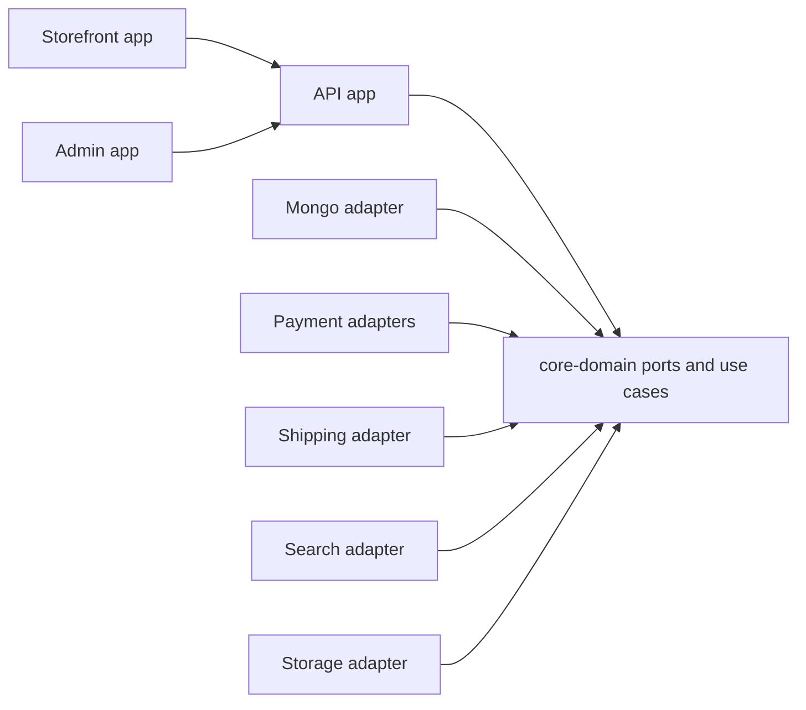

# System overview

Saha Textile is a boutique e-commerce platform split into deployable storefront, admin, API, and private developer-portal apps inside one pnpm/Turborepo monorepo.

The application follows a hexagonal architecture. Domain rules live in `packages/core-domain`; infrastructure lives in adapters; deployable apps compose ports to adapters at the edge.

## Dependency rule

Imports point inward. Core domain code does not import NestJS, Angular, MongoDB, payment SDKs, storage SDKs, or other adapters.

## Swap test

Replacing an edge concern should require a new adapter and DI binding, not edits across core use cases or UI packages.
