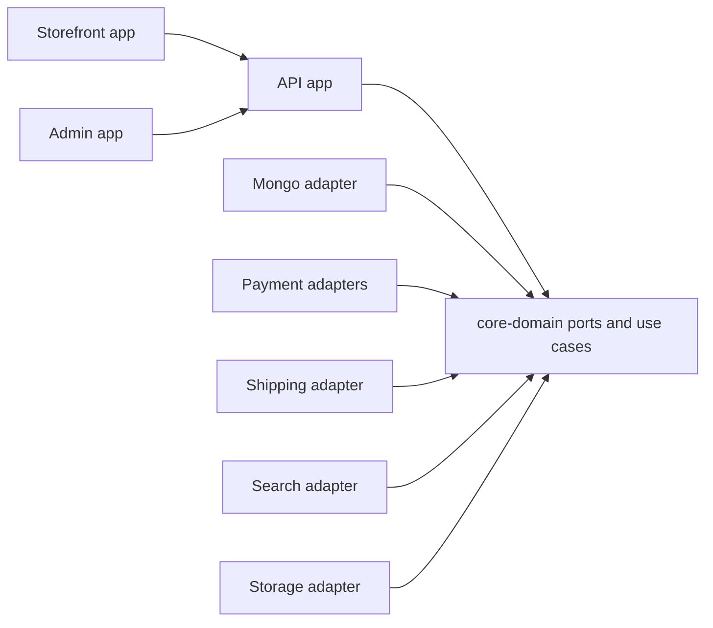

import { ArchitectureReactor } from '@site/src/components/ArchitectureReactor';

# System overview

Saha Textile is a boutique e-commerce platform split into deployable storefront, admin, API, and private developer-portal apps inside one pnpm/Turborepo monorepo.

The application follows a hexagonal architecture. Domain rules live in `packages/core-domain`; infrastructure lives in adapters; deployable apps compose ports to adapters at the edge.

The same architecture, live — hover, tap or arrow through a boundary to inspect what exists today:

<ArchitectureReactor />

## Dependency rule

Imports point inward. Core domain code does not import NestJS, Angular, MongoDB, payment SDKs, storage SDKs, or other adapters. The ratified contracts exception is type-only: core may reference project-owned contract shapes through runtime-erased `import type`, while value imports remain forbidden.

## Swap test

Replacing an edge concern should require a new adapter and DI binding, not edits across core use cases or UI packages.

## Runtime configuration and secrets boundary

Configuration is injected at runtime, not baked into builds, and secrets cross exactly one boundary:

- The **API** receives all secrets through its environment (local `.env`; deploy-time env files / Docker Compose secrets).
- The **Angular apps** receive only a public `config.json`, loaded at boot, carrying non-secret values (API/site URLs, locales, public client IDs). No secret ever reaches a browser build.
