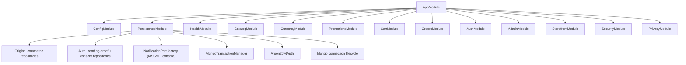
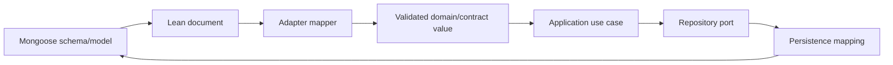

# Composition root and adapters

Composition is the only place where abstract capabilities become concrete implementations. The current API performs this work in `AppModule` and the global `PersistenceModule`.

## Current module graph

The name `PersistenceModule` is currently broader than persistence because it also binds `AuthPort`. The target folder plan separates composition into persistence, search, and external-adapter modules so dependency ownership remains obvious.

`PersistenceModule` binds customer/operator auth, sessions, OTP, OAuth state, provider identities, pending signup/contact-change proof, reset, verification, invite, rate-limit, role, admin-user-role-assignment, audit, consent, notification, and transaction capabilities. `AuthModule`, `StorefrontModule`, `AdminModule`, and privacy services consume those bindings. `OAuthService` composes the Google and Facebook verifier adapters from `@saha-textile/adapters-auth` at the API edge; provider SDK and payload types do not enter core. Signup and contact-change orchestration enter `MongoTransactionManager`; repositories without transaction parameters join through the adapter's ambient `AsyncLocalStorage` session, while ports that already expose opaque transaction context continue receiving it explicitly. `SessionGuard` resolves effective permissions from transitional embedded grants plus active assignments under the account's coarse-role ceiling. `NOTIFICATION_PORT` selects `Msg91NotificationAdapter` when configured and otherwise uses `ConsoleNotificationAdapter`. Chunk E's additional repository adapters exist in the Mongo package but are not all API-bound workflows.

## Current DI bindings

| Token family                    | Concrete implementation                                                                                                                                                                                          |
| ------------------------------- | ---------------------------------------------------------------------------------------------------------------------------------------------------------------------------------------------------------------- |
| Catalogue/commerce repositories | `MongoProductRepository`, `MongoCategoryRepository`, `MongoCurrencyRepository`, `MongoPromotionRepository`, `MongoCartRepository`, `MongoOrderRepository`, `MongoCustomerRepository`, `MongoAdminUserRepository` |
| Auth/authorization repositories | Mongo customer/operator auth, session, OTP, OAuth-state, provider-identity, pending-signup, pending-contact-change, reset, verification, invite, rate-limit, role and admin-user-role-assignment repositories    |
| Audit repository                | `MongoAuditLogRepository`, used by admin role/authority/offboarding and first-admin bootstrap paths                                                                                                              |
| Privacy repository              | `MongoConsentRepository`                                                                                                                                                                                         |
| Notification repositories       | `MongoNotificationSettingsRepository`, `MongoNotificationTemplateRepository`, `MongoMessageOutboxRepository`                                                                                                     |
| `TRANSACTION_MANAGER`           | `MongoTransactionManager`                                                                                                                                                                                        |
| `NOTIFICATION_PORT`             | Factory: `Msg91NotificationAdapter` (`@saha-textile/adapters-notifications-msg91`) or `ConsoleNotificationAdapter`                                                                                               |
| `AUTH_PORT`                     | `Argon2JwtAuth` factory using validated app config                                                                                                                                                               |
| OAuth verifier ports            | `GoogleIdTokenVerifier` and `FacebookTokenVerifier` from `@saha-textile/adapters-auth`, composed by `OAuthService`                                                                                               |

Unbound ports do not become operational merely because their interfaces exist.

## Mongo adapter responsibilities

The adapter currently owns:

- connection configuration and Mongoose lifecycle;
- 40 models with explicitly declared physical collection names, plus indexes;
- conversion from Mongoose documents to public contract-shaped values;
- original API-bound repositories plus bound auth/consent and tested Chunk E catalogue, inventory, media, governance, notification and content adapters;
- a transaction manager that exposes only the opaque core transaction context and uses `AsyncLocalStorage` so nested transactions join;
- stable translation of customer email/phone unique-index races into `DuplicateIdentifierError`;
- single-statement customer address writes, with a pipeline for default-address insertion and array filters for targeted updates;
- one provider-identity write boundary: `AuthIdentityRepository`; customer saves treat identities as a read projection;
- idempotent seed data for categories, products, currencies, and promotion;
- a gated live integration test.

It should continue to own provider-specific details such as `_id`, Mongoose query syntax, sessions, BSON dates, indexes, and schema options.

## Model-to-domain mapping

Current read mappers handle ids and dates explicitly, but nested `Mixed` values are cast. D1 expanded the user model to persist phone verification, account status, username, role/permission versions, credential lockout state, identities, consent and admin-profile seams. Public mapping still deliberately excludes credential hashes. Future implementation should validate/marshal nested fields deliberately and keep secret fields such as `passwordHash` and `pinHash` inside the adapter boundary.

## Provider adapter pattern

For payment, shipping, notifications, FX, storage, search, and media processing:

1. keep provider configuration at server runtime;
2. expose a core capability port;
3. translate domain input into provider request;
4. verify provider response/signature/status;
5. map provider failures into stable application error categories;
6. redact provider payloads from user responses/logs;
7. persist correlation and version evidence required for reconciliation;
8. bind the selected adapter in composition.

## Development, sandbox, and live adapters

| Kind                       | Use                                           | Must not be mistaken for                    |
| -------------------------- | --------------------------------------------- | ------------------------------------------- |
| Test implementation        | Deterministic verification of a port contract | Provider compatibility evidence             |
| Not-configured development | Explicitly unavailable or local-only behavior | Successful production integration           |
| Sandbox adapter            | Real provider sandbox protocol                | Live credential/capture readiness           |
| Live adapter               | Approved production integration               | Permission to expose unsafe console actions |

Seam-first provider work is ratified: ports and non-production adapters can advance before live credentials. A live adapter requires current official provider documentation, credentials, webhook verification, reconciliation, failure testing, and an approved rollout.

## Configuration boundary

`app-config.ts` validates API runtime values with zod. The current configuration boundary includes:

- proxy/client-IP settings (`TRUST_PROXY`, `CLIENT_IP_HEADER`) are parsed and applied to trusted request-id/client-IP handling and rate-limit keys;
- cookie/session/CSRF names (`st_access`, `st_refresh`, `st_csrf`, `x-csrf-token`, `CSRF_SECRET`) feed the shared cookie helpers and global CSRF foundation;
- notification (`NOTIFICATION_PROVIDER`/MSG91 plus an optional email fallback) and self-hosted Mongo (`rs0`) settings in `.env.example` and `app-config.ts`;
- the Mongo config now assembles a self-hosted `mongodb://…replicaSet=rs0` URI (or accepts a pre-encoded `MONGODB_URI`); the SRV hosted-cluster path and the obsolete email provider are gone.

Remaining configuration gaps:

- development JWT secrets are still supplied as defaults (`?? 'dev-…-change-me'`) without a production rejection gate;
- cookie session issuance/rotation and session-bound CSRF are wired; MSG91 delivery is adapter-ready behind env Authkey + DB templates (console remains the default local provider).

Production must fail closed when required secrets or security settings are absent. Never “helpfully” create predictable production secrets.

## Connection lifecycle and readiness

Current startup catches Mongo connection failure and keeps the application alive. The API now exposes the required separation:

- process can boot and serve `/health/live`;
- `/health/ready` fails while required dependencies are unavailable;
- deployment does not send traffic until readiness passes;
- background jobs do not begin until their own dependencies are ready;
- shutdown stops intake, completes bounded work, and closes adapters cleanly.

The split is runtime-proven: with Mongo stopped, `/health/ready` returned `503` with the dependency down while `/health/live` remained `200`. This proves health semantics, not full deployment readiness.

## Adding an adapter safely

1. Read the owning port and use case.
2. Verify the current official provider protocol/version.
3. Add provider config with zod and no browser exposure.
4. Implement mapping and error translation inside the adapter package.
5. Add unit tests with a controlled transport implementation.
6. Add sandbox/integration tests behind explicit environment gates.
7. Add composition binding.
8. Add readiness/metrics only for dependencies required to serve traffic.
9. Update docs and OpenAPI side effects.
10. Prove no SDK type leaked inward.

## Adapter review questions

- Can the provider be replaced without changing controllers/domain/Angular?
- Are timeouts, retries, backoff, and circuit behavior explicit?
- Is retry safe for the operation, or protected by idempotency?
- Are credentials, raw payloads, and PII redacted?
- Is the provider's id/correlation persisted where reconciliation needs it?
- Does failure preserve an auditable state instead of guessing success?
- Can the derived system be rebuilt from authoritative records?
