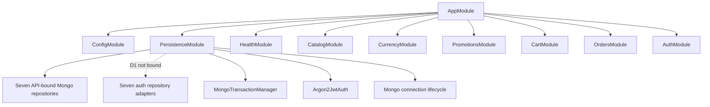
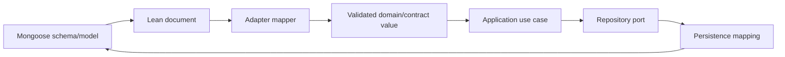

# Composition root and adapters

Composition is the only place where abstract capabilities become concrete implementations. The current API performs this work in `AppModule` and the global `PersistenceModule`.

## Current module graph

The name `PersistenceModule` is currently broader than persistence because it also binds `AuthPort`. The target folder plan separates composition into persistence, search, and external-adapter modules so dependency ownership remains obvious.

D1 added seven auth repository adapters and their Mongoose models, but `PersistenceModule` does not bind them yet. That composition and HTTP adoption belongs to D2–D5; model/repository presence alone does not make session lifecycle or auth endpoints operational.

## Current DI bindings

| Token                  | Concrete class                                     |
| ---------------------- | -------------------------------------------------- |
| `PRODUCT_REPOSITORY`   | `MongoProductRepository`                           |
| `CATEGORY_REPOSITORY`  | `MongoCategoryRepository`                          |
| `CURRENCY_REPOSITORY`  | `MongoCurrencyRepository`                          |
| `PROMOTION_REPOSITORY` | `MongoPromotionRepository`                         |
| `CART_REPOSITORY`      | `MongoCartRepository`                              |
| `ORDER_REPOSITORY`     | `MongoOrderRepository`                             |
| `USER_REPOSITORY`      | `MongoUserRepository`                              |
| `TRANSACTION_MANAGER`  | `MongoTransactionManager`                          |
| `AUTH_PORT`            | `Argon2JwtAuth` factory using validated app config |

Unbound ports do not become operational merely because their interfaces exist.

## Mongo adapter responsibilities

The adapter currently owns:

- connection configuration and Mongoose lifecycle;
- 14 models and indexes;
- conversion from Mongoose documents to public contract-shaped values;
- seven API-bound repository adapters plus seven currently unbound D1 auth repository adapters;
- a transaction manager that exposes only the opaque core transaction context and uses `AsyncLocalStorage` so nested transactions join;
- idempotent seed data for categories, products, currencies, and promotion;
- a gated live integration test.

It should continue to own provider-specific details such as `_id`, Mongoose query syntax, sessions, BSON dates, indexes, and schema options.

## Model-to-domain mapping

Current read mappers handle ids and dates explicitly, but nested `Mixed` values are cast. D1 expanded the user model to persist phone verification, account status, username, role/permission versions, credential lockout state, identities, consent and admin-profile seams. Public mapping still deliberately excludes credential hashes. Future implementation should validate/marshal nested fields deliberately and keep secret fields such as `passwordHash` and `pinHash` inside the adapter boundary.

## Provider adapter pattern

For payment, shipping, notifications, FX, storage, search, and media processing:

1. keep provider configuration at server runtime;
2. expose a core capability port;
3. translate domain input into provider request;
4. verify provider response/signature/status;
5. map provider failures into stable application error categories;
6. redact provider payloads from user responses/logs;
7. persist correlation and version evidence required for reconciliation;
8. bind the selected adapter in composition.

## Stub versus fake versus sandbox

| Kind            | Use                                                    | Must not be mistaken for                    |
| --------------- | ------------------------------------------------------ | ------------------------------------------- |
| Fake            | Deterministic test implementation                      | Provider compatibility evidence             |
| Stub adapter    | Explicit not-configured or canned development behavior | Successful production integration           |
| Sandbox adapter | Real provider sandbox protocol                         | Live credential/capture readiness           |
| Live adapter    | Approved production integration                        | Permission to expose unsafe console actions |

Seam-first provider work is locked: ports and stub/sandbox adapters can advance before live credentials. The live adapter requires official current provider documentation, credentials, webhook verification, reconciliation, failure testing, and owner-controlled rollout.

## Configuration boundary

`app-config.ts` validates API runtime values with zod, which is the right direction. The configuration **surface** has been reconciled to the locked model since these pages were first written:

- proxy/client-IP settings (`TRUST_PROXY`, `CLIENT_IP_HEADER`) are parsed and applied to trusted request-id/client-IP handling and rate-limit keys;
- cookie/session/CSRF names (`st_access`, `st_refresh`, `st_csrf`, `x-csrf-token`, `CSRF_SECRET`) feed the shared cookie helpers and global CSRF foundation;
- notification (`NOTIFICATION_PROVIDER`/MSG91 plus an optional email fallback) and self-hosted Mongo (`rs0`) settings are reconciled in `.env.example` and `app-config.ts`;
- the Mongo config now assembles a self-hosted `mongodb://…replicaSet=rs0` URI (or accepts a pre-encoded `MONGODB_URI`); the SRV hosted-cluster path and the obsolete email provider are gone.

Remaining configuration gaps:

- development JWT secrets are still supplied as defaults (`?? 'dev-…-change-me'`) without a production rejection gate;
- session issuance/rotation and notification provider adapters are not yet wired. D1 persists `authSessions.csrfSecretHash`; D2 must bind the present CSRF issuance/guard flow to the active session.

Production must fail closed when required secrets or security settings are absent. Never “helpfully” create predictable production secrets.

## Connection lifecycle and readiness

Current startup catches Mongo connection failure and keeps the application alive. The API now exposes the required separation:

- process can boot and serve `/health/live`;
- `/health/ready` fails while required dependencies are unavailable;
- deployment does not send traffic until readiness passes;
- background jobs do not begin until their own dependencies are ready;
- shutdown stops intake, completes bounded work, and closes adapters cleanly.

The split is runtime-proven: with Mongo stopped, `/health/ready` returned `503` with the dependency down while `/health/live` remained `200`. This proves health semantics, not full deployment readiness.

## Adding an adapter safely

1. Read the owning port and use case.
2. Verify the current official provider protocol/version.
3. Add provider config with zod and no browser exposure.
4. Implement mapping and error translation inside the adapter package.
5. Add unit tests with mocked transport.
6. Add sandbox/integration tests behind explicit environment gates.
7. Add composition binding.
8. Add readiness/metrics only for dependencies required to serve traffic.
9. Update docs and OpenAPI side effects.
10. Prove no SDK type leaked inward.

## Adapter review questions

- Can the provider be replaced without changing controllers/domain/Angular?
- Are timeouts, retries, backoff, and circuit behavior explicit?
- Is retry safe for the operation, or protected by idempotency?
- Are credentials, raw payloads, and PII redacted?
- Is the provider's id/correlation persisted where reconciliation needs it?
- Does failure preserve an auditable state instead of guessing success?
- Can the derived system be rebuilt from authoritative records?
