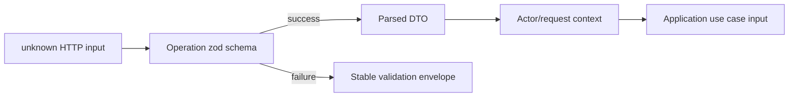

# Contracts, validation, and serialization

`packages/contracts` is the shared runtime boundary. Its zod schemas can validate unknown data and infer TypeScript types from the same source.

That does **not** mean one schema should represent every layer.

## Four different shapes

| Shape                | Purpose                    |              May contain secrets? | Current state                                  |
| -------------------- | -------------------------- | --------------------------------: | ---------------------------------------------- |
| Request DTO          | What one operation accepts |                                No | Many controller-local schemas                  |
| Domain input/entity  | Business-meaningful value  |          No infrastructure fields | Partial contract/core overlap                  |
| Persistence document | How an adapter stores data |    Sometimes internal-only values | Mongoose interfaces/models exist               |
| Response DTO         | What one actor may receive | Never secret/internal-only fields | Mostly public entity schemas returned directly |

An API request for account registration should not accept `role`, `emailVerified`, `passwordHash`, or internal flags merely because those fields exist somewhere in a user model.

## Current contract families

| File family                                          | Principal schemas                                                                 | Notable invariant                                                           |
| ---------------------------------------------------- | --------------------------------------------------------------------------------- | --------------------------------------------------------------------------- |
| `common.ts`                                          | locale config, localized text, ids/slugs, money/currency, pagination, API errors  | locale set is configured; page size is bounded; failures share one envelope |
| `catalog.ts`, `category.ts`, `category-placement.ts` | category lifecycle, multi-placement, facets and SEO policy                        | at most one canonical placement; arbitrary facets cannot be always-indexed  |
| `attribute.ts`, `product*.ts`, `promotion.ts`        | semantic attributes, lifecycle, options, variants, bundles, relations, promotions | only `live` is public; option role is independent of eight display styles   |
| `media.ts`, `inventory.ts`, `content.ts`             | assets/HLS, ledger/FIFO, FAQ, Q&A and verified reviews                            | ratified media/inventory/content invariants are runtime-validated           |
| `cart.ts`, `order.ts`, `currency.ts`, `shipping.ts`  | commerce aggregates, snapshots, FX inputs, and quote                              | value and currency travel together; canonical product price remains INR     |
| `user.ts`                                            | sanitized public user, identities, addresses, consent snapshot                    | credential material is intentionally absent                                 |
| `session.ts`                                         | access claims, public session info, server-internal session/refresh-family entity | browser response metadata contains no token values                          |
| `auth.ts`, `admin-auth.ts`                           | storefront/admin request and actor-safe response DTOs                             | 12-character password floor; six-digit admin PIN shape; no tokens in body   |
| `auth-internal.ts`                                   | OTP/OAuth/reset/invite/rate-limit persistence shapes                              | codes/tokens/IP/user-agent values are represented by hashes                 |
| `consent.ts`, `audit.ts`, `notification.ts`          | consent history, broad admin/security audit, notification settings/outbox         | append-only evidence and channel/category control are explicit              |

These contract families are not proof of end-to-end operations. Contract tests total 140, and the matching core port surface is complete. Auth/session, OTP, password reset, admin PIN/RBAC, consent/privacy, cart/`st_guest` ownership and order-ownership contracts now have meaningful HTTP adoption; email-verification completion, OAuth, admin invite/quick-resume and guest→user merge remain open. The Mongo adapter now implements current consent, audit, notification, catalogue, media, inventory, governance and content models/repositories, but most of those expanded families still lack complete HTTP workflows. Checkout, payment, reporting, analytics and the rest of the ratified target persistence remain incomplete.

## Boundary validation today

`ZodValidationPipe` correctly treats input as `unknown`, calls `safeParse`, and returns a sanitized `400` issue list. Current limitations:

- controllers define many body schemas locally;
- path/query values are often plain strings or manually converted numbers;
- there is no shared request/response schema naming system;
- OpenAPI does not automatically receive complete zod shape information from the local pipe;
- returned values are not consistently parsed through explicit response schemas;
- Mongoose `Mixed` nested arrays are cast by mappers without runtime revalidation.

## Target naming convention

Use bounded-context and operation names rather than one overloaded entity name.

```text
CatalogProductResponse
CatalogProductListQuery
AdminCreateProductRequest
AdminUpdateProductRequest
AdminProductResponse
CartResponse
AddCartLineRequest
CheckoutQuoteRequest
CheckoutQuoteResponse
PlaceOrderRequest
OrderSummaryResponse
OrderDetailResponse
AdminOrderDetailResponse
```

## Request parsing rule



- Apply defaults only when the API truly owns the default.
- Coerce only deliberate transport representations such as numeric query strings.
- Reject unknown privileged fields or strip them by an explicit, tested policy.
- Do not trust a TypeScript type assertion; it performs no runtime validation.
- Validate provider/webhook payloads even after signature verification.

## Response serialization rule

Response contracts are an allowlist. They should make it impossible to leak:

- password/PIN/OTP hashes;
- refresh-token/session hashes;
- provider credentials or raw provider payloads;
- internal fraud/risk flags;
- cost layers and supplier terms to customers;
- admin-only notes;
- hidden product states or embargoed content;
- full audit metadata not appropriate to the actor.

Storefront, admin, and internal-job responses may legitimately use different DTOs for the same underlying aggregate.

## Persistence mapping

Current mappers translate `_id` and `Date` values into contract-friendly ids and ISO strings. That is the correct adapter responsibility. The risk is that several nested fields use `unknown[]`/`Mixed` and then cast directly to contract types.

Target mapping sequence:

```text
Mongoose lean document
→ explicit adapter mapper
→ domain/contract runtime parse
→ application result
→ actor-specific response parse
```

Parsing twice is acceptable at trust boundaries when it prevents persistence drift or response leakage. Optimize only after measuring and preserving the guarantees.

## Evolution rules

### Backward-compatible changes

- Add an optional response field.
- Add an optional request field with server-owned default.
- Add a new enum only when every consumer handles unknown/future values safely.
- Add a new endpoint without changing existing semantics.

### Potentially breaking changes

- Rename/remove a field.
- Change nullability, unit, currency, or timestamp meaning.
- Make an optional request field required.
- Change pagination, sorting, error, idempotency, or authorization behavior.
- Reuse an enum value for a different lifecycle meaning.

When a breaking change is required, version the HTTP contract or execute a coordinated migration. Do not silently reinterpret persisted data.

## Contract test matrix

For every important schema, test:

1. minimum valid input;
2. full valid input;
3. defaults;
4. each boundary value;
5. malformed primitives;
6. missing required fields;
7. invalid enum/identifier/date/currency;
8. privileged or secret-field injection;
9. safe serialization;
10. compatibility fixture from the previous released contract.

## Contracts do not imply runtime delivery

The expanded contracts encode multi-placement categories, semantic option roles, first-class variants, non-nested bundles, governed relations, media, inventory, and content boundaries. Their presence does not make corresponding Mongo collections or API workflows operational. Persistence and operations advance through their roadmap chunks; contract coverage alone is not runtime delivery.
