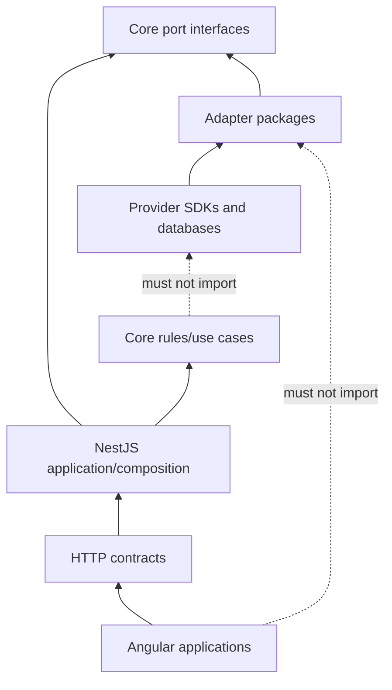

# Core domain, pricing, and ports

The core domain describes business meaning without knowing NestJS, Fastify, Mongoose, MongoDB, Meilisearch, Spaces, or any payment/shipping provider.

## Dependency direction



Imports point inward. Runtime calls can flow outward only through a port supplied by composition.

## Current pure pricing functions

| Function            | Responsibility                                  | Guardrails                                  |
| ------------------- | ----------------------------------------------- | ------------------------------------------- |
| `roundMoney`        | Round to an explicit number of decimals         | rejects non-finite input                    |
| `convertFromINR`    | Multiply canonical INR by a stored rate         | rejects negative INR/non-positive rate      |
| `discountAmountINR` | Compute percentage/fixed discount               | caps percentage at 100 and fixed at price   |
| `applyDiscountINR`  | Subtract resolved discount                      | never below zero under current helper rules |
| `paypalGrossUp`     | Preserve desired net after percentage/fixed fee | percentage must be in `[0,1)`               |

These functions are tested. They are not a complete checkout pricing engine: tax-inclusive reverse calculation, promotion priority/stacking, shipping, FX staleness, commission-rule versions, precision/rounding policy, and snapshot composition remain separate work.

## Current port inventory

| Port                           | Capability                                                                    | Current adapter/binding               |
| ------------------------------ | ----------------------------------------------------------------------------- | ------------------------------------- |
| `ProductRepository`            | Product read/list/save/delete                                                 | Mongo bound                           |
| `CategoryRepository`           | Category read/tree/save/delete                                                | Mongo bound                           |
| `CartRepository`               | Cart lookup/save/delete                                                       | Mongo bound                           |
| `OrderRepository`              | Order lookup/list/save/status                                                 | Mongo bound                           |
| `UserRepository`               | Public user and credential operations                                         | Mongo bound                           |
| `CurrencyRepository`           | Currency lookup/list/upsert                                                   | Mongo bound                           |
| `PromotionRepository`          | Promotion lookup/list/save                                                    | Mongo bound                           |
| `AuthPort`                     | Password hashing and JWT operations                                           | Argon2/JWT bound in API               |
| `PaymentGatewayPort`           | Create/verify a gateway payment                                               | No provider adapter                   |
| `ShippingPort`                 | Obtain shipping quotes                                                        | No provider adapter                   |
| `FxRatePort`                   | Fetch INR-derived exchange rates                                              | No provider adapter                   |
| `StoragePort`                  | Object storage and signed upload                                              | No provider adapter                   |
| `SearchPort`                   | Index/remove/search products                                                  | No Meilisearch adapter/binding        |
| `TransactionManagerPort`       | Opaque atomic-work boundary; nested work joins                                | Mongo bound and rs0 rollback-proven   |
| `NotificationPort`             | Deliver or deliberately suppress messaging                                    | Console development adapter bound     |
| `YouTubePort`                  | Discover channel-feed videos                                                  | No provider adapter                   |
| `VideoTranscodePort`           | Enqueue edge-owned HLS transcoding                                            | No worker adapter                     |
| Auth repositories              | Sessions, OTP, OAuth, reset, verification, invites, limits                    | Mongo adapters; HTTP flows partial    |
| `RoleRepository`               | Role definitions and normalized grants                                        | Mongo bound; admin CRUD API live      |
| `UserRoleAssignmentRepository` | Active assignment grant/revoke/list capability                                | Mongo bound; admin authority API live |
| Media repository               | References, orphan lifecycle and garbage collection                           | Mongo adapter tested; workflow open   |
| Inventory repository           | Atomic deltas and FIFO consume/release                                        | Mongo adapter tested; workflow open   |
| Governance repositories        | Audit, consent, notification settings/templates/outbox                        | Mongo adapters; consent API-bound     |
| Extended catalog repositories  | Placements, facets, attributes, variants, bundles, relations, content/reviews | Mongo adapters tested; HTTP open      |

An interface does not make an adapter, collection, or use case operational. Mongo implementations exist for the expanded repository families; roles and assignments are now API-bound while most other expanded families remain tested adapter capabilities rather than complete HTTP workflows. Core's `resolveEffectivePermissions` unions transitional embedded grants with active assignments, ignores revoked/dangling roles, and caps assigned authority at the holder's coarse tier. `TransactionManagerPort` is bound in API composition, and order creation uses it for the atomic order-save and cart-consume pair; idempotency and inventory, payment, audit, and outbox participation remain open. Core also owns the auth rate-limit policy and the canonical permission/role boundary without importing infrastructure.

## What belongs in a port

A port names a capability the application needs:

```ts
interface ShippingPort {
	getQuotes(request: ShippingQuoteRequest): Promise<ShippingQuote[]>;
}
```

It should not expose provider-specific tokens, SDK clients, response classes, error payloads, or configuration names. An adapter translates those details.

## Port design checklist

- Is the interface written in domain language?
- Are inputs/outputs stable across plausible providers?
- Does it avoid framework and SDK types?
- Does it express idempotency/correlation where the use case needs it?
- Are retryability and error categories translatable?
- Can tests supply an in-memory/fake implementation?
- Does it avoid becoming a generic “god repository”?
- Does transaction context cross only where atomic orchestration requires it?

## Repository versus provider port

- A **repository port** loads and persists domain facts controlled by this platform.
- A **provider port** invokes an external capability such as payment, shipping, messaging, search, or storage.

Do not hide an external provider call inside a Mongo repository. Do not make provider response payloads part of a domain entity.

## Swappability test

To replace MongoDB with PostgreSQL:

1. create a PostgreSQL adapter implementing the same repository/unit-of-work ports;
2. map SQL rows to domain values;
3. change composition bindings;
4. run the same port contract tests.

If controllers, Angular clients, checkout rules, or core pricing must be rewritten, the previous boundary leaked.

## Ratified contracts boundary

`G-CORE-CONTRACTS` was ratified on 2026-07-25 with Option C:

- `packages/contracts` remains the single zod-backed source of shared shapes;
- core may consume those shapes with `import type` only;
- the compiled core runtime must contain no contracts/zod import;
- value imports from contracts and all framework, adapter, database, and provider-SDK imports remain forbidden.

The boundary is mechanically enforced in both positions. ESLint permits contracts only through `import type`, bans zod outright, and bans infrastructure/provider packages in type and value position. A runtime-purity test compiles the package and rejects emitted imports outside `node:` built-ins and the package’s own relative modules. Mutation probes proved both the lint and emitted-JavaScript directions fail when violated.

## Current search boundary

`SearchPort` names the ratified self-hosted Meilisearch target. No Meilisearch adapter is bound yet; the current catalogue service still reaches an interim Mongo regular-expression search implementation. The interface is the durable seam, Mongo remains authoritative, and the future search index is derived and rebuildable.

## Domain test strategy

Pure domain tests should require no Nest application, network, MongoDB, clock wall time, or provider credentials. Inject clocks/identifiers/policies when determinism matters. Test invariants, boundary values, rounding, lifecycle transitions, idempotency decisions, and failure categories directly.
