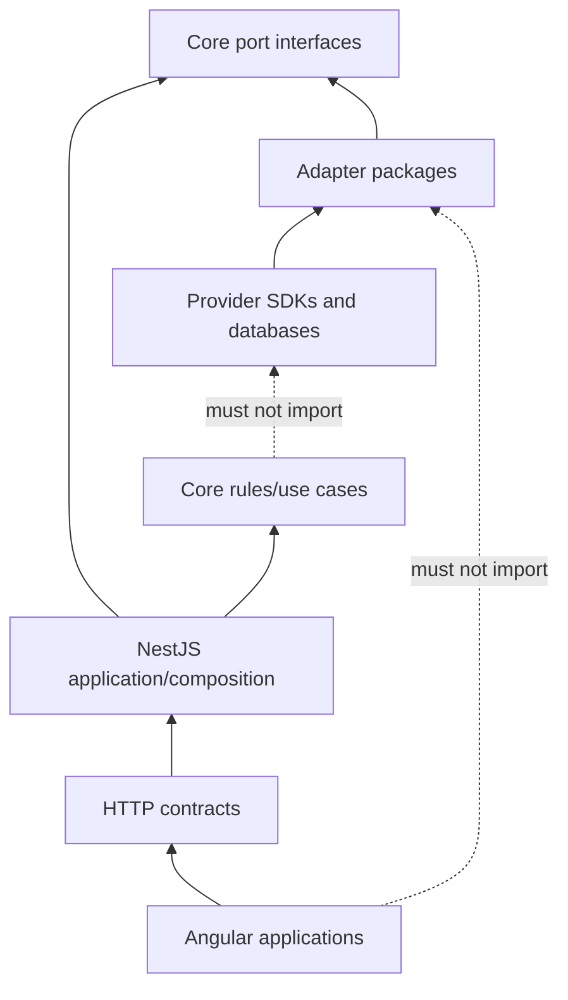

# Core domain, pricing, and ports

The core domain describes business meaning without knowing NestJS, Fastify, Mongoose, MongoDB, Meilisearch, Spaces, or any payment/shipping provider.

## Dependency direction



Imports point inward. Runtime calls can flow outward only through a port supplied by composition.

## Current pure pricing functions

| Function            | Responsibility                                  | Guardrails                                  |
| ------------------- | ----------------------------------------------- | ------------------------------------------- |
| `roundMoney`        | Round to an explicit number of decimals         | rejects non-finite input                    |
| `convertFromINR`    | Multiply canonical INR by a stored rate         | rejects negative INR/non-positive rate      |
| `discountAmountINR` | Compute percentage/fixed discount               | caps percentage at 100 and fixed at price   |
| `applyDiscountINR`  | Subtract resolved discount                      | never below zero under current helper rules |
| `paypalGrossUp`     | Preserve desired net after percentage/fixed fee | percentage must be in `[0,1)`               |

These functions are tested. They are not a complete checkout pricing engine: tax-inclusive reverse calculation, promotion priority/stacking, shipping, FX staleness, commission-rule versions, precision/rounding policy, and snapshot composition remain separate work.

## Current port inventory

| Port                  | Capability                            | Current adapter/binding        |
| --------------------- | ------------------------------------- | ------------------------------ |
| `ProductRepository`   | Product read/list/save/delete         | Mongo bound                    |
| `CategoryRepository`  | Category read/tree/save/delete        | Mongo bound                    |
| `CartRepository`      | Cart lookup/save/delete               | Mongo bound                    |
| `OrderRepository`     | Order lookup/list/save/status         | Mongo bound                    |
| `UserRepository`      | Public user and credential operations | Mongo bound                    |
| `CurrencyRepository`  | Currency lookup/list/upsert           | Mongo bound                    |
| `PromotionRepository` | Promotion lookup/list/save            | Mongo bound                    |
| `AuthPort`            | Password hashing and JWT operations   | Argon2/JWT bound in API        |
| `PaymentGatewayPort`  | Create/verify a gateway payment       | No provider adapter            |
| `ShippingPort`        | Obtain shipping quotes                | No provider adapter            |
| `FxRatePort`          | Fetch INR-derived exchange rates      | No provider adapter            |
| `StoragePort`         | Object storage and signed upload      | No provider adapter            |
| `SearchPort`          | Index/remove/search products          | No Meilisearch adapter/binding |

Locked architecture also calls for transaction/unit-of-work, notification, email, audit, analytics/reporting, session/auth repository, YouTube, and video-transcode capabilities as their phases are implemented. Their absence must remain visible.

## What belongs in a port

A port names a capability the application needs:

```ts
interface ShippingPort {
	getQuotes(request: ShippingQuoteRequest): Promise<ShippingQuote[]>;
}
```

It should not expose provider-specific tokens, SDK clients, response classes, error payloads, or configuration names. An adapter translates those details.

## Port design checklist

- Is the interface written in domain language?
- Are inputs/outputs stable across plausible providers?
- Does it avoid framework and SDK types?
- Does it express idempotency/correlation where the use case needs it?
- Are retryability and error categories translatable?
- Can tests supply an in-memory/fake implementation?
- Does it avoid becoming a generic “god repository”?
- Does transaction context cross only where atomic orchestration requires it?

## Repository versus provider port

- A **repository port** loads and persists domain facts controlled by this platform.
- A **provider port** invokes an external capability such as payment, shipping, messaging, search, or storage.

Do not hide an external provider call inside a Mongo repository. Do not make provider response payloads part of a domain entity.

## Swappability test

To replace MongoDB with PostgreSQL:

1. create a PostgreSQL adapter implementing the same repository/unit-of-work ports;
2. map SQL rows to domain values;
3. change composition bindings;
4. run the same port contract tests.

If controllers, Angular clients, checkout rules, or core pricing must be rewritten, the previous boundary leaked.

## Current dependency concern

The repository constitution says `packages/core-domain` depends on nothing external, while the current core port files import types from `packages/contracts`. This is an unresolved architectural dependency-direction issue.

Before expanding Phase B, reconcile one explicit policy:

- core owns domain entities/value objects and contracts map to/from them; or
- the constitution explicitly permits the contracts package as a dependency-free shared kernel.

Do not let the ambiguity spread through additional ports. Pass 4 records it; it does not silently choose a new architecture.

## Current stale search statement

The `SearchPort` comment names a superseded hosted search approach. The locked architecture is self-hosted Meilisearch behind `SearchPort`, with MongoDB as source of truth and a rebuildable derived index. Treat the interface as a useful seam and the comment/current regex implementation as reconciliation debt.

## Domain test strategy

Pure domain tests should require no Nest application, network, MongoDB, clock wall time, or provider credentials. Inject clocks/identifiers/policies when determinism matters. Test invariants, boundary values, rounding, lifecycle transitions, idempotency decisions, and failure categories directly.
