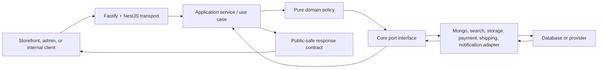

import { BackendRequestAtlas } from '@site/src/components/BackendRequestAtlas';

# Backend platform atlas

The backend is a real NestJS-on-Fastify scaffold, not an empty placeholder. It has controllers, services, zod validation, OpenAPI generation, core ports, pricing functions, Mongo models, repositories, mappers, seed tooling, and some tests. It is also **not production-ready**.

This section teaches both facts at the same time. Every capability distinguishes:

- the request path that exists now;
- the locked architecture it must become; and
- the verification needed before its lifecycle status can advance.

<BackendRequestAtlas />

## Read this section in order

1. [Request lifecycle and boundary tracing](./request-lifecycle)
2. [Contracts, validation, and serialization](./contracts-and-validation)
3. [Core domain, pricing, and ports](./core-domain-and-ports)
4. [Composition root and adapters](./composition-and-adapters)
5. [Security, sessions, and authorization](./security-and-identity)
6. [Readiness, observability, and verification](./readiness-testing-and-observability)
7. [Current API route inventory](../api/route-inventory)
8. [OpenAPI and future Scalar integration](../api/openapi-and-scalar)
9. [Current Mongo adapter map](../database/current-adapter-map)
10. [Transactions and generated catalogue trigger](../database/transactions-and-generation)

## The six boundaries

An implementation is incorrectly layered when a controller imports a provider SDK, core imports NestJS/Mongoose, an Angular app imports an adapter, or a persistence document escapes through the response boundary.

## Current capability radar

| Boundary                 | What exists                                                                                                             | What is not yet proven                                                                                                     |
| ------------------------ | ----------------------------------------------------------------------------------------------------------------------- | -------------------------------------------------------------------------------------------------------------------------- |
| Fastify/NestJS bootstrap | Helmet, global rate limit, CORS, OpenAPI, shutdown hooks; `TRUST_PROXY`/`CLIENT_IP_HEADER` parsed in config             | Trusted proxy chain not yet applied to Fastify, real client IP, route-specific limits, secure CSP, sanitized global errors |
| HTTP modules             | Health, auth, catalogue, currency, promotions, cart, orders                                                             | Public/admin segregation, complete DTO families, versioning, consistent errors                                             |
| Authentication           | Argon2id, access/refresh JWT signing, bearer guard, role guard                                                          | Cookie sessions, CSRF, refresh rotation/reuse detection, audiences, permissions, admin PIN                                 |
| Contracts                | Zod schemas for core catalogue/commerce plus auth/session/consent/audit/notification scaffolds                          | Runtime wiring, remaining domain families, planned tests, and complete OpenAPI mapping                                     |
| Core domain              | Repository/provider ports, pure pricing helpers, and ratified type-only contracts coupling                              | Complete boundary lint, use cases, unit of work, notification/media ports, and policy coverage                             |
| Mongo adapter            | Seven models, repositories, mappers, indexes, seed tool, self-hosted Docker `rs0` replica-set profile (`pnpm mongo:up`) | Transactional context, stronger nested validation, migrations, backups/restore                                             |
| Tests                    | Contract/pricing tests and gated Mongo integration tests                                                                | API tests, mandatory transaction tests, auth/security tests, non-skipped CI evidence                                       |
| Generated references     | `/openapi.json` from the API                                                                                            | Complete OpenAPI, portal publication, Scalar, generated database catalogue                                                 |

## Stop-the-line findings

These are documentation findings, not fixes made by Pass 4:

1. Public catalogue listing does not force `published` status.
2. Cart routes do not prove user/guest ownership.
3. `GET /orders/:id` authenticates but does not enforce object ownership.
4. Order creation is neither idempotent nor transactional and deletes the cart after a separate order save.
5. Browser auth returns reusable tokens in JSON and has no refresh-family reuse detection.
6. API configuration supplies development JWT defaults without a production fail-closed check.
7. `/health` can report success while Mongo-backed routes are unavailable.
8. Storefront search currently uses Mongo regular expressions even though the locked target is Meilisearch through `SearchPort`.
9. Resolved (2026-07-24): the Mongo connection builder and `.env.example` now implement the self-hosted Docker `rs0` model; the former hosted-cluster/SRV assumptions are gone and a local replica set is available via `pnpm mongo:up`.
10. API tests can pass with no tests, and the Mongo integration suite normally skips itself.

Treat each finding as an explicit implementation and verification gate. Do not “solve” it by documenting the unsafe behavior as acceptable.

## Beginner mental model

For any backend change, answer these questions in order:

1. **Who is the actor?** Anonymous shopper, guest cart identity, customer, staff, admin, job, or provider webhook.
2. **What input crosses the boundary?** Validate it as untrusted data.
3. **Which use case owns the action?** A controller coordinates HTTP; it does not own business truth.
4. **Which invariant decides success?** Ownership, state transition, price, stock, consent, or permission.
5. **Which port is required?** The application asks for a capability, not a vendor SDK.
6. **Which records must agree atomically?** If several durable facts must agree, define a transaction.
7. **What response is safe for this actor?** Persistence shape and public response shape are different.
8. **How can failure be retried safely?** Use idempotency, version checks, durable state, and audit evidence.
9. **Which test proves the claim?** Route existence is not proof of security or business completeness.

## Pass 4 boundary

Pass 4 changes documentation and portal interaction only. It does not refactor the API, replace auth, create Mongo transactions, install Meilisearch, wire providers, generate database pages, or integrate Scalar.
