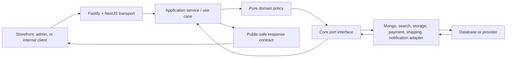

import { BackendRequestAtlas } from '@site/src/components/BackendRequestAtlas';

# Backend platform atlas

The backend is a real NestJS-on-Fastify scaffold, not an empty placeholder. It has controllers, services, zod validation, OpenAPI generation, core ports, pricing functions, Mongo models, repositories, mappers, seed tooling, and some tests. It is also **not production-ready**.

This section teaches both facts at the same time. Every capability distinguishes:

- the request path that exists now;
- the locked architecture it must become; and
- the verification needed before its lifecycle status can advance.

<BackendRequestAtlas />

## Read this section in order

1. [Request lifecycle and boundary tracing](./request-lifecycle)
2. [Contracts, validation, and serialization](./contracts-and-validation)
3. [Core domain, pricing, and ports](./core-domain-and-ports)
4. [Composition root and adapters](./composition-and-adapters)
5. [Security, sessions, and authorization](./security-and-identity)
6. [Readiness, observability, and verification](./readiness-testing-and-observability)
7. [Current API route inventory](../api/route-inventory)
8. [OpenAPI and the Scalar scaffold](../api/openapi-and-scalar)
9. [Current Mongo adapter map](../database/current-adapter-map)
10. [Transactions and generated catalogue trigger](../database/transactions-and-generation)

## The six boundaries

An implementation is incorrectly layered when a controller imports a provider SDK, core imports NestJS/Mongoose, an Angular app imports an adapter, or a persistence document escapes through the response boundary.

## Current capability radar

| Boundary                 | What exists                                                                                                                                                                                                                   | What is not yet proven                                                                                             |
| ------------------------ | ----------------------------------------------------------------------------------------------------------------------------------------------------------------------------------------------------------------------------- | ------------------------------------------------------------------------------------------------------------------ |
| Fastify/NestJS bootstrap | Helmet, trusted proxy/client IP, request ids, redacted pino logs, safe error envelope, strict CORS, global rate limit, cookies/CSRF, split health, OpenAPI, shutdown hooks                                                    | Route-specific limits, secure production CSP, complete session/audience policy and OpenAPI semantics               |
| HTTP modules             | Health, auth, catalogue, currency, promotions, cart, orders                                                                                                                                                                   | Public/admin segregation, complete DTO families, versioning, consistent errors                                     |
| Authentication           | Cookie-only access/opaque-refresh sessions, sid-bound logout revocation, session-bound CSRF (Policy B), audiences, storefront password/OTP/reset, admin PIN, roles/permissions, cart/`st_guest` ownership and order ownership | OAuth, email-verification completion, admin invite/quick-resume, guest→user merge and provider-backed OTP delivery |
| Contracts                | Zod schemas for common/auth/catalog/media/inventory/content/commerce families; 140 tests                                                                                                                                      | Runtime wiring and complete operation-level OpenAPI mapping                                                        |
| Core domain              | Repository/provider ports, pure pricing/visibility helpers, mechanically enforced type-only contract boundary; 36 tests                                                                                                       | Use-case/state-machine adoption and remaining policy coverage                                                      |
| Mongo adapter            | 32 models, 77 opt-in adapter tests, mappers, indexes, seed tool, `MongoTransactionManager`, self-hosted Docker `rs0` profile                                                                                                  | Remaining HTTP/workflow adoption, stronger nested validation, migrations, backups/restore                          |
| Tests                    | Contract/core suites, 57 API unit/guard tests and 81 opt-in Mongo adapter tests across baseline, transactions, auth, catalogue, inventory/media, governance/content and order+cart tx                                         | Full live HTTP matrix/idempotency/workflow coverage and CI execution of every DB-gated proof                       |
| Generated references     | API `/openapi.json`; portal OpenAPI + Scalar scaffold; 32-model source catalogue                                                                                                                                              | Complete OpenAPI operation metadata and target-complete database catalogue                                         |

## Stop-the-line findings

These are documentation findings, not fixes made by Pass 4:

1. **Resolved 2026-07-31:** public product reads now fail closed to `live`; the former list/direct-read visibility leak is covered by repository integration tests.
2. **Resolved 2026-08-01:** cart routes stay `@Public()` for guest add-to-cart but enforce Principal ownership or hashed `st_guest` proof; cross-owner access is 404.
3. **Resolved 2026-08-01:** `GET /orders/:id` enforces customer ownership, hides mismatches and permits an explicit staff/admin support bypass.
4. **Resolved for atomicity 2026-08-01:** order create validates cart ownership/adoption and commits order save + cart consume in one `TransactionManagerPort` unit of work. Idempotency keys remain a Chunk G seam.
5. **Resolved at the API boundary 2026-08-01:** browser auth uses cookie-only persisted session families with rotation/reuse revocation and immediate sid invalidation on logout. Angular interceptors still carry an ignored legacy bearer value.
6. API configuration supplies development JWT defaults without a production fail-closed check.
7. **Resolved for probe semantics 2026-08-01:** `/health/live` is dependency-free and `/health/ready` fails closed when Mongo is unavailable; `/health` remains a liveness alias.
8. Storefront search currently uses Mongo regular expressions even though the locked target is Meilisearch through `SearchPort`.
9. Resolved (2026-07-24): the Mongo connection builder and `.env.example` now implement the self-hosted Docker `rs0` model; the former hosted-cluster/SRV assumptions are gone and a local replica set is available via `pnpm mongo:up`.
10. API has 57 unit/guard tests. All 81 Mongo adapter tests remain explicitly gated by `RUN_DB_IT=1`; the transaction and repository suites have been proven against rs0 but must remain part of CI readiness work.

Treat each finding as an explicit implementation and verification gate. Do not “solve” it by documenting the unsafe behavior as acceptable.

## Beginner mental model

For any backend change, answer these questions in order:

1. **Who is the actor?** Anonymous shopper, guest cart identity, customer, staff, admin, job, or provider webhook.
2. **What input crosses the boundary?** Validate it as untrusted data.
3. **Which use case owns the action?** A controller coordinates HTTP; it does not own business truth.
4. **Which invariant decides success?** Ownership, state transition, price, stock, consent, or permission.
5. **Which port is required?** The application asks for a capability, not a vendor SDK.
6. **Which records must agree atomically?** If several durable facts must agree, define a transaction.
7. **What response is safe for this actor?** Persistence shape and public response shape are different.
8. **How can failure be retried safely?** Use idempotency, version checks, durable state, and audit evidence.
9. **Which test proves the claim?** Route existence is not proof of security or business completeness.

## Pass 4 boundary

Portal work does not replace application implementation. Order create now adopts the transaction port for order+cart consumption; idempotency, guest→user merge, Meilisearch, real provider adapters, remaining Chunk D gaps and complete generated contracts remain unfinished.
