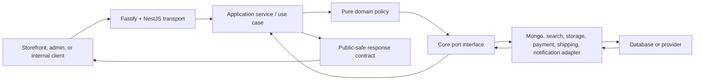

import { BackendRequestAtlas } from '@site/src/components/BackendRequestAtlas';

# Backend platform atlas

The backend is a real NestJS-on-Fastify scaffold, not an empty placeholder. It has controllers, services, zod validation, OpenAPI generation, core ports, pricing functions, Mongo models, repositories, mappers, seed tooling, and some tests. It is also **not production-ready**.

The atlas presents both conditions together. Every capability distinguishes:

- the request path that exists now;
- the ratified architecture it must become; and
- the verification needed before its lifecycle status can advance.

<BackendRequestAtlas />

## Recommended reading sequence

1. [Request lifecycle and boundary tracing](./request-lifecycle)
2. [Contracts, validation, and serialization](./contracts-and-validation)
3. [Core domain, pricing, and ports](./core-domain-and-ports)
4. [Composition root and adapters](./composition-and-adapters)
5. [Security, sessions, and authorization](./security-and-identity)
6. [Readiness, observability, and verification](./readiness-testing-and-observability)
7. [Current API route inventory](../api/route-inventory)
8. [OpenAPI and the Scalar scaffold](../api/openapi-and-scalar)
9. [Current Mongo adapter map](../database/current-adapter-map)
10. [Transactions and generated catalogue trigger](../database/transactions-and-generation)

## The six boundaries

An implementation is incorrectly layered when a controller imports a provider SDK, core imports NestJS/Mongoose, an Angular app imports an adapter, or a persistence document escapes through the response boundary.

## Current capability radar

| Boundary                 | What exists                                                                                                                                                                                                                                       | What is not yet proven                                                                                                                                             |
| ------------------------ | ------------------------------------------------------------------------------------------------------------------------------------------------------------------------------------------------------------------------------------------------- | ------------------------------------------------------------------------------------------------------------------------------------------------------------------ |
| Fastify/NestJS bootstrap | Helmet, trusted proxy/client IP, request ids, redacted logs, safe error envelope, strict CORS, rate limiting, cookies/CSRF, split health, OpenAPI, shutdown hooks                                                                                 | Route-specific limits, secure production CSP, fail-closed secret validation, and complete OpenAPI semantics                                                        |
| HTTP modules             | Health, storefront/admin auth, storefront account self-service, admin authority/CRM/notifications, privacy, catalogue, currency, promotions, cart, orders                                                                                         | Complete public/admin route families, DTO families, versioning, and operation metadata                                                                             |
| Authentication           | Resumable verified signup, atomic identity/contact writes, email/phone password and OTP login, provider verifiers and identity links, sessions/password/account management, guest-cart adoption, admin PIN/invites/resume, 89-code registry, BOLA | Complete provider-account round trips, Meta console verification, PIN browser proof, pending-intent continuation, granular migration, and provider-backed delivery |
| Contracts                | Zod families for common identity, account, authority, catalogue, media, inventory, content and commerce boundaries                                                                                                                                | Runtime wiring and complete operation-level OpenAPI mapping                                                                                                        |
| Core domain              | Repository/provider ports, signup/password/PIN/permission policy, pure pricing/visibility helpers, mechanically enforced inward dependencies                                                                                                      | Use-case/state-machine adoption and remaining policy coverage                                                                                                      |
| Mongo adapter            | 40 explicitly named models, mappers, indexes, seed/reconciliation tools, `MongoTransactionManager`, and self-hosted Docker `rs0` profile                                                                                                          | Remaining HTTP/workflow adoption, stronger nested validation, migrations, and backup/restore proof                                                                 |
| Tests                    | Package-level unit/contract suites, rs0-gated adapter integration suites, and focused live auth/security campaigns                                                                                                                                | Full live HTTP/idempotency workflow coverage and CI execution of every DB-gated proof                                                                              |
| Generated references     | API `/openapi.json`; 96-path/113-operation Scalar scaffold; 40-model source catalogue                                                                                                                                                             | Complete OpenAPI operation metadata and target-complete database catalogue                                                                                         |

## Current implementation boundaries

1. Public catalogue reads enforce `live` visibility in the repository; search remains the transitional Mongo implementation until a Meilisearch adapter is bound through `SearchPort`.
2. Guest cart routes enforce the hashed `st_guest` proof, customer cart/order reads enforce ownership, and support access is explicit.
3. Order creation commits order save and cart consumption in one `TransactionManagerPort` unit of work. Signup finalisation atomically commits customer/credential/provider identity, and contact confirmation atomically commits proof/identifier/audit. Checkout idempotency, inventory, payment, order audit, and outbox participation remain open.
4. Browser authentication is cookie-only with session-family rotation, reuse revocation, session-bound CSRF, and audience separation. Focused social-SDK and pending-signup browser probes exist; complete provider-account round trips and Meta console verification remain readiness gates.
5. `/health/live` is dependency-free and `/health/ready` reflects Mongo availability. Other required production dependencies must join readiness as their adapters become traffic-critical.
6. API configuration still permits development JWT defaults and needs a production fail-closed check.
7. Mongo integration suites are opt-in and require a dedicated test database before they can be treated as a safe routine local gate.

Treat each boundary as an implementation and verification gate; the presence of a route, port, or test seam does not promote the wider capability.

## Request analysis framework

For any backend change, answer these questions in order:

1. **Who is the actor?** Anonymous shopper, guest cart identity, customer, staff, admin, job, or provider webhook.
2. **What input crosses the boundary?** Validate it as untrusted data.
3. **Which use case owns the action?** A controller coordinates HTTP; it does not own business truth.
4. **Which invariant decides success?** Ownership, state transition, price, stock, consent, or permission.
5. **Which port is required?** The application asks for a capability, not a vendor SDK.
6. **Which records must agree atomically?** If several durable facts must agree, define a transaction.
7. **What response is safe for this actor?** Persistence shape and public response shape are different.
8. **How can failure be retried safely?** Use idempotency, version checks, durable state, and audit evidence.
9. **Which test proves the claim?** Route existence is not proof of security or business completeness.

## Capability boundary

Order creation adopts the transaction port for order and cart consumption. Idempotency, pending-intent continuation, Meilisearch, production provider activation, remaining commerce workflows, and complete generated operation contracts remain unfinished.
