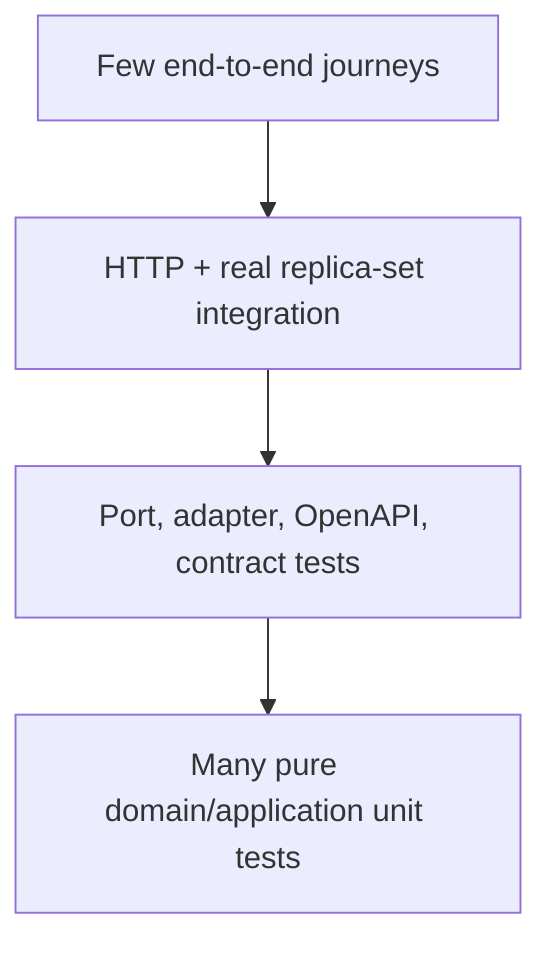

# Readiness, observability, and verification

A process that answers HTTP is live. A service that can correctly perform its required work is ready. The API now exposes dependency-free `/health/live`, Mongo-aware `/health/ready`, and `/health` as a backwards-compatible liveness alias. Mongo failure remains deliberately non-fatal to process boot, while readiness fails closed with `503`.

## Target health contract

| Probe           | Question                                           | Dependencies                                               | Deployment action                     |
| --------------- | -------------------------------------------------- | ---------------------------------------------------------- | ------------------------------------- |
| `/health/live`  | Is the process event loop alive?                   | None or minimal self-check                                 | Restart only when failing             |
| `/health/ready` | Can this instance safely receive required traffic? | Mongo, Meilisearch, mandatory config and critical adapters | Remove from traffic / block promotion |

Do not include credentials, connection strings, internal network topology, raw provider responses, or stack traces in health output.

## Dependency-state example

```json
{
	"status": "not_ready",
	"checks": {
		"mongo": "unavailable",
		"search": "ready"
	},
	"requestId": "req_safe_correlation"
}
```

This is conceptual. The final schema belongs in shared contracts and must not expose sensitive details.

## Request observability

Every request now receives a correlation id, echoed through `x-request-id`; an inbound id is honoured only through a trusted proxy and strict pattern. Pino redacts authorization/cookie/CSRF headers and password/PIN/code/token body fields at the adapter. Structured logs/metrics should continue to answer:

- which route/use case ran;
- which actor class/audience was involved;
- outcome and stable error category;
- latency by application and adapter boundary;
- retry/idempotency result;
- dependency health and timeout class;
- safe resource/correlation identifiers;
- whether an audit or outbox record was emitted.

Redact tokens, cookies, OTPs, passwords, raw IPs, provider secrets, payment payloads, full address/customer bodies, and sensitive query values.

## Minimum metrics

- request rate, latency, and errors by normalized route/status;
- auth success/failure/lockout without identifiers;
- rate-limit rejections by bucket;
- Mongo pool/operation/transaction latency and failures;
- search latency, errors, outbox backlog, no-result rate;
- checkout quote/place-order outcomes and idempotent replays;
- payment callback verification/state transitions;
- notification usage/failures by channel/category;
- job lag and last-success timestamp;
- readiness changes and dependency saturation.

Avoid high-cardinality labels such as raw user id, order id, email, token, full URL, or search query.

## Current automated-test evidence

| Package       | Present evidence                                                                      | Limitation                                                               |
| ------------- | ------------------------------------------------------------------------------------- | ------------------------------------------------------------------------ |
| `contracts`   | 140 schema tests across common/auth/catalog/media/inventory/content/commerce families | Complete operation DTO/OpenAPI wiring remains                            |
| `core-domain` | 36 pricing, visibility, runtime-purity and port-conformance tests                     | No complete use-case/state-machine suites                                |
| Mongo adapter | Seven repository integration tests plus six transaction-manager commit/rollback tests | Requires `RUN_DB_IT=1` and a real rs0 profile; workflow adoption remains |
| API           | 28 platform and CSRF unit tests, with test files included in typecheck                | Full auth/ownership/idempotency/OpenAPI route coverage remains           |

The admin application separately has zero unit specs and passes through `--passWithNoTests`; that frontend limitation must not be confused with the real API suite. The backend gate still rejects permanently skipped transaction proof as a production-done state.

## Test pyramid for this backend



### Unit

- pure pricing/tax/transition/permission/idempotency rules;
- application orchestration with fake ports;
- config parsing and fail-closed behavior;
- validation and response serialization;
- error translation and redaction.

### Integration

- Nest/Fastify route behavior;
- cookie/CSRF/audience/ownership checks;
- Mongo indexes/repositories/mappers;
- single-node replica-set transactions and rollback;
- OpenAPI generation;
- adapter sandbox/protocol behavior where safe.

### End-to-end

- login → guest-cart merge → checkout continuation;
- quote → idempotent place-order → provider callback → order state;
- admin authorized status transition and audit;
- offline sync correction;
- search publication/removal/reindex;
- return/refund reconciliation.

## Transaction proof pattern

For every atomic workflow:

1. establish the real Docker MongoDB 8.3 single-node replica set (`pnpm mongo:up`);
2. seed only isolated test fixtures;
3. inject failure after each participating write;
4. assert every participating collection rolled back;
5. run success path and assert all records/correlations;
6. repeat the request and assert idempotent outcome;
7. exercise concurrent/race behavior;
8. run in CI, not only manually.

## API proof matrix

| Area           | Required proof before “implemented”                                                |
| -------------- | ---------------------------------------------------------------------------------- |
| Bootstrap      | config, trusted proxy/client IP, CORS, headers, rate limits, safe errors, shutdown |
| Auth           | cookies, CSRF, rotation/reuse, audience, password/PIN/OTP, revocation              |
| Catalogue      | public visibility, admin mutations, semantic model, audit/search outbox            |
| Search         | normalization, facets, aliases, publication removal, rebuild                       |
| Cart           | guest ownership, merge transaction, offline sync, stock/status corrections         |
| Checkout/order | quote version, idempotency, transaction, snapshots, stock/payment rollback         |
| Providers      | signature/auth, timeout, retry, correlation, reconciliation, secret redaction      |
| Data           | validators, indexes, migrations, backup/restore, retention/TTL                     |
| Documentation  | OpenAPI smoke, operation completeness, portal provenance/freshness                 |

## Manual runtime probes

Runtime probes supplement tests; they do not replace them.

1. Start required local profiles.
2. Read `/openapi.json` instead of guessing routes.
3. Check liveness and readiness separately.
4. Exercise anonymous, customer A, customer B, staff, and admin identities.
5. Probe negative cases before the happy path.
6. Capture request ids and sanitized results.
7. Stop one dependency at a time and observe truthful degradation.
8. Restore state and confirm recovery/backlog drain.

## Definition of done

A backend capability is implemented only when:

- architecture and ownership boundaries are correct;
- security controls are server-enforced;
- contracts and response safety are explicit;
- durable writes are atomic where required;
- retry/idempotency/failure recovery are defined;
- tests prove positive and negative cases;
- runtime health/telemetry can distinguish failure;
- OpenAPI and maintained narrative docs match the behavior;
- no deferred provider or generated surface is represented as live.
