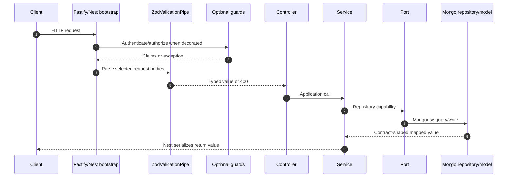
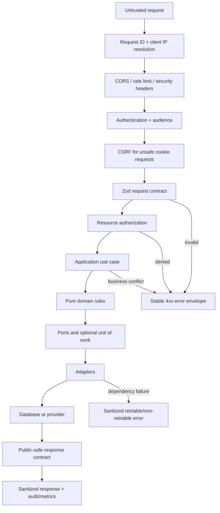

import { FlightSimulator } from '@site/src/components/FlightSimulator';

# Request lifecycle and boundary tracing

A request is not “handled by the controller.” The controller is one checkpoint in a longer chain. A safe backend makes each checkpoint visible, testable, and replaceable.

<FlightSimulator />

## Current request path

This path exists, but it is inconsistent:

- not every route uses guards;
- body validation schemas usually live inside controllers rather than shared contract families;
- query/path parameters are often parsed manually;
- there is no global safe error envelope or explicit response serializer;
- authorization is sometimes a role check and sometimes absent;
- multi-record writes have no transaction context.

## Target request path

## Trace template

Use this worksheet when debugging or documenting an endpoint.

| Question           | Record                                                                        |
| ------------------ | ----------------------------------------------------------------------------- |
| Method and route   | Example: `POST /checkout/place-order`                                         |
| Actor and audience | Customer cookie session, admin cookie session, provider webhook, internal job |
| Authentication     | Required, optional, or forbidden                                              |
| Authorization      | Ownership, role, permission, consent, provider signature                      |
| CSRF               | Required for cookie-authenticated unsafe methods                              |
| Rate-limit bucket  | Global plus route-specific key and threshold                                  |
| Request contract   | Shared zod schema and version                                                 |
| Use case           | One application service method with explicit input/context                    |
| Domain invariants  | Stock, price, transition, identity, consent, idempotency                      |
| Ports              | Repository/provider capabilities used                                         |
| Transaction        | Records that must commit or roll back together                                |
| Response contract  | Actor-safe DTO; forbidden internal fields                                     |
| Errors             | Validation, authorization, conflict, dependency, unexpected                   |
| Side effects       | Audit, notification, search outbox, analytics, provider call                  |
| Proof              | Unit, integration, authorization, transaction, OpenAPI, runtime probe         |

## Example: current order creation

Current execution:

1. Bearer guard validates an access JWT.
2. `CreateOrderSchema` validates `cartId`, optional currency/gateway/coupon.
3. Controller attaches `user.sub`, but the service does not verify cart ownership.
4. Service loads the cart and each product.
5. Service computes a partial INR/conversion/coupon total.
6. Service saves the order.
7. Service deletes the cart in a separate write.

What is missing before this can be a production place-order flow:

- owned cart resolution;
- server quote/version and expiry;
- idempotency key;
- purchase eligibility and stock reservation;
- tax and shipping decisions;
- provider/gateway policy;
- separate payment attempt;
- immutable complete snapshots;
- one transaction across required records;
- rollback and replay tests.

## Error taxonomy

| Class             | Example                    | Client behavior                    | Log behavior                              |
| ----------------- | -------------------------- | ---------------------------------- | ----------------------------------------- |
| Validation        | Malformed quantity         | Correct highlighted input          | Request id and safe issue paths           |
| Authentication    | Missing/expired session    | Start or resume auth               | No token contents                         |
| Authorization     | Another user's order       | Generic forbidden/not found policy | Actor id, resource type/id hash, decision |
| Business conflict | Stock changed              | Refresh affected line/quote        | Invariant code and current version        |
| Idempotent replay | Order already placed       | Return/reconcile original outcome  | Original operation id                     |
| Dependency        | Search/payment unavailable | Degrade or retry by policy         | Adapter, latency, safe provider code      |
| Unexpected        | Programming/data error     | Stable generic 500                 | Redacted stack and correlation id         |

Never send stack traces, database documents, provider payloads, secrets, tokens, OTPs, raw IPs, or full address/customer data to the client.

## Read versus write checklist

### Read

- Scope the query by visibility and actor ownership, not after fetching when avoidable.
- Enforce pagination limits and deterministic sorting.
- Select only response-safe fields.
- Treat cache keys and `Vary` dimensions as part of correctness.
- Prevent non-public records from entering public search/cache layers.

### Write

- Authenticate, authorize the resource, and validate CSRF before mutation.
- Validate entity version when concurrent edits matter.
- Recalculate business truth server-side.
- Use idempotency for retryable high-value actions.
- Open a transaction when several durable facts must agree.
- Emit audit/outbox records inside the same consistency boundary when required.
- Return a versioned response DTO rather than a persistence document.

## Webhook variation

A provider callback is not a trusted internal call. Replace browser session checks with:

1. raw-body/signature verification;
2. replay/idempotency check;
3. known payment/shipment correlation;
4. legal state transition;
5. transactional write;
6. durable acknowledgement;
7. safe asynchronous follow-up.

The provider's “success” field alone never authorizes an order/payment transition.
