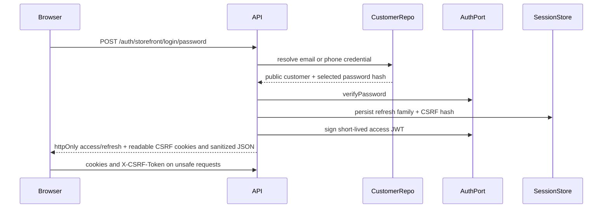
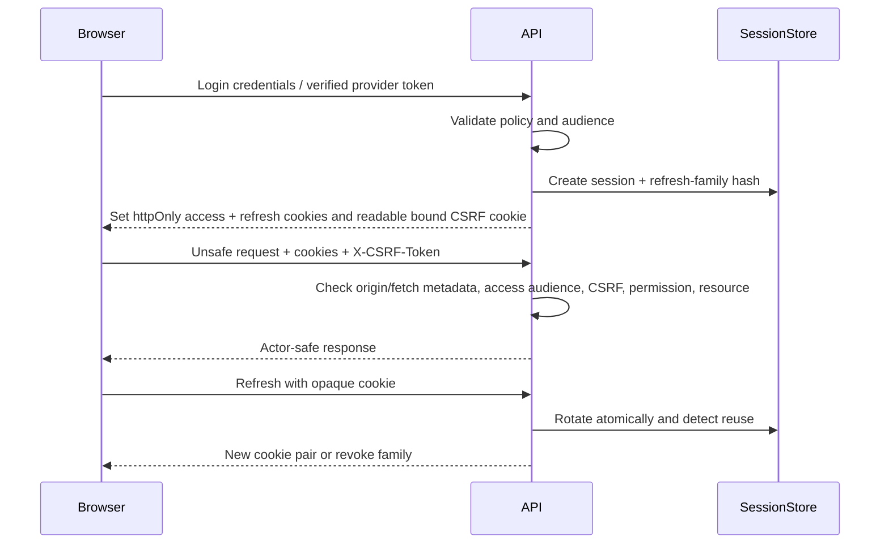

# Security, sessions, and authorization

Security status is **scaffolded** because the implemented identity and authorization foundation still has deployment and browser-proof gaps. Browser auth uses audience-bound httpOnly access/refresh cookies, opaque refresh rotation with reuse-triggered family revocation, session `sid` checks, session-bound double-submit CSRF, current-account/version checks, role/permission enforcement, and object ownership. Storefront identity includes verified-before-creation signup with server-held resume/discard state, password and OTP login by email or phone, Google and Facebook verifier adapters, provider-neutral identity links, step-up credential management, aligned remember-me lifetimes, session management, and guest-cart adoption. Signup account/credential/identity writes and contact-change proof/identifier/audit writes now use bounded transactions; duplicate identifier races become stable domain refusals. The admin boundary includes a closed **89-code** registry, active assignment resolution, permission-gated authority routes, no-delegation-above-self, last-administrator protection, offboarding/session revocation, operator bootstrap, Account Security, and idle-lock resume. Strict credentialed CORS, Helmet, trusted client-IP rate limiting, request correlation, log redaction, and the safe error envelope also exist. Remaining gaps include complete real-provider browser/account round trips, Meta console verification, real-browser PIN-login proof, pending-intent continuation, fail-closed production secret validation, provider-backed delivery, granular-permission migration for older privileged routes, portal private-access deployment (`DEC-PORTAL-PRIVATE-ACCESS`), and soft-delete operations (`DEC-CUSTOMER-SOFT-DELETE-OPS`).

## Authentication versus authorization

- **Authentication:** Who is the caller?
- **Authorization:** May this caller perform this action on this resource now?

A valid token proves identity and live session membership; object-level cart/order ownership is enforced separately and fails closed as not-found on mismatch.

## Current browser auth



Important current gaps:

- both Angular applications use cookie-only typed auth gateways with no browser-held credential; the shared transport coordinates CSRF, one refresh attempt and cross-tab refresh exclusion;
- signup and password-management flows enforce the shared 12-character minimum and the domain common-password policy;
- OTP request/verify is live through `NotificationPort`. DI selects `Msg91NotificationAdapter` when `NOTIFICATION_PROVIDER=msg91` and `MSG91_AUTH_KEY` is set; otherwise `ConsoleNotificationAdapter` (local/test / missing key fallback);
- signup holds identifiers and proof server-side until both email and phone are verified; the browser can recover the server projection after reload and discard it when leaving registration; Google and Facebook verification, OAuth state/nonce validation, and identity connect/disconnect routes are implemented;
- signup finalisation resolves ownership before consuming proof, then commits customer, password credential when applicable, and provider identity in one transaction; unique-index races return `signup_identifier_taken`, and failure to merge a guest cart does not revoke an otherwise valid login;
- contact-change confirmation consumes the pending proof, changes the identifier, and records its audit event in one transaction; a competing unique write returns `contact_in_use`;
- admin password recovery, password/PIN login, PIN setup/lockout, invite lifecycle, HTTP resume, Account Security at `/account`, idle soft-lock PIN/password resume, first-admin bootstrap and fine-grained assignment enforcement on the admin management surfaces are live;
- consent/privacy, order ownership, cart Principal/`st_guest` ownership, order-create cart adoption, and guest-cart adoption during signup/social login are live; pending-intent continuation and checkout idempotency remain Chunk G;
- production configuration still needs a fail-closed secret check.

## Chunk D status boundary

Chunk D1's tested stores are bound into the HTTP flow. The current adapter suite also proves atomic refresh rotation, replay lookup, family revocation, one-active OTP handling, single-use token consumption, concurrency-safe rate-limit counters, role-assignment uniqueness, secret-field exclusion, and TTL policy against rs0.

| Pass | Current evidence                                                                                                                                                                                                                                                                                                                                    | Remaining boundary                                                                                       |
| ---- | --------------------------------------------------------------------------------------------------------------------------------------------------------------------------------------------------------------------------------------------------------------------------------------------------------------------------------------------------- | -------------------------------------------------------------------------------------------------------- |
| D2   | **Done:** cookie issue/refresh/revoke, sid-bound access invalidation, reuse-family revocation, session-bound CSRF (Policy B) and storefront/admin audience guards                                                                                                                                                                                   | None in the defined D2 scope                                                                             |
| D3   | **Partial:** verified-before-creation signup with resumable/discardable pending state, atomic account/credential/identity creation, password/OTP login by email or phone, Google/Facebook verification, identity management, password/session management, atomic contact confirmation, account self-service and guest-cart adoption are implemented | Complete provider browser/account round trips, Meta console verification and pending-intent continuation |
| D4   | **Partial:** admin recovery, password/PIN login, PIN setup/lockout, invites, HTTP resume, Account Security client, idle soft-lock orchestration, bootstrap, registry-backed assignments, deny-by-default admin management, no-delegation, last-admin/offboarding controls and version invalidation                                                  | Real-browser PIN-login proof coverage and granular migration of older privileged routes                  |
| D5   | **Partial:** consent/privacy, order BOLA, cart/`st_guest` ownership, order-create cart adoption, and authentication-time guest-cart adoption                                                                                                                                                                                                        | Checkout idempotency and pending-intent continuation (Chunk G)                                           |

## Browser session architecture



### Cookie roles

| Cookie/token               | Browser readable? | Purpose                                             |
| -------------------------- | ----------------: | --------------------------------------------------- |
| Access cookie              |                No | Short-lived authenticated requests                  |
| Refresh cookie             |                No | Opaque rotation credential; hash stored server-side |
| CSRF cookie                |               Yes | Double-submit value bound/signed to session         |
| Guest cookie               |                No | Opaque authority for one guest cart only            |
| Locale/currency preference |            May be | Non-secret presentation context                     |

The base cookie names are `st_access`, `st_refresh`, and the browser-readable `st_csrf` (CSRF header `x-csrf-token`). Session cookies use `httpOnly`, `SameSite=Lax`, `Path=/`, and Secure-by-default configuration; the CSRF cookie is deliberately readable and is not a credential. The `__Host-` prefix is used when cookies are Secure and no cookie domain is pinned. An explicit insecure local opt-out or a pinned domain uses the compact `st_*` names. Auth responses return sanitized account/session metadata, never reusable access or refresh credentials.

`GET /auth/storefront/me` is an identity probe, not a gated resource: a true guest (no access cookie and no refresh cookie) receives 200 `{ user: null }`. Expired access with a live refresh still 401s `session_expired` so the browser interceptor can rotate. It is not `@Public()`; a present access cookie is still validated.

## CSRF rule

For cookie-authenticated `POST`, `PUT`, `PATCH`, and `DELETE`, the global guard currently:

1. allows safe methods and unsafe requests with no session cookie;
2. otherwise requires the readable CSRF cookie and matching `x-csrf-token` header;
3. compares them in constant time and rejects generically before mutation.

Login, OTP verification, and refresh issue the readable CSRF cookie together with a matching `authSessions.csrfSecretHash`; copy that cookie value into the header for unsafe requests. `GET /auth/csrf` remains useful before a session exists. For an active session it follows Policy B: preserve the still-valid bound token, and only atomically rotate `csrfSecretHash` when the readable cookie is missing or desynced. Unsafe requests that carry session cookies fail closed when no live session resolves.

Never use `GET` for a state-changing operation.

## Audience and privilege separation

| Actor               | Audience          | Allowed surface                                    |
| ------------------- | ----------------- | -------------------------------------------------- |
| Guest cart identity | none/accountless  | Only its cart and public catalogue actions         |
| Customer            | `storefront`      | Own account/cart/orders and allowed public writes  |
| Staff/admin         | `admin`           | Explicit admin routes permitted by role/permission |
| Provider webhook    | signature-based   | One verified callback capability                   |
| Internal job        | internal identity | Narrow scheduled capability                        |

An admin session must not automatically become customer authority, and a storefront session must never authorize an admin route.

## Object-level authorization

Customer order reads compare `order.userId` with the authenticated subject and return not-found on a mismatch; staff/admin have an explicit support bypass. Cart routes remain `@Public()` for guest add-to-cart but enforce Principal ownership or the hashed `st_guest` proof, and order creation validates ownership/adoption before any write.

Prefer ownership-scoped repository methods/use cases:

```text
getCustomerOrder({ actorUserId, orderId })
→ repository.findOwnedOrder(actorUserId, orderId)
→ not found/forbidden policy
→ CustomerOrderDetailResponse
```

Repeat this pattern for carts, addresses, returns, refunds, wishlist, saved items, media drafts, and admin tenant/resource scopes.

## Role versus permission

The current guard accepts `customer | staff | admin` roles, enforces explicit permissions when a route declares them, and compares token/permission versions with current user state on each guarded request. It resolves effective permissions from the user's transitional embedded grants and active role assignments, ignores revoked/dangling assignments, and refuses contributions above the user's coarse-role tier. Routes with no `@RequirePermissions` declaration do not trigger assignment resolution.

- Role groups permissions.
- Permission authorizes an action such as `orders.status.update`.
- Resource policy checks the specific order/entity and legal transition.
- UI hiding is convenience only.
- Every privileged write produces an audit event.

### Current admin authority controls

- `GET /admin/permissions` publishes the compile-time closed **89-code** registry; clients cannot mint free-form privileges.
- `/admin/roles` CRUD is admin-audience and permission-gated; system roles cannot be edited or deleted.
- `/admin/users/:userId/authority` returns server-resolved roles and effective permissions.
- Role grants cannot exceed the actor's tier or permission set.
- Revoking or disabling the last administrator is refused, as is self-disable.
- Offboarding bumps token version and revokes every session.
- Assignment/role mutations write security-retention audit evidence and invalidate affected permission versions.
- The operator-only bootstrap creates the first administrator with a generated one-time password, records a critical actorless audit event, exposes no HTTP route, and refuses once administrative authority exists.

Recorded direct-API and browser campaigns cover audience isolation, BOLA, no-delegation, last-administrator protection, offboarding, permission-version behavior, password login, cookie-only reload, CSRF-protected authority changes, refusal recovery, expiry recovery, logout, pending social-signup rendering, reload survival, in-app abandonment, Google grant revocation dispatch, and the Facebook button reaching the live SDK object. These focused probes do not prove a complete Google or Facebook account round trip. PIN login and the provider-account last mile still require supported-browser proof. The idle soft-lock client is live in the admin shell (`IdleLockService` + `idle-lock-modal` + `POST /auth/admin/resume`).

## Password, PIN, and OTP policies

### Password

- Minimum 12 characters for storefront and admin.
- Common-password denylist.
- Argon2id hash.
- Generic login failure.
- Rate limiting/backoff.
- Password change revokes sessions/increments token version.

### Admin PIN

- Six digits, chosen only after a password credential exists.
- Reject repeated, sequential, known-weak, keyboard/calendar-like patterns.
- Strong hash, never plaintext.
- Stricter rate limit/lockout due to low entropy.
- Same secure session after successful verification.

### OTP

- Six-digit CSPRNG value.
- Store HMAC with server pepper, not plaintext.
- Ten-minute expiry, maximum five attempts, single active challenge per identifier/purpose.
- Atomic constant-time verification and single-use consumption.
- Generic anti-enumeration responses.
- Channel-direct delivery through the ratified notification abstraction and provider; no code or token logs.

The PIN/OTP/session DTOs and persistence shapes are active in the HTTP lifecycle. Storefront signup/login/contact-change OTP flows, Google and Facebook verification adapters, admin recovery, PIN setup/login/lockout, invite acceptance, Account Security, idle soft-lock resume, and the resume endpoint are implemented. Provider-backed MSG91 delivery, provider-console activation, provider browser proof, and real-browser PIN-login proof remain outside the current evidence.

## Configuration fail-closed rule

Current config falls back to predictable development JWT secrets. Production bootstrap must reject defaults/missing secrets. Test this directly by setting production mode with each required security value absent.

## Security verification matrix

| Boundary          | Minimum proof                                                           |
| ----------------- | ----------------------------------------------------------------------- |
| Login/register    | cookies set, no tokens in JSON, password policy, enumeration resistance |
| CSRF              | all unsafe cookie routes reject missing/wrong/cross-session token       |
| Refresh           | atomic rotation, replay revokes family, concurrent refresh handled      |
| Audience          | storefront cannot call admin; admin cannot bypass customer ownership    |
| BOLA              | cross-user ids fail for every owned resource                            |
| Permissions       | stale/downgraded/disabled admin fails quickly                           |
| Secrets           | production fails without secure config; logs/responses redacted         |
| OTP/PIN           | entropy/policy/attempts/expiry/race/reuse tests                         |
| Provider callback | signature, replay, amount/order correlation, legal transition           |

## Incident evidence

Security audit logs should identify request/session/actor, action, target, decision, timestamp, and safe context. Never record passwords, PINs, OTP values, access/refresh tokens, provider secrets, raw IPs, or full PII payloads.
