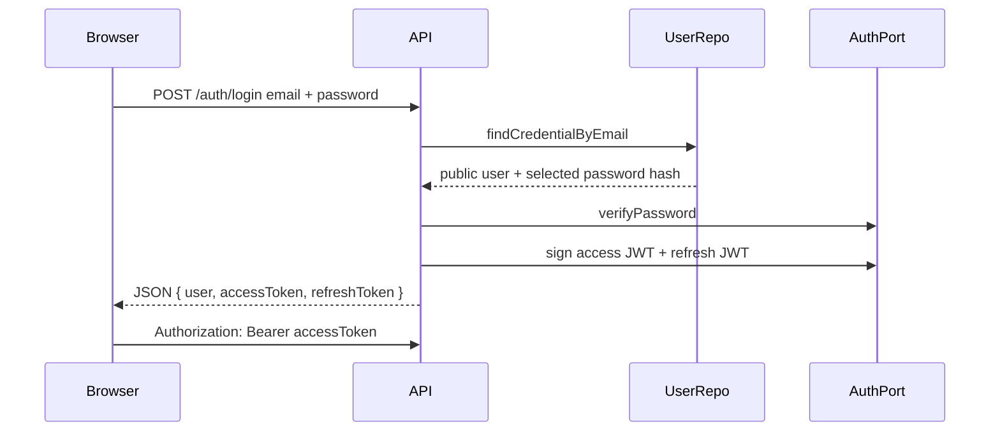

# Security, sessions, and authorization

Security status is **scaffolded**. Argon2id, signed JWTs, the transitional bearer/role guards, strict credentialed CORS, Helmet, trusted client-IP rate limiting, per-request correlation, adapter-level log redaction, and the shared safe error envelope exist. Cookie attribute helpers, global double-submit CSRF enforcement, and `GET /auth/csrf` now form a real foundation. The complete cookie-session, refresh-family, audience, admin PIN, OTP, consent, and audit lifecycles are not wired into current repositories or collections.

## Authentication versus authorization

- **Authentication:** Who is the caller?
- **Authorization:** May this caller perform this action on this resource now?

A valid token proves neither order ownership nor permission to mutate an arbitrary cart.

## Current browser auth



Important current gaps:

- browser-readable token response;
- bearer-only guard;
- refresh JWT without server-side token-family rotation/reuse detection;
- no logout revocation;
- no storefront/admin audience separation;
- no persisted cookie-session lifecycle yet; the global CSRF guard is already active whenever a session cookie is present;
- the legacy controller-local registration schema still accepts eight characters; the new shared auth contract sets the locked 12-character floor, but it is not wired into that endpoint and the denylist policy is not implemented;
- OTP endpoints are still explicit not-implemented stubs, though the provider and policy config now exist (MSG91 is the locked provider behind the notification abstraction; `OTP_TTL_SECONDS`/`OTP_MAX_ATTEMPTS` are parsed);
- no admin PIN implementation;
- no account lock/backoff/session/audit collections.

## Locked browser session

```mermaid
sequenceDiagram
    participant Browser
    participant API
    participant SessionStore

    Browser->>API: Login credentials / verified provider token
    API->>API: Validate policy and audience
    API->>SessionStore: Create session + refresh-family hash
    API-->>Browser: Set httpOnly access + refresh cookies; readable bound CSRF cookie
    Browser->>API: Unsafe request + cookies + X-CSRF-Token
    API->>API: Check origin/fetch metadata, access audience, CSRF, permission, resource
    API-->>Browser: Actor-safe response
    Browser->>API: Refresh with opaque cookie
    API->>SessionStore: Rotate atomically; detect reuse
    API-->>Browser: New cookie pair or revoke family
```

### Cookie roles

| Cookie/token               | Browser readable? | Purpose                                             |
| -------------------------- | ----------------: | --------------------------------------------------- |
| Access cookie              |                No | Short-lived authenticated requests                  |
| Refresh cookie             |                No | Opaque rotation credential; hash stored server-side |
| CSRF cookie                |               Yes | Double-submit value bound/signed to session         |
| Guest cookie               |                No | Opaque authority for one guest cart only            |
| Locale/currency preference |            May be | Non-secret presentation context                     |

The locked cookie names are `st_access`, `st_refresh`, and the browser-readable `st_csrf` (CSRF header `x-csrf-token`). Session cookies use `httpOnly`, `SameSite=Lax`, `Path=/`, and `Secure` in production; the CSRF cookie is deliberately readable and is not a credential. The `__Host-` prefix is used exactly when valid: production and no pinned `COOKIE_DOMAIN`. A pinned domain or plain HTTP falls back to the allowed compact `st_*` name. Cookie sessions themselves are not yet issued by the auth flow—the current API still returns bearer tokens in JSON.

## CSRF rule

For cookie-authenticated `POST`, `PUT`, `PATCH`, and `DELETE`, the global guard currently:

1. allows safe methods and unsafe requests with no session cookie;
2. otherwise requires the readable CSRF cookie and matching `x-csrf-token` header;
3. compares them in constant time and rejects generically before mutation.

Obtain the pair through `GET /auth/csrf`, which returns a 32-byte CSPRNG token in the `CsrfTokenResponse` body and sets the readable cookie. Binding that token to `authSessions.csrfSecretHash`, plus complete session validation and origin/fetch-metadata policy, remains Chunk D work.

Never use `GET` for a state-changing operation.

## Audience and privilege separation

| Actor               | Audience          | Allowed surface                                    |
| ------------------- | ----------------- | -------------------------------------------------- |
| Guest cart identity | none/accountless  | Only its cart and public catalogue actions         |
| Customer            | `storefront`      | Own account/cart/orders and allowed public writes  |
| Staff/admin         | `admin`           | Explicit admin routes permitted by role/permission |
| Provider webhook    | signature-based   | One verified callback capability                   |
| Internal job        | internal identity | Narrow scheduled capability                        |

An admin session must not automatically become customer authority, and a storefront session must never authorize an admin route.

## Object-level authorization

The current `GET /orders/:id` is the clearest BOLA risk: it checks authentication but not whether `order.userId === actor.sub`.

Prefer ownership-scoped repository methods/use cases:

```text
getCustomerOrder({ actorUserId, orderId })
→ repository.findOwnedOrder(actorUserId, orderId)
→ not found/forbidden policy
→ CustomerOrderDetailResponse
```

Repeat this pattern for carts, addresses, returns, refunds, wishlist, saved items, media drafts, and admin tenant/resource scopes.

## Role versus permission

The current guard accepts `customer | staff | admin` role values. The target needs permissions for privileged actions and a permission version in admin sessions.

- Role groups permissions.
- Permission authorizes an action such as `orders.status.update`.
- Resource policy checks the specific order/entity and legal transition.
- UI hiding is convenience only.
- Every privileged write produces an audit event.

## Password, PIN, and OTP policies

### Password

- Minimum 12 characters for storefront and admin.
- Common-password denylist.
- Argon2id hash.
- Generic login failure.
- Rate limiting/backoff.
- Password change revokes sessions/increments token version.

### Admin PIN

- Six digits, chosen only after a password credential exists.
- Reject repeated, sequential, known-weak, keyboard/calendar-like patterns.
- Strong hash, never plaintext.
- Stricter rate limit/lockout due to low entropy.
- Same secure session after successful verification.

### OTP

- Six-digit CSPRNG value.
- Store HMAC with server pepper, not plaintext.
- Ten-minute expiry, maximum five attempts, single active challenge per identifier/purpose.
- Atomic constant-time verification and single-use consumption.
- Generic anti-enumeration responses.
- Channel-direct delivery through locked notification abstraction/provider; no code/token logs.

The PIN/OTP/session DTO and internal persistence shapes now exist in `packages/contracts`; none of the locked PIN/OTP/session lifecycle is currently implemented.

## Configuration fail-closed rule

Current config falls back to predictable development JWT secrets. Production bootstrap must reject defaults/missing secrets. Test this directly by setting production mode with each required security value absent.

## Security verification matrix

| Boundary          | Minimum proof                                                           |
| ----------------- | ----------------------------------------------------------------------- |
| Login/register    | cookies set, no tokens in JSON, password policy, enumeration resistance |
| CSRF              | all unsafe cookie routes reject missing/wrong/cross-session token       |
| Refresh           | atomic rotation, replay revokes family, concurrent refresh handled      |
| Audience          | storefront cannot call admin; admin cannot bypass customer ownership    |
| BOLA              | cross-user ids fail for every owned resource                            |
| Permissions       | stale/downgraded/disabled admin fails quickly                           |
| Secrets           | production fails without secure config; logs/responses redacted         |
| OTP/PIN           | entropy/policy/attempts/expiry/race/reuse tests                         |
| Provider callback | signature, replay, amount/order correlation, legal transition           |

## Incident evidence

Security audit logs should identify request/session/actor, action, target, decision, timestamp, and safe context. Never record passwords, PINs, OTP values, access/refresh tokens, provider secrets, raw IPs, or full PII payloads.
