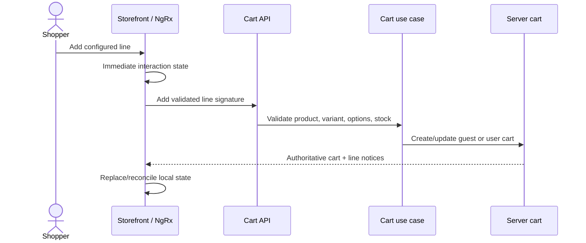
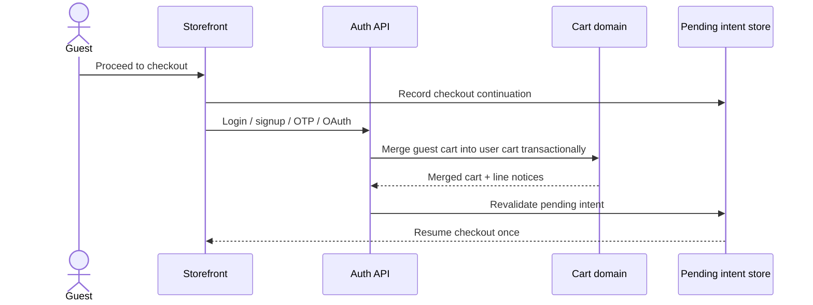

# Cart, pending intent, and offline reconciliation

The current storefront has a capable browser cart implemented with classic NgRx. The API also exposes cart operations. The ratified launch architecture goes further: the server cart is authoritative for both guests and users, while browser state provides immediate UI and an offline mutation queue.

## Time and ownership model

| Record                 | Owner                     | Lifetime                                          | Purpose                                    |
| ---------------------- | ------------------------- | ------------------------------------------------- | ------------------------------------------ |
| Guest cart             | Opaque guest cookie/token | 30-day sliding expiry                             | Normal guest shopping continuity           |
| User cart              | Authenticated user        | Business-defined persistence                      | Cross-session/device cart                  |
| Pending intent         | Guest/session             | Maximum 30 minutes                                | Resume one account-bound action after auth |
| Offline mutation queue | Current browser           | Until synced, cleared, or browser storage is lost | Temporary offline interaction only         |

The latest pending intent wins. It is not an unbounded command queue.

## Add-to-cart journey

Add-to-cart never requires login. Guest checkout, however, is not available at launch.

## Proceed-to-checkout journey

The order is mandatory: authenticate → merge cart → revalidate intent → replay once → clear intent.

## Merge policy

Duplicate lines merge when product, variant, variation values, named add-ons, measurements/customization, and bundle selections match. Quantities merge only up to current stock.

Invalid lines are not silently dropped:

- retired product → terminal line error;
- missing/invalid variant → line error;
- insufficient stock → adjusted or unavailable quantity;
- stale add-on/measurement choice → explain required reconfiguration; and
- changed price/promotion → show the new validated values before checkout.

## Account-bound intent matrix

| Action              | Guest behavior                | Replay rule                                                          |
| ------------------- | ----------------------------- | -------------------------------------------------------------------- |
| Wishlist            | Save one intent, authenticate | Revalidate product, then add and return to origin                    |
| Save for later      | Authenticate from cart        | Revalidate line, then move it; distinct from wishlist                |
| Notify me           | Authenticate                  | Recheck selected product/variant is still out of stock               |
| Review              | Authenticate                  | Recheck verified-purchase eligibility                                |
| Proceed to checkout | Authenticate                  | Merge cart first, then resume checkout                               |
| Product question    | No forced login               | Allow name/email submission; keep identity private in public display |
| Reorder             | Already authenticated         | Revalidate every historical item; allow partial success              |
| Public track order  | Deferred                      | Do not invent a lookup model yet                                     |

## Offline reconciliation

Offline catalogue and cart support is planned but not wired in the current Vite configuration. The ratified reconnect flow is:

1. Determine whether the session is still valid.
2. Sync queued mutations to the guest or user cart.
3. Check product/variant lifecycle first.
4. If active, check stock second.
5. Recalculate pricing and other authoritative facts.
6. Replace local state with server truth and show line-level notices.

Never cache auth tokens, refresh tokens, payment data, account/order PII, admin responses, or secrets in the offline queue.

## Current and target boundary

Current NgRx effects perform useful client-side variation, quantity, stock-shaped, and configuration transitions. Current reducer IDs and totals can still be generated in the browser. These are UI behaviors—not proof that the server-authoritative merge, ownership, validation, TTL, or offline synchronization contract is complete.

## Debugging checkpoints

- Compare the browser line signature with the API cart line.
- Check guest/user ownership and token/session state.
- Check whether the pending intent expired or was replaced by a newer one.
- Inspect line-level merge notices before investigating checkout.
- Confirm the local cart was replaced with server truth after reconnect/login.
- Never “fix” a mismatch by trusting browser totals or silently dropping a line.
