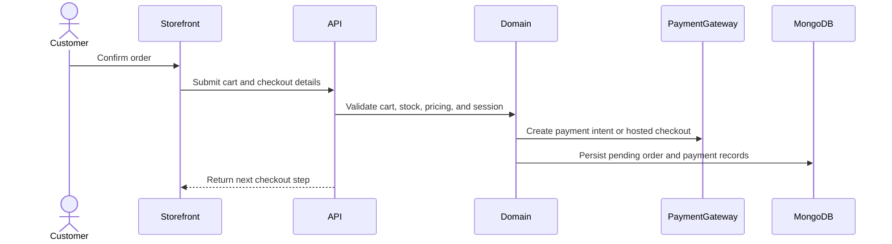

# Checkout

Checkout is not fully implemented yet. This page records the intended documentation shape so implementation PRs can fill it in incrementally.

## To complete during implementation

| Area                  | Link target                            |
| --------------------- | -------------------------------------- |
| Storefront route      | Locale-aware checkout route            |
| State/query operation | Cart and checkout query keys           |
| API endpoint          | OpenAPI operation                      |
| Collections           | Orders, payments, carts, inventory     |
| Recovery behavior     | Payment failure, abandoned cart, retry |
