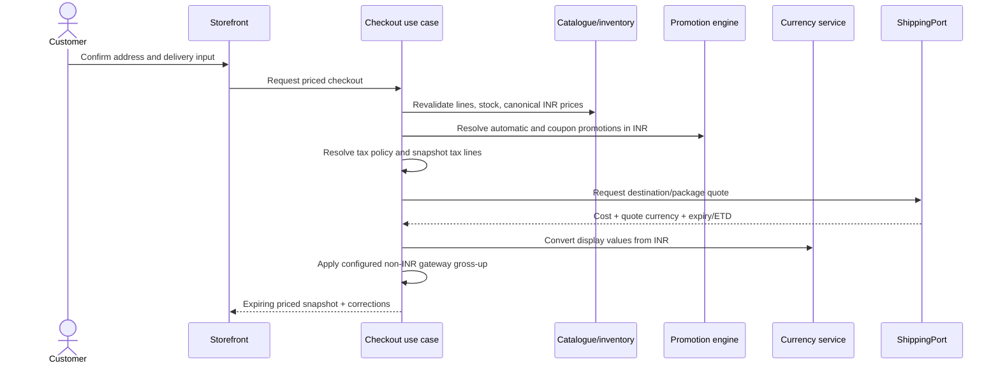
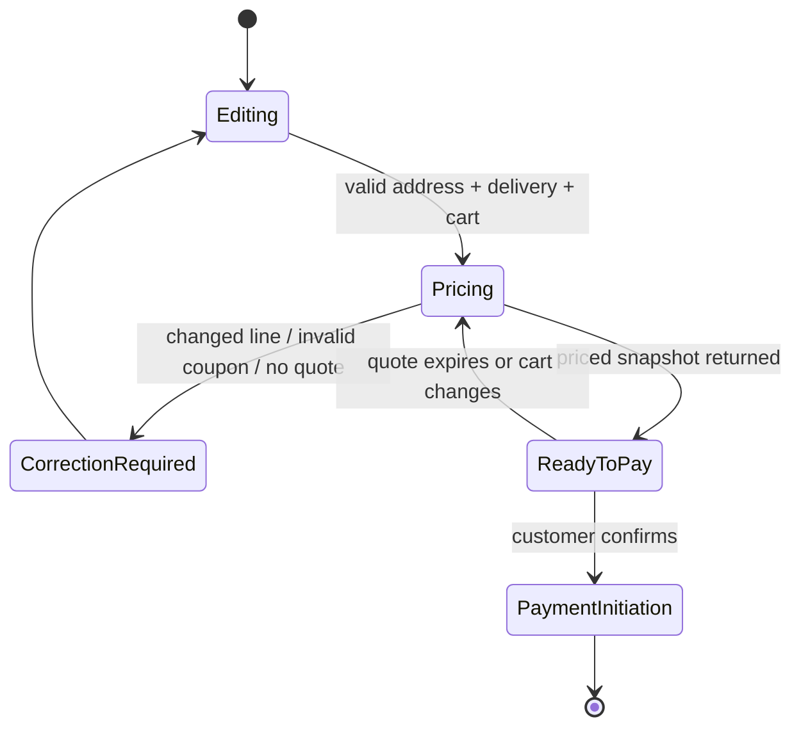

# Checkout, pricing, tax, currency, and shipping

Checkout is the server-owned calculation and validation boundary between a cart and a payment attempt. The current storefront presents checkout forms, addresses, delivery, payment choices, coupons, and totals, but it uses a static totals object and navigates to an unwired order detail. It is not a production transaction.

## Preconditions

- The customer is authenticated; guest checkout is unavailable at launch.
- Guest cart merge has completed.
- Every line has a valid product, variant, semantic option, add-on, measurement, and bundle signature.
- Shipping and billing addresses satisfy the current contract.
- Selected currency is enabled.

## Target calculation sequence



The browser renders the snapshot. It does not reconstruct the total from product cards, local cart state, or stale display prices.

## Amount ownership

| Amount                        | Source of truth                 | Snapshot requirement                        |
| ----------------------------- | ------------------------------- | ------------------------------------------- |
| Product/variant selling price | Canonical INR catalogue row     | INR and paid-currency unit/line totals      |
| Add-on/bundle deltas          | Validated configuration         | Selected options plus resolved deltas       |
| Promotion                     | API promotion engine            | Rule/id/code and applied INR value          |
| Tax                           | Tax class/rule resolution       | HSN/class/rate/base/amount/inclusive flag   |
| Shipping                      | Shipping provider quote         | Value, currency, INR value, provider/method |
| FX                            | Latest good stored rate         | Rate, source, fetched date, display result  |
| Gateway gross-up              | Versioned payment configuration | Rule/config version and charged amount      |

## Canonical price and currency

Product pricing starts in INR:

```ts
effectiveSellingINR = activeSalePriceINR ?? priceINR;
displayNet = roundCurrency(effectiveSellingINR * rateFromINR, currency);
```

INR uses a rate of `1`. If rate refresh fails, keep the latest good rate and mark it stale; never overwrite it with a null/invalid value.

For the non-INR PayPal path, the base gross-up formula is:

```text
G = (N + f) / (1 - p)
```

`N` is the intended net amount in the paid currency, `p` is the configured percentage fee, `f` is the configured fixed fee, and `G` is the charge before currency rounding. Policies for extra FX/GST-on-fee gross-up must be explicit versioned configuration, not hidden constants.

## Shipping selection

- India destination → domestic shipping adapter.
- Non-India destination → international shipping adapter.
- Provider response must include value and currency.
- Shipping cost is converted with stored FX.
- International shipping receives PayPal gross-up only when the active rule explicitly enables it.
- A deliberate fallback may be used when no courier is serviceable; it must be identifiable in the quote.

## Tax boundary

Tax resolves at checkout from the product or variant tax profile and applicable tax rules. The order line freezes the resolved result. The exact customer display policy remains an unresolved business and accounting decision and must not be guessed in Angular.

## Promotions and unsupported UI seams

The current API exposes active-promotion and coupon-validation scaffolds. Final checkout must re-evaluate coupon validity, timing, scope, priority, stacking, and cart conditions against current INR facts.

Current checkout UI also exposes points and wallet-shaped controls inherited from scaffolding. A production loyalty/points engine is a future seam, and these controls must not be described as operational value until the ledger/rules/transaction path exists.

## Checkout state machine



## Correction matrix

| Failure                | Response                                                                       |
| ---------------------- | ------------------------------------------------------------------------------ |
| Product retired        | Mark line terminal/unavailable; require removal or replacement                 |
| Stock reduced          | Adjust/block quantity with explicit line notice                                |
| Price changed          | Show old/new values and require reconfirmation                                 |
| Coupon invalid/expired | Keep cart; remove discount and explain                                         |
| Address invalid        | Map structured errors to address fields                                        |
| No shipping service    | Offer valid fallback/manual contact only if configured                         |
| Quote expired          | Requote before payment                                                         |
| FX stale               | Use latest acceptable rate with policy/alert; block if beyond safety threshold |

## Debugging checkpoints

1. Confirm guest-cart merge finished and the user session is valid.
2. Compare cart version/signature with the priced snapshot.
3. Inspect line corrections before promotion or shipping calculations.
4. Verify canonical INR inputs before checking converted values.
5. Inspect the exact FX and gross-up configuration versions.
6. Check shipping destination, package facts, quote currency, and expiry.
7. Never debug a total only from the rendered Angular numbers.
