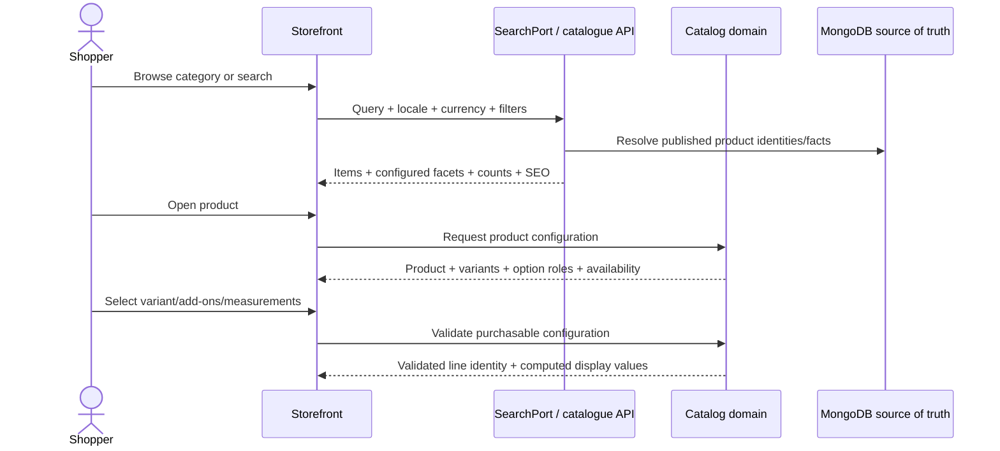
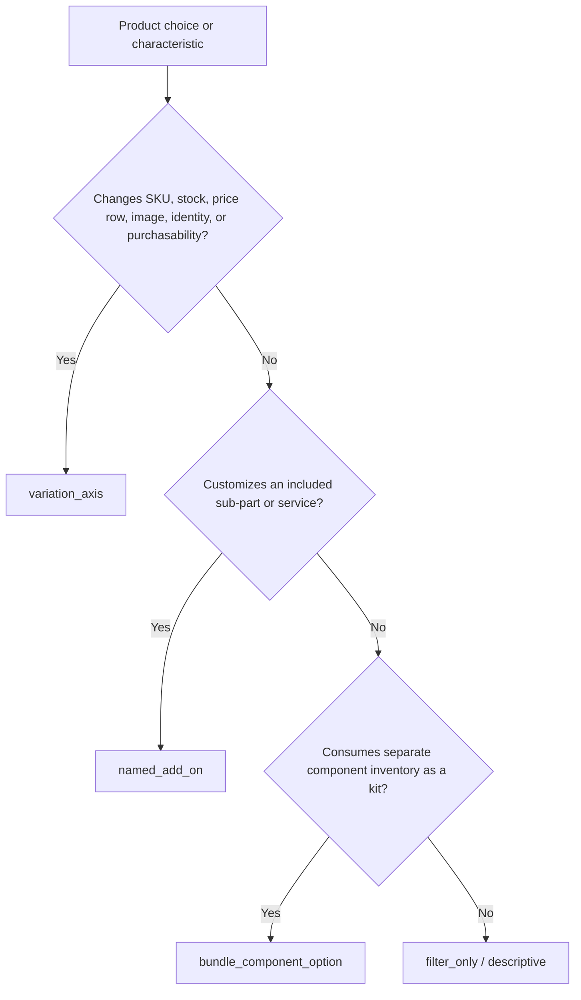

# Discovery and product configuration

This journey begins with a customer need and ends with one valid, purchasable cart-line signature. It includes discovery, product visibility, options, price, media, and stock—not just rendering a product card.

## Journey



The current code implements the route and presentation surface, but it still mixes a catalogue API request with fixture-backed detail and adjacent readers. Treat the sequence above as the locked target unless a step is explicitly marked current.

## Semantic option decision

An option’s label—color, size, design, fabric, waist, or any other name—does not determine its behavior. Its per-product semantic role does.



| Role                      | Creates variant matrix? | Own stock/SKU?                | Default catalogue facet?                                 |
| ------------------------- | ----------------------- | ----------------------------- | -------------------------------------------------------- |
| `variation_axis`          | Yes                     | Yes, through the variant      | Eligible through active purchasable variants             |
| `named_add_on`            | No                      | Usually service/add-on policy | No, unless deliberately merchandised                     |
| `bundle_component_option` | Separate composition    | Component inventory           | No by default                                            |
| `filter_only`             | No                      | No                            | Eligible when category/placement facet config enables it |

## Saree and blouse example

A saree with an included blouse piece remains the base product. `Blouse Design` is a named add-on group:

- default `No Design`;
- optional design terms;
- optional INR price delta;
- design-specific media when relevant; and
- required measurement definitions only for stitched choices.

A standalone blouse may instead use design as a variation axis because the design identifies the sellable SKU/stock row.

## Cart-line signature

Two lines can merge only when their full purchase configuration is equivalent. The target merge identity includes:

```text
product id
+ variant id
+ selected variation values
+ selected named add-ons
+ measurement/customization signature
+ bundle component selections where applicable
```

Quantity is applied after identity matching and remains subject to current stock.

## Price and stock ownership

- The storefront may show returned display values and perform immediate interaction checks.
- Canonical price, active sale price, promotion eligibility, add-on deltas, bundle totals, tax basis, and stock are server-authoritative.
- The API revalidates the configuration before adding online, reading the cart, continuing checkout, and replaying a pending intent.
- Retired, archived, disabled, or discontinued products must disappear from live discovery surfaces.

## Failure and edge cases

| Condition                          | Expected behavior                                                                            |
| ---------------------------------- | -------------------------------------------------------------------------------------------- |
| Unknown slug                       | Use a real not-found response and helpful navigation.                                        |
| Discontinued product               | Return 410 or an intentional category redirect according to SEO policy.                      |
| Variant combination does not exist | Disable the invalid combination and retain prior valid selections.                           |
| Required add-on missing            | Keep the product visible; block add-to-cart with field-level explanation.                    |
| Measurement required               | Render data-defined fields and validate them; do not hardcode one universal measurement set. |
| Stock changed                      | Revalidate; adjust/block quantity with a line-specific message.                              |
| Currency changed                   | Refetch backend-computed display prices; never convert final totals only in Angular.         |

## Debugging checkpoints

1. Confirm the route resolved the expected locale and slug.
2. Identify whether the reader used the catalogue API or fixture collection.
3. Inspect the product status and selected semantic roles.
4. Reconstruct the variant/add-on/measurement signature.
5. Confirm the API returned, rather than the browser invented, price and availability.
6. Verify the same configuration survives product-detail → cart → checkout.
