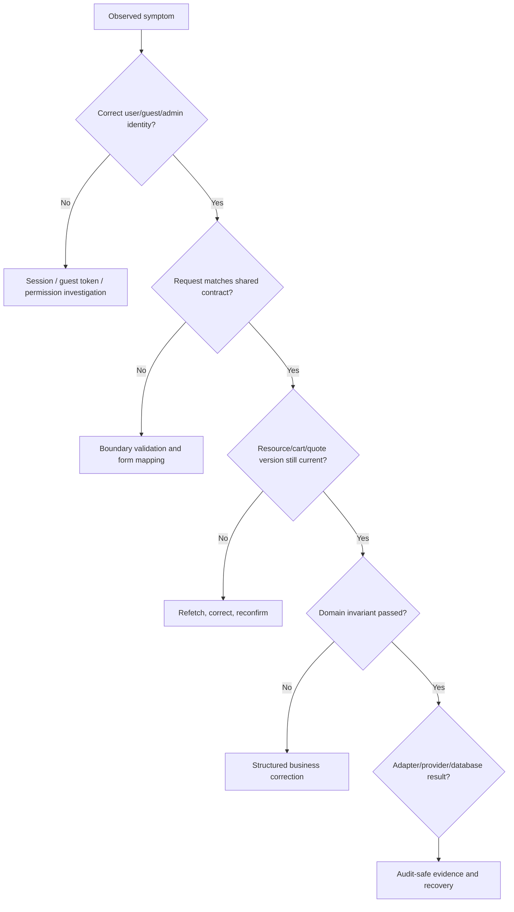

# Failure recovery and debugging

Debug business journeys from the first broken invariant, not from the final error toast. A payment-looking failure may have begun with stale stock; an authorization-looking failure may be an expired session; an order mismatch may be a snapshot or ownership problem.

## Universal trace

## Symptom map

| Symptom                             | Check first                                       | Then inspect                                    | Never do                             |
| ----------------------------------- | ------------------------------------------------- | ----------------------------------------------- | ------------------------------------ |
| Product missing                     | Status, locale route, redirect/410 policy         | Search index freshness and catalogue source     | Re-publish blindly                   |
| Variant cannot add                  | Semantic role and exact combination               | Stock, add-ons, measurements, line signature    | Force a default invalid variant      |
| Cart differs after login            | Guest/user ownership and merge notices            | Line signatures, stock, expired intent          | Drop conflicting lines silently      |
| Checkout total changed              | Cart/quote version                                | INR price, promotions, tax, FX, shipping        | Trust the old browser total          |
| Coupon rejected                     | Code, time window, scope, conditions              | Priority/stacking and current cart              | Apply a client-only discount         |
| Payment “success” but order pending | Verified callback/webhook                         | Amount/currency/idempotency and attempt state   | Mark paid from return URL            |
| Customer cannot open order          | Session and resource ownership                    | Order snapshot/read model                       | Remove ownership checks              |
| Admin action hidden/forbidden       | Permission/version and role                       | UI mapping, then API policy                     | Treat UI visibility as authorization |
| Refund stuck                        | Payment/refund identifiers and provider reference | Idempotency, amount, currency, provider outcome | Mark processed before confirmation   |
| Notification missing                | Channel/category switch and consent               | Outbox/provider delivery state                  | Roll back the business event         |

## Evidence to capture safely

- request/correlation identifier;
- actor type and sanitized identifier;
- route/operation name;
- cart/order/payment/shipment/refund identifiers;
- contract-validation outcome;
- state/status transition before and after;
- adapter/provider outcome category; and
- timestamps in UTC, formatted with context at the UI edge.

Never capture passwords, OTPs, access/refresh tokens, guest-token plaintext, card data, gateway secrets, full sensitive provider payloads, or unnecessary customer PII.

## Recovery principles

1. **Fail closed on security.** Never weaken ownership, CSRF, authentication, or permission checks to make a journey proceed.
2. **Preserve valid user work.** Keep valid cart lines, form fields, drafts, and route origin whenever safe.
3. **Explain corrections locally.** Prefer line/field/action-specific messages over a generic failure banner.
4. **Use idempotency.** Retrying payment, order, refund, and notification commands must not duplicate side effects.
5. **Separate business and communication state.** A failed notification does not erase a successful order transition.
6. **Reconcile from authority.** Replace browser assumptions with validated server truth after reconnect, auth, or conflict.
7. **Audit privileged/manual actions.** Operator overrides need reason, actor, time, and before/after evidence.

## Beginner debugging checklist

- [ ] Reproduce using the direct route, not only client navigation.
- [ ] Identify current code versus locked target; do not debug an unimplemented integration as if it exists.
- [ ] Find the route/page, feature, query/store, service, contract, controller, use case, and port involved.
- [ ] Inspect structured validation or business errors before logs.
- [ ] Check ownership and state versions.
- [ ] Check server-calculated values before rendered formatting.
- [ ] Verify retry/idempotency behavior.
- [ ] Remove sensitive test data from screenshots and issue reports.
- [ ] Update portal evidence when the underlying behavior changes.
