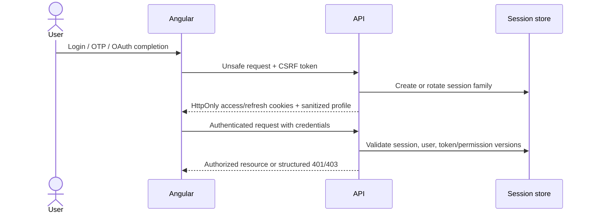
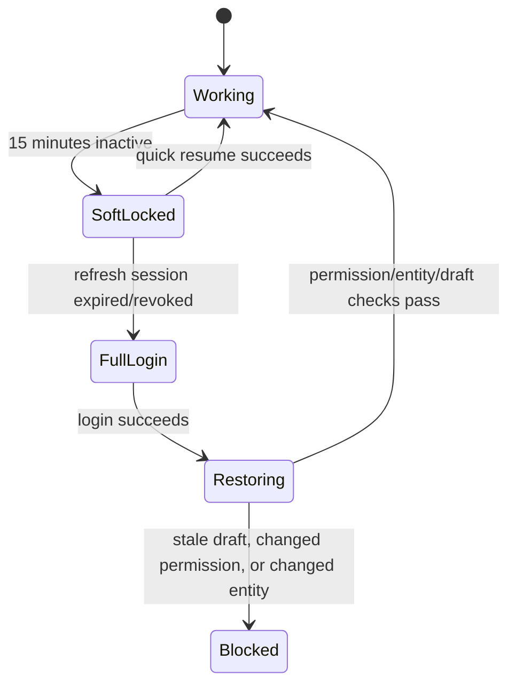

# Identity, account, and admin resume

Current auth UI and API scaffolds exist, including password endpoints, bearer-token guards, OTP stubs, and demo frontend session stores. Shared zod contracts now model the locked storefront/admin requests, cookie-session metadata, refresh-family state, OTP/OAuth/reset/invite records, and sanitized responses. They are design/code seams only: the current API still returns browser-readable bearer tokens, and the new lifecycle is not persisted or executed.

## Storefront methods

Launch target includes email/password, email OTP, Google, and Facebook login. Guest browsing/cart remains first-class. Phone OTP and other identity methods remain seams or later work according to owner decisions.

## Browser session model

Angular stores sanitized user/session status, never access or refresh secrets.

## Authentication outcome rules

- Login failure is enumeration-safe.
- OTP/reset requests respond generically regardless of whether an account exists.
- OTPs are short-lived, rate-limited, single-purpose, and one-time-use.
- OAuth validates state, provider, redirect, nonce, and verified identity facts.
- Disabled/locked/deleted users receive no new session.
- Refresh rotation invalidates the previous token; reuse revokes the family.
- Password/role changes invalidate affected sessions or permission versions.

## Account data

Addresses, order history, wishlists, reviews, saved-for-later items, notifications, and profile facts are authenticated server state. They are not public offline cache. Every object lookup enforces ownership.

## Admin authentication

Admin/staff use invited accounts with email-or-username plus password. Self-registration and social login are not admin launch methods. Sensitive operations require explicit server-side permissions and may later require step-up authentication.

## Admin deep-link and soft-lock flow

The soft-lock overlay keeps the current component tree mounted so in-memory form state survives. Reload/crash/route-exit recovery requires feature-owned drafts or autosave.

## Safe admin resume order

1. Preserve only allowed workflow state.
2. Reauthenticate using the preferred quick-resume method.
3. Revalidate active user, session, token version, and permission version.
4. Revalidate the target entity/version.
5. Restore draft through the normal form mapping/validation path.
6. Retry a blocked unsafe request only when explicitly safe and idempotent.

RBAC failures are not queued. A 403 remains blocked until permissions actually change.

## Dynamic draft requirements

Complex product/order/invoice forms need enough draft metadata to reconstruct conditional controls, including product type, option semantic roles, generated variant inputs, add-on groups, measurements, current step/tab, and unsaved media references. Draft restoration must never bypass normal validation.

## Current-versus-target warning

The current storefront/admin stores and API endpoints are scaffolds. Demo/local-storage tokens, bearer response bodies, permissive child guards, and OTP stubs must not be documented as the final secure session implementation.
