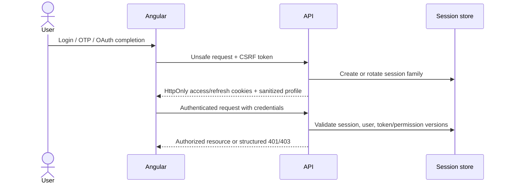
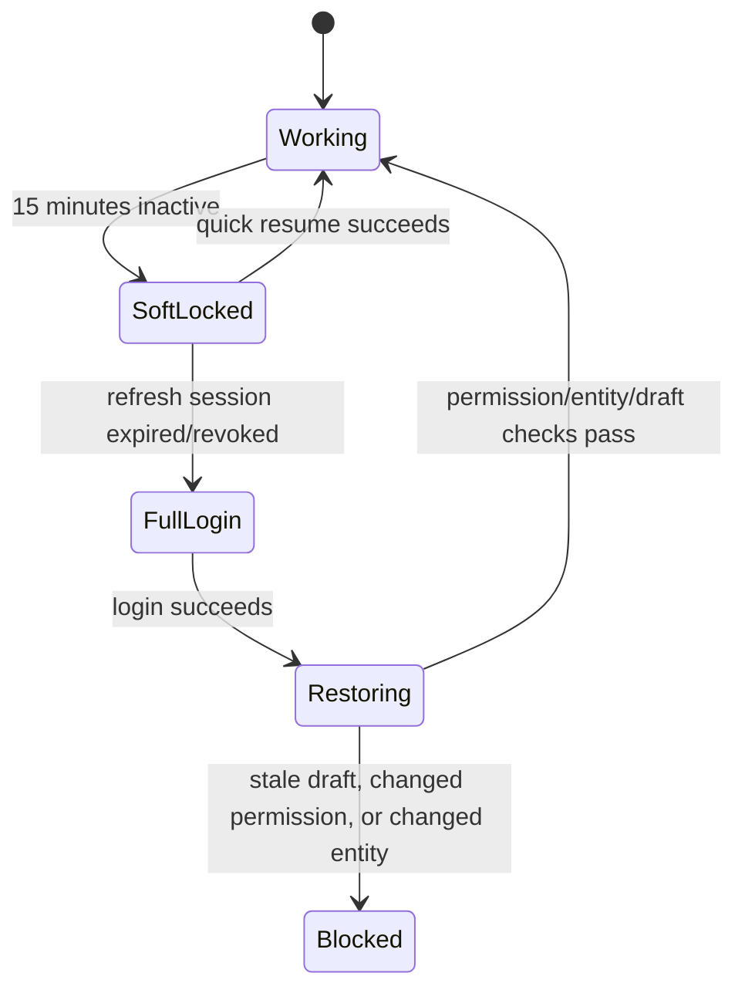

# Identity, account, and admin resume

The API now executes cookie-session auth: storefront registration/password/OTP login, logout, refresh, password reset and `me`; admin password/PIN login, PIN setup/lockout, logout, refresh and `me`; audience separation; version-aware RBAC; and rotating persisted refresh families. Responses are sanitized and reusable credentials stay in httpOnly cookies. The Angular auth stores and route guards remain transitional, and their interceptors still attach legacy local-storage bearer values that the cookie-only API ignores.

## Storefront methods

Email/password and email OTP are implemented at the API boundary. Google/Facebook OAuth and email-verification completion remain open. Guest browsing/cart remains first-class: cart routes enforce Principal ownership or hashed `st_guest` proof, while guest→user merge remains Chunk G.

## Browser session model

Angular stores sanitized user/session status, never access or refresh secrets.

## Authentication outcome rules

- Login failure is enumeration-safe.
- OTP/reset requests respond generically regardless of whether an account exists.
- OTPs are short-lived, rate-limited, single-purpose, and one-time-use.
- OAuth validates state, provider, redirect, nonce, and verified identity facts.
- Disabled/locked/deleted users receive no new session.
- Refresh rotation invalidates the previous token; reuse revokes the family.
- Password/role changes invalidate affected sessions or permission versions.

## Account data

Addresses, order history, wishlists, reviews, saved-for-later items, notifications, and profile facts are authenticated server state. They are not public offline cache. Every object lookup enforces ownership.

## Admin authentication

Admin/staff password and PIN login accept email-or-username, and the global guard enforces audience, role, declared permissions, and current permission versions. Invite persistence exists but invite acceptance is not exposed; self-registration and social login are not admin launch methods.

## Admin deep-link and soft-lock flow

This is still target behavior. The API enforces a 15-minute admin session idle lifetime and PIN lockout, but the Angular soft-lock overlay and quick-resume orchestration are not implemented. Reload/crash/route-exit recovery still requires feature-owned drafts or autosave.

## Safe admin resume order

1. Preserve only allowed workflow state.
2. Reauthenticate using the preferred quick-resume method.
3. Revalidate active user, session, token version, and permission version.
4. Revalidate the target entity/version.
5. Restore draft through the normal form mapping/validation path.
6. Retry a blocked unsafe request only when explicitly safe and idempotent.

RBAC failures are not queued. A 403 remains blocked until permissions actually change.

## Dynamic draft requirements

Complex product/order/invoice forms need enough draft metadata to reconstruct conditional controls, including product type, option semantic roles, generated variant inputs, add-on groups, measurements, current step/tab, and unsaved media references. Draft restoration must never bypass normal validation.

## Current-versus-target warning

The API session lifecycle and cart/order ownership checks are real, while frontend adoption is incomplete. Legacy local-storage bearer state, permissive child guards, missing OAuth/email-verification completion, missing admin invite/quick-resume, and missing guest→user merge must not be presented as secure end-to-end completion.
