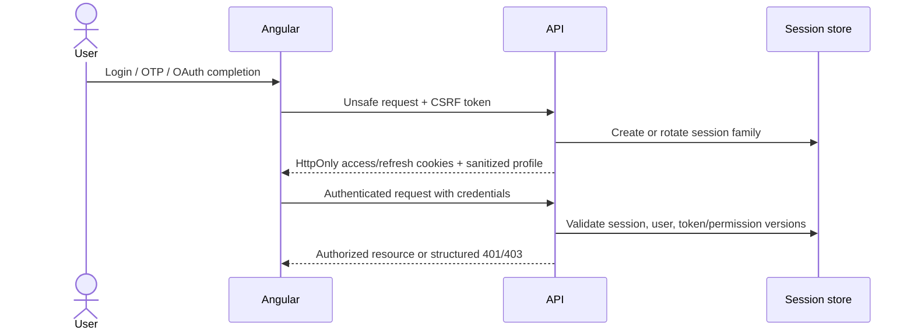
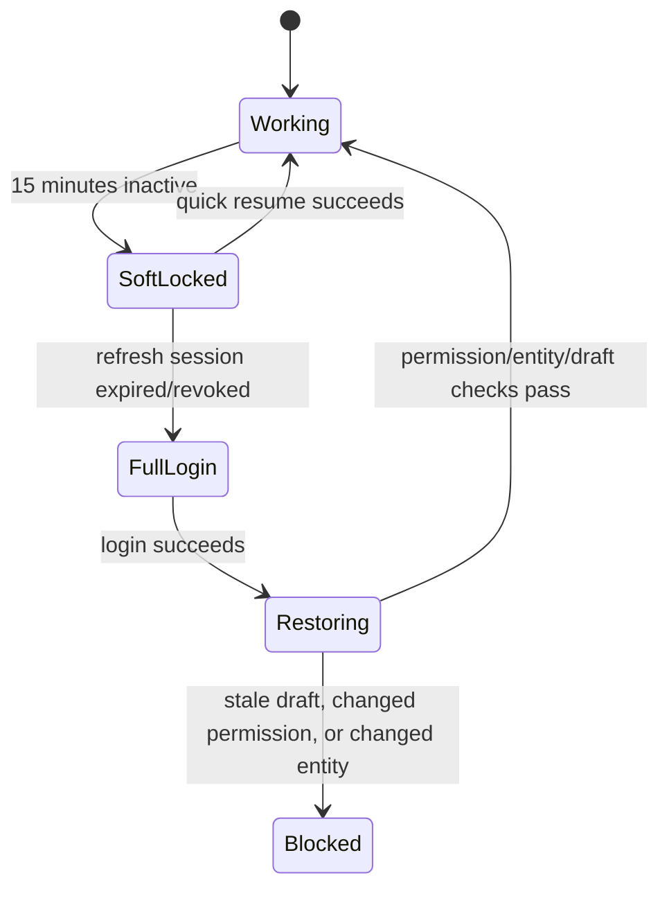

# Identity, account, and admin resume

The API executes cookie-session auth for storefront and admin audiences. Storefront capabilities include verified-before-creation signup with server-held resume/discard state, password and OTP login by email or phone, Google/Facebook verification, identity connect/disconnect, password/session management, profile/address/contact self-service, guest-cart adoption, logout, refresh, recovery, and `me`. Admin capabilities include recovery, password/PIN login, PIN management/lockout, invites, HTTP resume, logout, refresh, `me`, Account Security, and the idle soft lock. Admin authority uses a closed **89-code** permission registry, active role assignments, deny-by-default management routes, no-delegation/last-administrator/offboarding controls, and operator bootstrap. Responses are sanitized and reusable credentials stay in httpOnly cookies. Both Angular applications consume sessions through typed gateways with no browser-held token. Remaining work includes complete Google/Meta provider-account round trips, Meta console verification, real-browser PIN-login proof, granular adoption by older privileged routes, protected deep-link/pending-intent continuation, portal private-access deployment, and soft-delete operations.

## Storefront methods

Email or phone can identify password and OTP login. Signup creates no customer until both email and phone are verified, and finalisation reads those proven values from server-held pending state. `GET /auth/storefront/signup` lets the browser recover that safe projection after a reload; `DELETE /auth/storefront/signup` explicitly abandons it. Finalisation resolves identifier ownership before consuming proof, then commits the customer row, optional password credential, and provider identity together. Google and Facebook verifier adapters and storefront provider controls are present; real use requires configured credentials, approved origins, provider-console acceptance, and a complete browser/account round trip. Guest browsing remains first-class: public pages do not 401 a true guest. `GET /auth/storefront/me` is an identity probe that returns 200 `{ user: null }` when neither access nor refresh cookies are present; expired access with a live refresh still 401s so rotation can run. Cart routes enforce Principal ownership or hashed `st_guest` proof, and signup or social sign-in attempts to adopt a proven guest cart without invalidating a successful authentication when merge fails. Gated `/account/*` uses the storefront AuthGuard redirect rather than manufacturing a 401. Pending-intent continuation remains open.

### Social-signup continuation and abandonment

An unknown Google or Facebook subject begins a server-held signup and navigates to `/auth/register`. On every browser arrival, registration reads the pending projection before presenting the form. Provider-supplied name and email are prefilled, a provider-verified email is locked, social-origin flows do not request a password, other provider controls are hidden, and the remaining phone proof is made explicit. Refresh preserves the record. In-app navigation away runs a non-blocking discard request; TTL expiry is the fallback.

Abandoning a Google-origin signup also asks Google Identity Services to revoke this site's grant for that email hint. This does not sign the person out of Google; it means a later attempt may require account selection and consent again. A completed signup keeps the grant. Facebook initialization waits for `fbAsyncInit`, reads the current `window.FB` at call time, and keeps `FB.login()` synchronous with the user gesture; separate initialization and callback watchdogs settle unavailable/stranded states. OAuth state is re-armed after refusals or staleness. Connect mode emits the provider credential to the step-up owner for both providers rather than entering the sign-in flow.

## Browser session model

Angular stores sanitized user/session status, never access or refresh secrets.

## Authentication outcome rules

- Login failure is enumeration-safe.
- OTP/reset requests respond generically regardless of whether an account exists.
- OTPs are short-lived, rate-limited, single-purpose, and one-time-use.
- OAuth validates state, provider, redirect, nonce, and verified identity facts.
- Provider state is single-use and re-armed after refusal/staleness; connect mode never silently becomes sign-in.
- Disabled/locked/deleted users receive no new session.
- Refresh rotation invalidates the previous token; reuse revokes the family.
- Password/role changes invalidate affected sessions or permission versions.

## Account data

The current account API owns the signed-in customer profile name, addresses, login methods, sessions, and pending email/phone changes. Account screens read the authenticated customer rather than a static account record. Address add/update operations use one atomic Mongo statement so concurrent customer/operator edits do not replace the whole array. Contact confirmation consumes the proof, changes the unique identifier, and records the audit event in one transaction; a unique-index race returns `contact_in_use`. Order history, wishlists, reviews, saved items, notifications, points, and wallet/credit remain separate capabilities and must not be inferred from the account shell. Personalized records are not public offline cache, and object lookups enforce ownership.

## Admin authentication

Admin/staff password and PIN login accept email-or-username, and the global guard enforces audience, role, declared permissions, and current permission versions. Effective permissions combine transitional embedded grants with active assignments under a coarse-tier ceiling. Password recovery, invite create/list/revoke/acceptance and authenticated HTTP resume are exposed. The permission registry, role CRUD, authority inspection, role grant/revoke and account-status APIs are live with named permission checks, audit evidence, no-delegation-above-self, last-administrator protection and offboarding session revocation. Self-registration and social login are not admin launch methods; older privileged routes that declare only roles have not all migrated to granular permissions.

## Admin deep-link and soft-lock flow

This diagram reflects the live admin soft-lock client. After 15 minutes of inactivity the shell opens the idle-lock modal; resume uses the preferred method (PIN when configured, otherwise password) through `POST /auth/admin/resume`. The API also enforces admin session idle lifetime and PIN lockout. Reload/crash/route-exit recovery for complex forms still requires feature-owned drafts or autosave.

## Safe admin resume order

1. Preserve only allowed workflow state.
2. Reauthenticate using the preferred quick-resume method.
3. Revalidate active user, session, token version, and permission version.
4. Revalidate the target entity/version.
5. Restore draft through the normal form mapping/validation path.
6. Retry a blocked unsafe request only when explicitly safe and idempotent.

RBAC failures are not queued. A 403 remains blocked until permissions actually change.

## Dynamic draft requirements

Complex product/order/invoice forms need enough draft metadata to reconstruct conditional controls, including product type, option semantic roles, generated variant inputs, add-on groups, measurements, current step/tab, and unsaved media references. Draft restoration must never bypass normal validation.

## Current and target boundary

The API session lifecycle, resumable verified signup/provider/account flows, transactional identity/contact writes, authentication-time guest-cart adoption, recovery/invite endpoints, operator bootstrap, fine-grained admin management APIs, Account Security, idle-lock resume, and cart/order ownership checks are implemented, and both Angular clients use the shared cookie transport. Focused browser evidence covers SDK-object reachability and pending-signup continuation/abandonment, but complete Google and Meta account round trips, Meta console verification, real-browser PIN-login proof, complete granular migration, and protected deep-link/pending-intent continuation keep the end-to-end capability incomplete.
