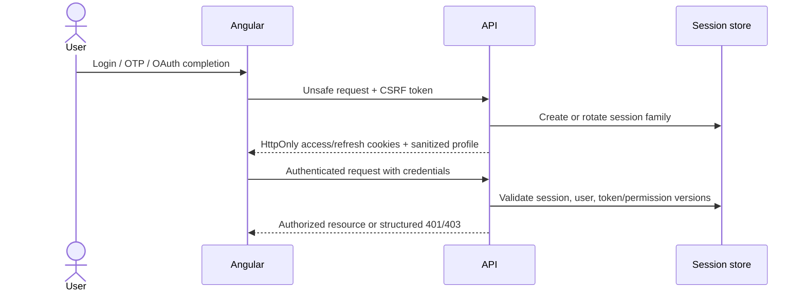
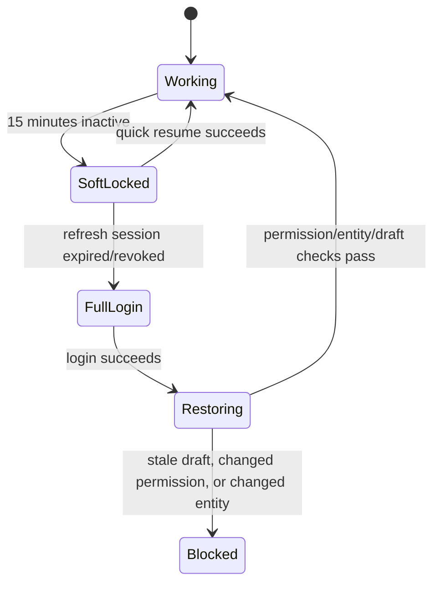

# Identity, account, and admin resume

The API executes cookie-session auth: storefront registration/password/OTP login, logout, refresh, password reset, email verification and `me`; admin recovery, password/PIN login, PIN setup/lockout, invite lifecycle, HTTP resume, logout, refresh and `me`; audience separation; permission-version invalidation; and rotating persisted refresh families. Admin authority additionally uses a closed permission registry, active role assignments, deny-by-default management routes, no-delegation/last-admin/offboarding controls and an operator-only first-admin bootstrap. Responses are sanitized and reusable credentials stay in httpOnly cookies. Both Angular applications consume the session through one typed auth gateway each, with no browser-held token. The shared transport implements CSRF acquisition, per-tab refresh single-flight, cross-tab rotation exclusion, deterministic refusal handling and loop prevention. The admin Security Settings and idle soft-lock clients, real-browser PIN proof, granular adoption by older privileged routes, and protected deep-link continuation remain incomplete.

## Storefront methods

Email/password, email OTP and email-verification completion/resend are implemented at the API boundary. Google/Facebook OAuth verification remains open. Guest browsing/cart remains first-class: cart routes enforce Principal ownership or hashed `st_guest` proof, while guest→user merge remains Chunk G.

## Browser session model

Angular stores sanitized user/session status, never access or refresh secrets.

## Authentication outcome rules

- Login failure is enumeration-safe.
- OTP/reset requests respond generically regardless of whether an account exists.
- OTPs are short-lived, rate-limited, single-purpose, and one-time-use.
- OAuth validates state, provider, redirect, nonce, and verified identity facts.
- Disabled/locked/deleted users receive no new session.
- Refresh rotation invalidates the previous token; reuse revokes the family.
- Password/role changes invalidate affected sessions or permission versions.

## Account data

Addresses, order history, wishlists, reviews, saved-for-later items, notifications, and profile facts are authenticated server state. They are not public offline cache. Every object lookup enforces ownership.

## Admin authentication

Admin/staff password and PIN login accept email-or-username, and the global guard enforces audience, role, declared permissions, and current permission versions. Effective permissions combine transitional embedded grants with active assignments under a coarse-tier ceiling. Password recovery, invite create/list/revoke/acceptance and authenticated HTTP resume are exposed. The permission registry, role CRUD, authority inspection, role grant/revoke and account-status APIs are live with named permission checks, audit evidence, no-delegation-above-self, last-administrator protection and offboarding session revocation. Self-registration and social login are not admin launch methods; older privileged routes that declare only roles have not all migrated to granular permissions.

## Admin deep-link and soft-lock flow

This diagram remains target client behavior. The API enforces a 15-minute admin session idle lifetime, PIN lockout and authenticated resume revalidation, but the Angular soft-lock overlay and orchestration are not implemented. Reload/crash/route-exit recovery still requires feature-owned drafts or autosave.

## Safe admin resume order

1. Preserve only allowed workflow state.
2. Reauthenticate using the preferred quick-resume method.
3. Revalidate active user, session, token version, and permission version.
4. Revalidate the target entity/version.
5. Restore draft through the normal form mapping/validation path.
6. Retry a blocked unsafe request only when explicitly safe and idempotent.

RBAC failures are not queued. A 403 remains blocked until permissions actually change.

## Dynamic draft requirements

Complex product/order/invoice forms need enough draft metadata to reconstruct conditional controls, including product type, option semantic roles, generated variant inputs, add-on groups, measurements, current step/tab, and unsaved media references. Draft restoration must never bypass normal validation.

## Current and target boundary

The API session lifecycle, recovery/invite endpoints, first-admin operator bootstrap, fine-grained admin management APIs and cart/order ownership checks are real, and both Angular clients use the shared cookie transport. Missing OAuth verification, the admin Security Settings and idle-lock/quick-resume clients, browser PIN proof, complete granular migration, protected deep-link continuation and guest→user merge keep the end-to-end capability incomplete.
