import { CommerceJourneyAtlas } from '@site/src/components/CommerceJourneyAtlas';

# Business and commerce journey atlas

A business journey crosses more boundaries than a screen or endpoint. This section follows customer and operator intent through routes, UI state, contracts, API composition, domain rules, persistence, external ports, and recovery.

Use the atlas to select a journey and switch between three evidence lenses:

- **Current code** — what exists in this repository now.
- **Ratified target** — the authoritative intended behavior.
- **Failure recovery** — how the system must remain safe and understandable when the happy path breaks.

<CommerceJourneyAtlas />

## Read the deep dives

1. [Discovery and product configuration](./discovery-and-product-configuration)
2. [Cart, authentication intent, and offline reconciliation](./cart-and-intent)
3. [Checkout, pricing, tax, currency, and shipping](./checkout)
4. [Payment and order lifecycle](./payment-and-order-lifecycle)
5. [Returns, refunds, and notifications](./returns-refunds-and-notifications)
6. [Identity, account, and admin resume](./identity-account-and-admin-resume)
7. [Failure recovery and debugging](./failure-recovery-and-debugging)

## The trace every page should expose

```mermaid
flowchart LR
    Intent["Customer or operator intent"] --> Route["Route / page"]
    Route --> Feature["Feature composition"]
    Feature --> State["Query / store / form"]
    State --> Contract["Shared zod contract"]
    Contract --> API["API operation"]
    API --> UseCase["Domain use case"]
    UseCase --> Port["Port"]
    Port --> Adapter["Adapter"]
    Adapter --> External["MongoDB or provider"]
    External --> Result["User-visible result"]
```

Not every current journey reaches every box. A missing segment is a documented implementation gap, not an invitation to pretend the flow is complete.

Shared auth/session/consent/audit/notification contract scaffolds now describe several target boxes, but those shapes do not prove a route, use case, collection, adapter, or end-to-end journey exists. The **Current code** lens advances only when those runtime boundaries land and are verified.

## Evidence hierarchy

| Question                                   | Primary evidence                                               |
| ------------------------------------------ | -------------------------------------------------------------- |
| What does the UI do now?                   | Tested route/component/state behavior                          |
| What HTTP shape exists?                    | `packages/contracts`, controller validation, generated OpenAPI |
| What must the business flow eventually do? | Ratified decisions and the canonical technical knowledge base  |
| What data is durable?                      | Adapter models, indexes, mappings, and verified transactions   |
| What does an external provider do?         | Its adapter plus current official provider documentation       |

## Commerce invariants

These rules apply across the deep dives:

- Canonical product price is INR.
- Angular never authoritatively calculates checkout totals.
- Product, variant, add-on, bundle, price, promotion, tax, stock, and shipping eligibility are revalidated by the API.
- Guest cart is supported; guest checkout is not available at launch.
- Authentication merges the guest cart before replaying one pending intent.
- Orders snapshot purchased facts so later catalogue changes cannot rewrite history.
- Payment, shipment, return, and refund records have separate lifecycles.
- UI permissions improve usability but do not authorize an operation.
- Sensitive account, order, payment, and admin data is never treated as offline public cache.

:::info Why target flows appear before implementation

The portal may document a ratified target before code exists, but lifecycle status and the **Current code** lens make that distinction explicit.

:::
