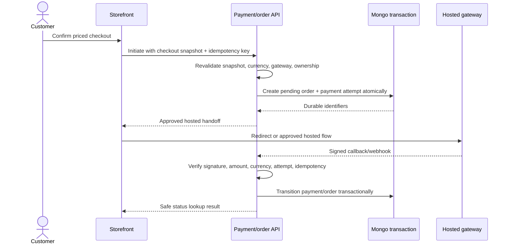
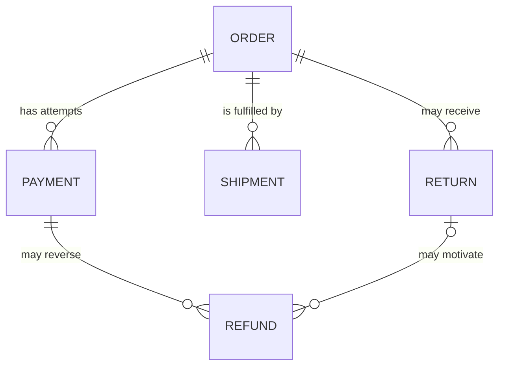

# Payment and order lifecycle

The API currently has order creation/list/detail/status scaffolding and the core domain defines a payment gateway port. Provider adapters, customer payment execution, hosted handoff, callback/webhook verification, and full transactional persistence are not wired.

## Gateway selection

| Paid currency                | Gateway  | Decision owner                |
| ---------------------------- | -------- | ----------------------------- |
| INR                          | CCAvenue | API checkout/payment use case |
| Any enabled non-INR currency | PayPal   | API checkout/payment use case |

Angular does not choose a trusted gateway from an arbitrary client flag. The server derives it from the validated paid currency and active configuration.

## Initiation and confirmation

Gateway credentials, encryption/signing keys, and webhook secrets remain server-side behind `PaymentGatewayPort`.

## Why order and payment are separate

One order can have multiple payment attempts. A failed attempt must not erase the shopping record, and a gateway callback must not rewrite immutable purchased facts.

## Order snapshot

Every purchased line freezes enough information to remain correct after product edits or archival:

- product and optional variant identifiers;
- title, slug, SKU, product type, and category context;
- chosen variation attributes;
- named add-ons and captured measurements;
- image/asset reference;
- unit and line totals in INR and paid currency;
- resolved promotion and tax lines;
- return/refund eligibility facts; and
- product status at purchase.

Order history must render from the snapshot, not from the current product document.

## Lifecycle separation

### Order

`pending → paid → processing → shipped → delivered`, with explicit cancellation/refund paths. Real business rules may add finer internal states, but transitions must be validated and appended to a timeline.

### Payment attempt

`initiated → authorized/captured` or `failed`, with later partial/full refund states. Callback arrival order and retries must be idempotent.

### Shipment

Quote, label, pickup, transit, delivery, failure, and cancellation remain shipment events—not overloaded order/payment fields.

## Idempotency and callback safety

- Client retries reuse an idempotency key tied to the same priced snapshot.
- Provider callbacks are authenticated and verified against stored amount/currency/order/attempt.
- Repeated valid callbacks return the existing result rather than creating another order.
- Browser return URLs are not payment proof.
- Unknown, mismatched, or stale callbacks fail closed and enter an auditable investigation path.

## Ownership and authorization

Customer order list/detail operations must verify that the authenticated customer owns the resource. Admin/staff transitions require explicit permissions. A guarded route or a supplied order ID is never sufficient authorization.

The current order controller is a scaffold. Its presence does not advance production readiness until object-level authorization, cookie-session/CSRF behavior, transactional persistence, provider confirmation, and tests are verified.

## Mandatory numbering decision gate

The contracts already reserve an `orderNumber`, but the legal/business numbering policy is not locked. Before implementing order, tax-invoice, purchase-invoice, or adjacent numbering behavior, stop and obtain the owner’s decisions on:

- financial-year reset versus perpetual sequence;
- company code, separators, and zero-padding;
- consecutive/gapless requirements and cancellation handling; and
- separate sequences for order, tax invoice, and purchase invoice.

Do not generate production numbering from database counts, random IDs, timestamps, or a frontend formatter. India financial-year boundaries are calculated in IST, and issued invoice evidence must remain immutable.

## Failure matrix

| Situation                       | Order                                         | Payment                              | Customer experience                  |
| ------------------------------- | --------------------------------------------- | ------------------------------------ | ------------------------------------ |
| Provider handoff fails          | Remains pending/abandoned according to policy | Attempt failed/not started           | Retry safely without duplicate order |
| Browser closes                  | Durable pending state remains                 | Await callback/status reconciliation | Resume from account/order status     |
| Callback delayed                | Do not mark paid from browser return          | Pending                              | Explain processing and poll safely   |
| Amount mismatch                 | Do not fulfil                                 | Flag/failed review                   | Safe generic message; operator alert |
| Duplicate callback              | No duplicate transition                       | Return existing result               | Stable confirmation                  |
| Stock changed before initiation | Do not initiate                               | None                                 | Return to corrected checkout         |

## Debugging checkpoints

1. Trace the checkout snapshot ID/version and idempotency key.
2. Check the server-derived gateway and paid currency.
3. Inspect order and payment attempt independently.
4. Verify provider signature and amount/currency match.
5. Inspect the append-only status timeline/audit evidence.
6. Confirm ownership/permission checks before exposing detail.
7. Never rely on the browser success page as settlement evidence.
