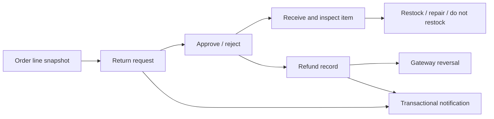

# Returns, refunds, and notifications

Customer refund UI and admin refund/notification surfaces exist, but their production backend workflows are not connected. The target separates physical return logistics, financial reversal, shipment state, and customer communication.

## Separate lifecycles

A refund can exist without a physical return, and a return can be rejected without a refund. Do not collapse both into one order status.

## Return facts

An item-level return records:

- order and line identity;
- quantity;
- reason code and optional condition;
- customer/actor ownership;
- request, approval/rejection, receipt, and close timestamps; and
- restock, repair, or do-not-restock decision.

Eligibility is based on immutable order-line facts plus current policy—not the current product page.

## Refund facts

A financial reversal records:

- order and optional return/payment identifiers;
- amount and currency;
- INR equivalent;
- reason;
- pending/processed/failed status; and
- provider refund reference.

Partial refunds must never accidentally move an entire payment/order into a fully refunded state.

## Notifications

Customer messaging flows through `NotificationPort`, with SMS, WhatsApp, and email behind swappable adapters. The ratified primary provider is **MSG91** (SMS, WhatsApp, and email, including authentication OTP), with an optional email fallback (`resend`, `ses`, or `smtp`) that is never primary. The API validates provider configuration and currently binds a `ConsoleNotificationAdapter` development seam used by live OTP orchestration. Mongo models and repositories persist notification settings, templates, usage and outbox facts, consent events, and broad audit evidence. A production MSG91 adapter, fallback adapters, and complete notification workflow and side-effect orchestration remain planned, so provider delivery is not production-implemented. Transactional and marketing controls are separate.

| Category              | Examples                                               | Consent/availability rule                                                             |
| --------------------- | ------------------------------------------------------ | ------------------------------------------------------------------------------------- |
| Transactional/utility | OTP, payment, order status, shipment, refund, security | Keep available subject to legal/provider rules; use an enabled fallback where defined |
| Marketing             | Campaigns, promotions, abandoned-cart marketing        | Explicit consent and independent caps/kill switches                                   |

Channel/settings mutations are restricted, server-authorized, versioned, and audited. Hiding the admin menu is not enough.

## Delivery semantics

- Business state changes do not roll back merely because a notification provider is temporarily unavailable.
- Durable outbox/log records distinguish queued, sent, delivered, failed, and suppressed outcomes.
- Provider retries are idempotent.
- Templates are versioned and localized according to their content machine.
- Disabled channel/category combinations short-circuit before provider calls.
- No sensitive data is placed in a message beyond the approved template requirement.

## Failure matrix

| Failure                           | Required behavior                                                            |
| --------------------------------- | ---------------------------------------------------------------------------- |
| Return line not owned by customer | Deny without exposing order details                                          |
| Return window/condition invalid   | Explain policy outcome; do not create refund                                 |
| Provider refund fails             | Keep refund failed/pending with retry/manual review; do not claim completion |
| Duplicate refund command          | Return existing idempotent result                                            |
| Notification provider unavailable | Queue/retry or use approved fallback; preserve business state                |
| Marketing consent absent          | Suppress marketing message and record why                                    |
| Transactional channel disabled    | Use an approved enabled channel or escalate operationally                    |

## Operator checklist

- Verify actor, order, line, quantity, and eligibility.
- Inspect captured payment currency and refundable amount.
- Keep return and refund statuses separate.
- Require confirmation and permission for manual financial actions.
- Record provider reference and audit event.
- Communicate only after the durable state transition succeeds.
- Never expose raw provider payloads or secrets in the portal/UI.
