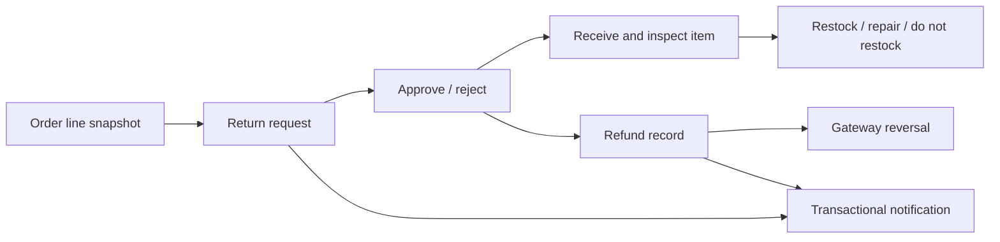

# Returns, refunds, and notifications

This page describes how returns, refunds and customer messages work together. Notifications are built. Returns and refunds are planned: the storefront and admin have refund screens, but no backend.

## Separate lifecycles

```mermaid
flowchart LR
    Order["Order line snapshot"] --> Return["Return request"]
    Return --> Review["Approve / reject"]
    Review --> Logistics["Receive and inspect item"]
    Logistics --> Inventory["Restock / repair / do not restock"]
    Review --> Refund["Refund record"]
    Refund --> Payment["Gateway reversal"]
    Return --> Notice["Transactional notification"]
    Refund --> Notice
```

A refund can exist without a physical return, and a return can be rejected without a refund. Do not collapse both into one order status.

## Return facts

An item-level return records:

- Order and line identity.
- Quantity.
- Reason code and optional condition.
- Customer or actor ownership.
- Request, approval, receipt and close timestamps.
- A restock, repair or do-not-restock decision.

Eligibility comes from immutable order-line facts and current policy, not the current product page.

## Refund facts

A financial reversal records:

- Order and optional return and payment identifiers.
- Amount and currency.
- INR equivalent.
- Reason.
- Pending, processed or failed status.
- Provider refund reference.

A partial refund must never move a whole payment or order into a fully refunded state.

## Notifications

Customer messages go through `NotificationPort`.

| Setting                                | Adapter                      | Behaviour                                                                               |
| -------------------------------------- | ---------------------------- | --------------------------------------------------------------------------------------- |
| `NOTIFICATION_PROVIDER=msg91`, key set | `Msg91NotificationAdapter`   | Sends email, SMS and WhatsApp through MSG91                                             |
| `console`, or `msg91` without a key    | `ConsoleNotificationAdapter` | Logs that a message would be sent, with the destination hashed and the content withheld |

The MSG91 adapter applies channel kill-switches, plan limits and marketing consent, and records each message in the outbox. A repeated idempotency key returns the first result. Email uses the template key as the MSG91 template id, SMS uses the Flow id and WhatsApp uses the approved template name. These values are stored in `notificationTemplates` and edited from the admin notification screens. The MSG91 key stays in the API environment.

| Category      | Examples                                      | Rule                                                        |
| ------------- | --------------------------------------------- | ----------------------------------------------------------- |
| Transactional | OTP, order status, shipment, refund, security | Sent subject to legal and provider rules                    |
| Marketing     | Campaigns, promotions, abandoned cart         | Needs explicit consent, with its own caps and kill-switches |

## Channel settings

Each channel and category pair has one settings row, held in the database and changed only by holders of `setting.edit`. A row can record a plan limit and a warning threshold, which defaults to 80%. With `autoDisableAtLimit` on, reaching the limit stops the pair. Settings hold no provider secrets.

Every attempt writes an outbox row with a hashed destination. A suppressed send is an expected outcome, not an error. Its status is `suppressed_channel_disabled`, `suppressed_no_consent` or `suppressed_plan_limit`.

## Delivery rules

- A business state change does not roll back because a provider is unavailable.
- Outbox records distinguish queued, sent, delivered, failed and suppressed outcomes.
- Provider retries are idempotent.
- Disabled channel and category combinations stop before any provider call.
- No sensitive data appears in a message beyond the approved template.

## Failure matrix

| Failure                            | Required behaviour                                         |
| ---------------------------------- | ---------------------------------------------------------- |
| Return line not owned by customer  | Deny without exposing order details                        |
| Return window or condition invalid | Explain the outcome; create no refund                      |
| Provider refund fails              | Keep the refund failed or pending with retry or review     |
| Duplicate refund command           | Return the existing result                                 |
| Notification provider unavailable  | Retry or use an approved fallback; preserve business state |
| Marketing consent absent           | Suppress the message and record why                        |
| Transactional channel disabled     | Use an enabled channel or escalate                         |

## Operator checklist

- Verify the actor, order, line, quantity and eligibility.
- Inspect the payment currency and refundable amount.
- Keep return and refund statuses separate.
- Require confirmation and permission for manual financial actions.
- Record the provider reference and audit event.
- Notify only after the durable state change succeeds.
- Never expose raw provider payloads or secrets in the UI.

## Limitations

- No return or refund collection, route or provider call exists.
- Optional email fallback providers are configuration values only; no fallback adapter exists.
- The SMS adapter sends the Flow id as both `template_id` and `flow_id`, until a live send confirms which field MSG91 uses.
