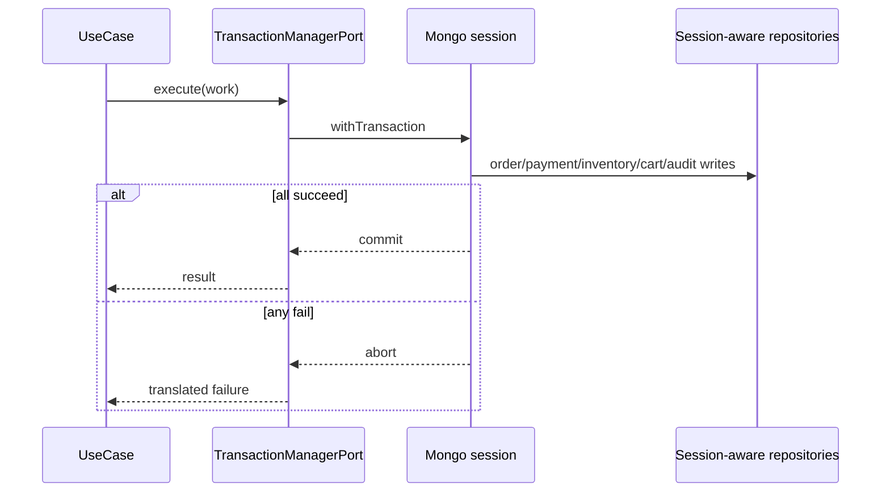
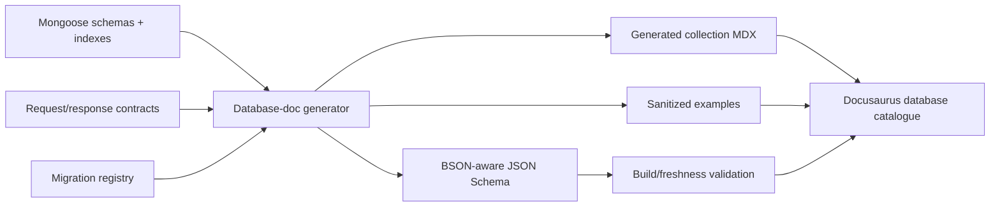

# Transactions and generated catalogue

The transaction infrastructure **and the shared transaction capability now exist**. The `rs0` single-node replica set is provisioned by the Docker profile, `TransactionManagerPort` is implemented by `MongoTransactionManager`, nested calls join the outer `AsyncLocalStorage` session, the adapter is bound in API dependency injection, and six replica-set integration tests prove commit and rollback behavior. The order workflow has not adopted that capability: it still saves the order and then deletes the cart in separate writes, so order creation is not atomic.

## Why a replica set is required

A standalone Mongo process does not provide the multi-document transaction behavior this architecture requires. Local and production use the same single-node replica-set profile (`rs0`) so transaction code is exercised before deployment. The replica set and transaction manager are proven; workflow-level transactional boundaries remain adoption work.

A single-node replica set provides transactions, not high availability. Backups, restore drills, resource monitoring, and a later redundancy plan remain necessary.

## Transaction capability and workflow target

The core port now describes an atomic unit without leaking a Mongoose `ClientSession`, and the Mongo adapter translates that boundary into its session. The remaining target is for multi-write use cases such as order placement to execute their repository calls inside it.

## Transactional workflows

At minimum:

- session creation/refresh rotation where identity/session/audit facts agree;
- guest-to-user cart merge;
- place order with order, payment attempt, inventory/reservation/ledger, cart, audit/outbox;
- verified payment callback with payment/order/inventory/audit;
- purchase-invoice posting with header/lines/ledger/FIFO layers/stock/audit;
- return/refund with order/payment/refund/inventory facts;
- sensitive admin changes with associated audit/outbox when atomicity is required.

Do not wrap external network calls inside a long database transaction. Use durable intent/state, provider idempotency, and outbox/reconciliation patterns around the transactional local changes.

## Transaction rules

- Keep the callback bounded and deterministic.
- Do not run parallel operations inside one transaction with `Promise.all`.
- Pass transaction context explicitly to participating repositories.
- Generate or reserve idempotency/correlation evidence before unsafe retries.
- Treat unknown commit result as a reconciliation problem, not automatic failure/success.
- Test rollback after every participating write.
- Do not delete accounting/order history to preserve numbering gaplessness; cancel/void with audit state.

## Order-number gate

Numbering is still an owner decision. Before implementing order, tax-invoice, purchase-invoice, or neighboring sequence behavior, stop and obtain:

- financial-year reset or perpetual mode;
- company code, separators, and padding;
- gapless/consecutive policy and cancellation handling;
- separate sequence decisions for each document type.

Business periods use India financial-year boundaries in IST, while stored timestamps remain UTC. Generated invoices are frozen in IST.

## Migration discipline

Every persistent shape/index change should state:

1. forward schema/index change;
2. compatibility window for old code/data;
3. backfill or lazy-upgrade behavior;
4. deploy ordering;
5. verification query/metric;
6. rollback/roll-forward plan;
7. retention and backup impact;
8. generated catalogue change.

Never assume a Mongoose schema edit automatically migrates historical documents.

## Current generated catalogue

The composite portal publishes a source-only **Schema Observatory** at `/database/catalogue/`. The 2026-08-01 regeneration imports every exported Mongoose model without opening a connection and measures:

- 32 current models;
- 406 schema paths;
- 89 indexes;
- 27 paths whose `Mixed` or array-of-`Mixed` shape is explicitly marked temporary;
- 13 excluded-by-default credential, PIN, token, code, state, nonce, PKCE, CSRF and private-contact fields, all omitted from synthetic previews.

The catalogue covers the seven original models plus the 25 D/E identity, consent, catalogue, variant, merchandising, media, inventory, governance, notification and content models. Only `reviews` among the new target-backed physical names resolves exactly to a locked Schema Nebula node; lowercase Mongoose defaults do not promote mismatched lower-camel stars, and `authratelimits` remains outside the 64-node graph. The catalogue remains a current-evidence scaffold, not the finished database dictionary: it does not claim complete HTTP/workflow adoption, migration history, retention completeness, or complete nested validators.

## Target-complete catalogue gate

The catalogue remains **scaffolded** until:

1. persistence models reflect the reconciled backend phase rather than temporary simplified shapes;
2. nested schemas/validators and indexes are explicit enough to generate useful output;
3. DTO-to-persistence mappings are named and stable;
4. the generator can run deterministically without production access;
5. generated files are clearly marked and pre-build freshness is enforced.

## Target generation pipeline

## One generated collection page

Each page must include:

- physical collection/model name and owning bounded context;
- domain purpose and lifecycle status;
- full field table with BSON/TypeScript meaning;
- required/optional/null/default/enum/validation details;
- nested object/array shape;
- references versus embedded decisions;
- unique, compound, partial, TTL and other indexes;
- sanitized example document;
- read/write paths and actor ownership;
- create/update/response DTO mapping;
- retention, deletion, archive and privacy behavior;
- sensitive/internal/excluded fields;
- transaction participation;
- migration history and verification date;
- source links back to models/contracts/migrations.

## Do not duplicate sources manually

Once generation exists, do not independently maintain a Mongoose schema, database validator, field-table Markdown, and index table by hand. Generate derived representations and keep human-authored pages focused on business meaning, tradeoffs, lifecycle and operations.

## Generation safety

- Run against source code/metadata, never by dumping production records.
- Examples are synthetic or rigorously sanitized.
- Never emit hash values, tokens, credentials, addresses, provider payloads, or customer data. Field names and exclusion policy may be documented; excluded-by-default fields must not appear in synthetic previews.
- Deterministic output keeps review diffs meaningful.
- CI fails when checked-in generated pages are stale.
- Generated pages show their generator version/source commit.

## Backup and restore proof

Database readiness eventually requires:

- scheduled backup success evidence;
- encrypted/offsite copy policy as adopted;
- documented retention;
- periodic restore into an isolated environment;
- application-level integrity checks after restore;
- measured recovery time/data-loss objectives;
- secret rotation and access audit.

A backup file that has never been restored is not a proven recovery plan.
