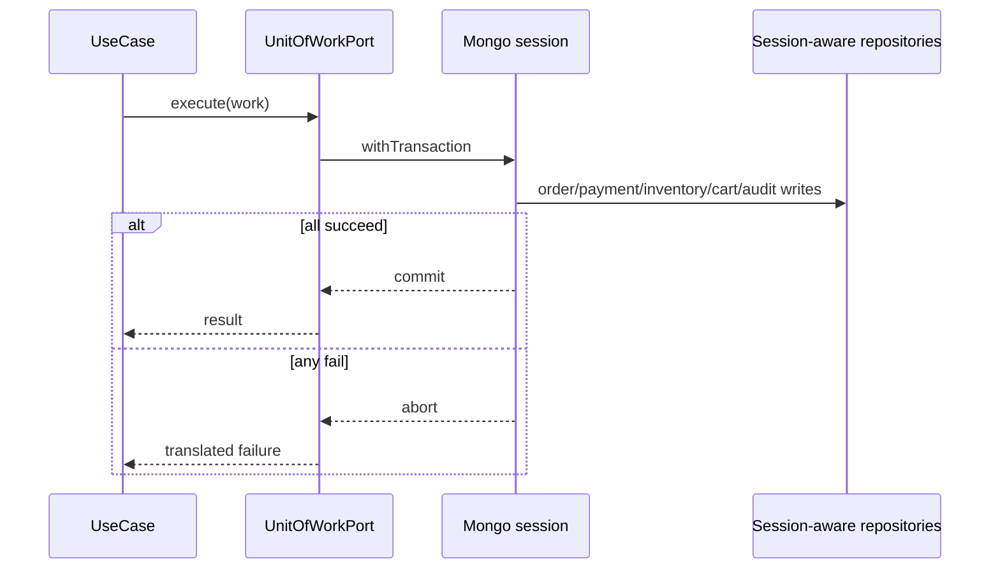
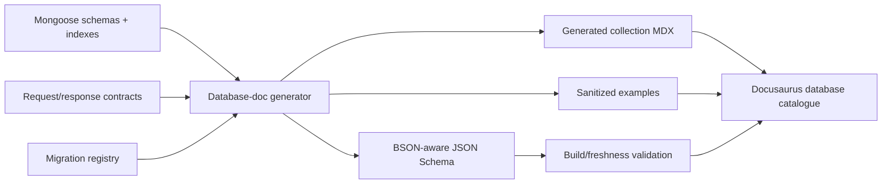

# Transactions and generated catalogue

The transaction **infrastructure now exists locally**, but the transaction **code does not yet**. The `rs0` single-node replica set is provisioned by the Docker profile (`docker/mongo/docker-compose.yml`, `pnpm mongo:up`), so multi-document transactions _can_ be exercised on a developer machine. What remains planned is the application side: there is no `UnitOfWorkPort`, no session-aware repository contract, and current repositories still perform individual writes. Order creation, for example, saves the order and then deletes the cart in two separate writes (`apps/api/src/orders/orders.service.ts`), which is not atomic.

## Why a replica set is required

A standalone Mongo process does not provide the multi-document transaction behavior this architecture requires. Local and production use the same single-node replica-set profile (`rs0`) so transaction code is exercised before deployment. The replica set is already running locally; the transactional code paths below are the planned work it unblocks.

A single-node replica set provides transactions, not high availability. Backups, restore drills, resource monitoring, and a later redundancy plan remain necessary.

## Unit of work target

The core port should describe an atomic unit without leaking a Mongoose `ClientSession`. The Mongo adapter translates the abstract transaction context into its session.

## Transactional workflows

At minimum:

- session creation/refresh rotation where identity/session/audit facts agree;
- guest-to-user cart merge;
- place order with order, payment attempt, inventory/reservation/ledger, cart, audit/outbox;
- verified payment callback with payment/order/inventory/audit;
- purchase-invoice posting with header/lines/ledger/FIFO layers/stock/audit;
- return/refund with order/payment/refund/inventory facts;
- sensitive admin changes with associated audit/outbox when atomicity is required.

Do not wrap external network calls inside a long database transaction. Use durable intent/state, provider idempotency, and outbox/reconciliation patterns around the transactional local changes.

## Transaction rules

- Keep the callback bounded and deterministic.
- Do not run parallel operations inside one transaction with `Promise.all`.
- Pass transaction context explicitly to participating repositories.
- Generate or reserve idempotency/correlation evidence before unsafe retries.
- Treat unknown commit result as a reconciliation problem, not automatic failure/success.
- Test rollback after every participating write.
- Do not delete accounting/order history to preserve numbering gaplessness; cancel/void with audit state.

## Order-number gate

Numbering is still an owner decision. Before implementing order, tax-invoice, purchase-invoice, or neighboring sequence behavior, stop and obtain:

- financial-year reset or perpetual mode;
- company code, separators, and padding;
- gapless/consecutive policy and cancellation handling;
- separate sequence decisions for each document type.

Business periods use India financial-year boundaries in IST, while stored timestamps remain UTC. Generated invoices are frozen in IST.

## Migration discipline

Every persistent shape/index change should state:

1. forward schema/index change;
2. compatibility window for old code/data;
3. backfill or lazy-upgrade behavior;
4. deploy ordering;
5. verification query/metric;
6. rollback/roll-forward plan;
7. retention and backup impact;
8. generated catalogue change.

Never assume a Mongoose schema edit automatically migrates historical documents.

## Current generated catalogue

The composite portal now publishes a source-only **Schema Observatory** at `/database/catalogue/`. Its generator imports the seven Mongoose models without opening a database connection and currently derives:

- 7 current models;
- 93 schema paths;
- 19 indexes;
- 11 paths whose `Mixed` or array-of-`Mixed` shape is explicitly marked temporary;
- safe synthetic shape previews that omit the excluded `passwordHash` field.

This is a truthful current-evidence scaffold, not the finished database dictionary. It does not promote any of Schema Nebula’s 57 target-only collections, and it does not yet claim stable DTO mappings, transaction participation, migration history, retention, or complete nested validators.

## Target-complete catalogue gate

The catalogue remains **scaffolded** until:

1. persistence models reflect the reconciled backend phase rather than temporary simplified shapes;
2. nested schemas/validators and indexes are explicit enough to generate useful output;
3. DTO-to-persistence mappings are named and stable;
4. the generator can run deterministically without production access;
5. generated files are clearly marked and pre-build freshness is enforced.

## Target generation pipeline

## One generated collection page

Each page must include:

- physical collection/model name and owning bounded context;
- domain purpose and lifecycle status;
- full field table with BSON/TypeScript meaning;
- required/optional/null/default/enum/validation details;
- nested object/array shape;
- references versus embedded decisions;
- unique, compound, partial, TTL and other indexes;
- sanitized example document;
- read/write paths and actor ownership;
- create/update/response DTO mapping;
- retention, deletion, archive and privacy behavior;
- sensitive/internal/excluded fields;
- transaction participation;
- migration history and verification date;
- source links back to models/contracts/migrations.

## Do not duplicate sources manually

Once generation exists, do not independently maintain a Mongoose schema, database validator, field-table Markdown, and index table by hand. Generate derived representations and keep human-authored pages focused on business meaning, tradeoffs, lifecycle and operations.

## Generation safety

- Run against source code/metadata, never by dumping production records.
- Examples are synthetic or rigorously sanitized.
- Never emit hashes, tokens, credentials, addresses, provider payloads, or customer data.
- Deterministic output keeps review diffs meaningful.
- CI fails when checked-in generated pages are stale.
- Generated pages show their generator version/source commit.

## Backup and restore proof

Database readiness eventually requires:

- scheduled backup success evidence;
- encrypted/offsite copy policy as adopted;
- documented retention;
- periodic restore into an isolated environment;
- application-level integrity checks after restore;
- measured recovery time/data-loss objectives;
- secret rotation and access audit.

A backup file that has never been restored is not a proven recovery plan.
