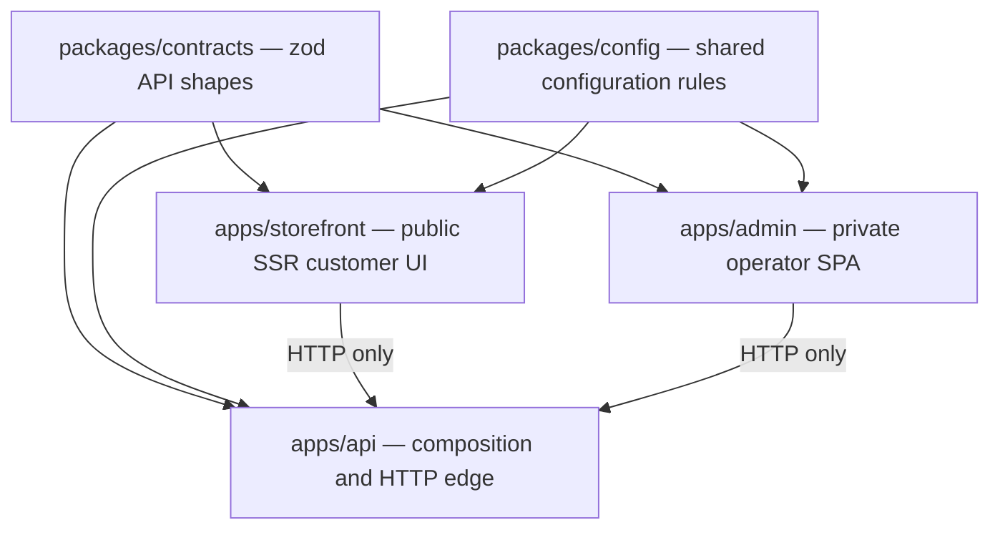

import { FrontendDecisionLab } from '@site/src/components/ApplicationAtlas';

# Frontend engineering system

Storefront and admin share core architectural choices but serve different users and runtimes. Reuse decisions and contracts where they are truly common; do not force customer and operator presentation into one component merely because both applications use Angular.

## State ownership lab

Choose the shape that best describes the value you are adding.

<FrontendDecisionLab />

## Cross-application boundaries

Angular applications may consume contracts and non-secret shared configuration. They must never import database, payment, shipping, storage, search, authentication, or other server adapters.

## Contracts today

`packages/contracts/src` contains zod-backed contract modules for cart, category, common pagination/problem shapes, currency, order, product, promotion, shipping, and user.

These contracts are the preferred trust boundary as real endpoints replace fixtures. Existing application-local interfaces still describe many fixture/view shapes; migrate deliberately rather than renaming them “contracts.”

## Reusable UI reality

Both applications currently maintain their own extensive `shared/ui` trees. A repository-level `packages/ui` implementation is not present in the current snapshot.

That means:

- reuse within an application is implemented;
- cross-application component reuse is not yet a real package capability; and
- new work should not import a package that does not exist or duplicate a complex widget solely to anticipate one.

When repeated behavior becomes genuinely stable across both applications, extract the smallest framework-compatible primitive with accessibility and test coverage.

## Layer choice

| If you are adding…        | Start in…                                             | Move outward only when…                          |
| ------------------------- | ----------------------------------------------------- | ------------------------------------------------ |
| URL entry                 | `pages/` for storefront; feature route file for admin | The route composes a real feature                |
| Feature journey           | `features/<feature>`                                  | Another feature needs a stable shared primitive  |
| Remote reader/write       | `data-access/queries` + `services`                    | A shared contract is defined                     |
| Cross-page client state   | `core/state`                                          | Ownership and lifetime justify application scope |
| Reusable visual primitive | Application `shared/ui`                               | Both apps have proven the same abstraction       |
| Pure formatter/helper     | `shared/util` or `shared/pipes`                       | It is independent of feature policy              |
| Boundary schema           | `packages/contracts`                                  | The shape is shared across API and consumer      |

## Runtime differences

| Concern           | Storefront                            | Admin                                     |
| ----------------- | ------------------------------------- | ----------------------------------------- |
| Primary user      | Shopper/crawler                       | Authenticated operator                    |
| Routing           | Analog file-based pages               | Explicit Angular lazy routes              |
| Rendering         | Dynamic SSR + hydration               | Browser SPA                               |
| SEO               | Product/category/content critical     | Normally private/no-index                 |
| Offline target    | Catalogue and cart planned            | Not a primary product requirement         |
| Density           | Customer comprehension and conversion | Efficient operator tables/forms           |
| Security emphasis | Session, cart ownership, checkout     | Fine-grained administrative authorization |

## Dependency rule

Before importing across boundaries, ask:

1. Is the dependency a contract, configuration value, or genuinely reusable UI primitive?
2. Does it point inward toward a stable abstraction?
3. Does it expose secrets, persistence shapes, or adapter behavior?
4. Would replacing the backend adapter force this frontend import to change?

If the last two answers are yes, the dependency is in the wrong layer.
