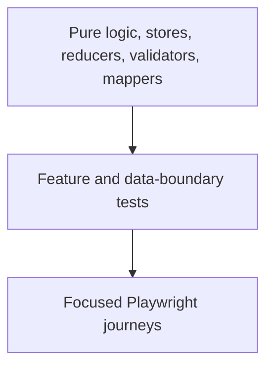

# Frontend quality and definition of done

The frontend application-unit foundation is focused but no longer empty. Storefront has **57** tests for its auth gateway, interceptor and session store; admin has **61** across the same transport/state boundary plus route protection. These do not yet constitute broad feature or component coverage.

Storybook is a separate component-rendering boundary: its automated inventory accounts for 141/141 reusable components across 290 Angular components, including the real social-sign-in component specimen. That does not cover the admin `App` shell, provider-account journeys, or replace feature/integration/Playwright tests.

This page defines the verification standard for new work while preserving an accurate baseline.

## Risk-based test pyramid

### Unit tests

Prioritize reducers/selectors/effects, SignalStore methods, zod parsing, form validators, command mapping, price/currency/variant calculations, and pure transformation helpers.

### Feature integration tests

Cover pending/error/empty/success states, route parameter changes, query enablement and invalidation, form validation mapping, permission-aware presentation, and SSR-safe storefront rendering.

### End-to-end journeys

Use Playwright for a small number of business-critical paths rather than duplicating every component assertion:

- catalogue → product detail → cart;
- cart → checkout handoff;
- login/account boundaries;
- social signup continuation across provider result → registration → reload/abandonment;
- admin list → create/edit operation once real writes exist; and
- authorization denial for privileged operations.

## Definition of done

A frontend change is not done because it renders once on a developer machine.

### Architecture

- [ ] The change is owned by the correct route, feature, data, state, or shared layer.
- [ ] Server records are not duplicated into client stores without a documented reason.
- [ ] Frontend code imports no server adapter.
- [ ] API shapes use shared zod contracts when the endpoint is real.

### Behavior

- [ ] Loading, empty, error, success, and retry behavior are intentional.
- [ ] Duplicate submissions and destructive actions are controlled.
- [ ] Repeated templates use a stable domain id, or a positional key only when the source has no unique identity.
- [ ] Fixture-backed and unwired seams remain clearly labelled until replaced.
- [ ] Price, stock, identity, and authorization assumptions are server-revalidated.

### Rendering and interaction

- [ ] Storefront direct SSR navigation and hydration were checked.
- [ ] Admin deep-link refresh reaches the correct shell.
- [ ] Keyboard, focus, touch target, screen-reader label, and reduced-motion behavior were checked.
- [ ] Dense tables/forms remain usable at supported widths.

### Verification

- [ ] TypeScript, formatting, lint, and relevant tests pass.
- [ ] High-risk logic has focused automated coverage.
- [ ] Provider popups, user-gesture constraints, navigation/reload semantics, and multi-page social flows have real-browser evidence; unit doubles are not presented as proof of those behaviors.
- [ ] No browser secrets or sensitive logs were introduced.
- [ ] The portal status, evidence paths, and verification date were updated.

## Status advancement rule

Visual completeness does not advance a capability from scaffolded to implemented. Advance only after the real data/write/security boundary and its tests satisfy the documented definition of done.
