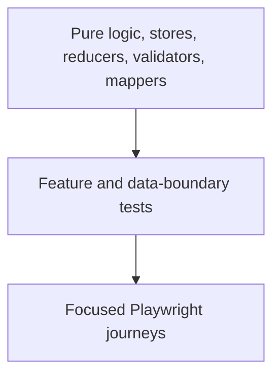

# Frontend quality and definition of done

The frontend application-unit foundation is not mature yet. The stale admin scaffold spec was deleted on 2026-07-31 after verification that it referenced a nonexistent component name and asserted obsolete title markup. `apps/admin` now has **zero unit specs** and stays green through `vitest run --passWithNoTests`; the storefront likewise has no unit-spec inventory. This must not be described as unit coverage.

Storybook is a separate component-rendering boundary: its automated inventory accounts for 139/139 reusable components across 282 Angular components. That does not cover the admin `App` shell or replace feature/integration/Playwright tests.

This page defines the standard new work should move toward without misrepresenting today’s baseline.

## Risk-based test pyramid

### Unit tests

Prioritize reducers/selectors/effects, SignalStore methods, zod parsing, form validators, command mapping, price/currency/variant calculations, and pure transformation helpers.

### Feature integration tests

Cover pending/error/empty/success states, route parameter changes, query enablement and invalidation, form validation mapping, permission-aware presentation, and SSR-safe storefront rendering.

### End-to-end journeys

Use Playwright for a small number of business-critical paths rather than duplicating every component assertion:

- catalogue → product detail → cart;
- cart → checkout handoff;
- login/account boundaries;
- admin list → create/edit operation once real writes exist; and
- authorization denial for privileged operations.

## Definition of done

A frontend change is not done because it renders once on a developer machine.

### Architecture

- [ ] The change is owned by the correct route, feature, data, state, or shared layer.
- [ ] Server records are not duplicated into client stores without a documented reason.
- [ ] Frontend code imports no server adapter.
- [ ] API shapes use shared zod contracts when the endpoint is real.

### Behavior

- [ ] Loading, empty, error, success, and retry behavior are intentional.
- [ ] Duplicate submissions and destructive actions are controlled.
- [ ] Mock seams remain clearly labelled until replaced.
- [ ] Price, stock, identity, and authorization assumptions are server-revalidated.

### Rendering and interaction

- [ ] Storefront direct SSR navigation and hydration were checked.
- [ ] Admin deep-link refresh reaches the correct shell.
- [ ] Keyboard, focus, touch target, screen-reader label, and reduced-motion behavior were checked.
- [ ] Dense tables/forms remain usable at supported widths.

### Verification

- [ ] TypeScript, formatting, lint, and relevant tests pass.
- [ ] High-risk logic has focused automated coverage.
- [ ] No browser secrets or sensitive logs were introduced.
- [ ] The portal status, evidence paths, and verification date were updated.

## Status advancement rule

Visual completeness does not advance a capability from scaffolded to implemented. Advance only after the real data/write/security boundary and its tests satisfy the documented definition of done.
