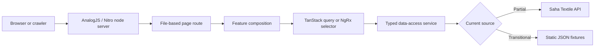

# Storefront orientation

The storefront is the public, search-facing Saha Textile shopping experience. It is an Angular 21 application hosted by AnalogJS, rendered dynamically through Nitro, and organized around file-based routes in `apps/storefront/src/app/pages`.

This area is **scaffolded**, not production-complete. The customer-facing page and feature surface is broad, but its data sources are mixed: catalogue listing has a real API seam, many readers still load JSON fixtures, and important writes such as authentication, checkout, refunds, reviews, and server-cart reconciliation remain unconnected.

## Recommended reading sequence

1. [Application atlas](./application-atlas) — discover what exists and filter it by implementation status.
2. [Routing and rendering](./routing-and-rendering) — understand how a URL becomes an SSR-rendered Angular page.
3. [State and data ownership](./state-and-data) — choose between TanStack Query, SignalStore, classic NgRx, and local signals.
4. [Contributor recipes](./contributor-recipes) — follow safe, beginner-oriented implementation checklists.

## Mental model

The page layer should stay thin. A route identifies the customer journey and composes a feature. The feature owns presentation and user interaction. Query/store layers own asynchronous or shared state. Services own transport details.

## Current implementation snapshot

| Concern              | Current evidence                                                               | Status      | Important boundary                                                            |
| -------------------- | ------------------------------------------------------------------------------ | ----------- | ----------------------------------------------------------------------------- |
| Routing              | Approximately 40 page entry files, including dynamic slug and catch-all routes | Implemented | Routes are discovered from filenames, not a central route array.              |
| Rendering            | Analog SSR enabled; Nitro emits a Node server                                  | Implemented | Static generation is disabled and no routes are prerendered.                  |
| Catalogue list       | `ProductService.getCatalog()` calls `/api/products`                            | Scaffolded  | Product-detail and several related readers still use JSON data.               |
| Cart                 | Classic NgRx reducer/effects/selectors plus browser persistence                | Implemented | This is the current client cart, not the future authenticated server cart.    |
| Server data          | TanStack Angular Query functions exist across the data-access layer            | Scaffolded  | Many query functions still wrap JSON-backed services.                         |
| Authentication       | Auth pages and a SignalStore session seam exist                                | Scaffolded  | The token/session behavior is a mock, not secure API authentication.          |
| Checkout             | UI, address, totals, delivery, and payment-selection surfaces exist            | Scaffolded  | Order placement and payment execution are not connected.                      |
| Internationalization | Transloco loader and switcher are wired                                        | Scaffolded  | Code currently advertises `en/fr`; the active locale set is configuration.    |
| PWA/offline          | Product requirement is ratified                                                | Planned     | The Vite PWA and Workbox integration is not present in current configuration. |

## Directory ownership

| Directory               | Owns                                                  | Should not own                         |
| ----------------------- | ----------------------------------------------------- | -------------------------------------- |
| `pages/`                | URL entry points, route metadata, feature composition | Business logic or transport code       |
| `features/`             | Customer journeys and feature-level presentation      | Raw HTTP construction                  |
| `data-access/queries/`  | Server-state keys, caching, selection, invalidation   | Reusable visual components             |
| `data-access/services/` | HTTP calls and response typing                        | Cross-page UI state                    |
| `core/state/`           | Application-wide client state and effects             | Remote-cache duplication without cause |
| `layout/`               | Header, footer, page shells                           | Catalogue or checkout rules            |
| `shared/ui/`            | Reusable presentational building blocks               | Feature-specific orchestration         |
| `shared/util/`          | Pure reusable helpers                                 | Angular component state                |

## Before making a storefront change

- Identify the URL or feature that owns the behavior.
- Check whether the data is server-owned, browser-owned, or component-local.
- Check the atlas for mock/API boundaries.
- Preserve SSR safety: browser globals require an explicit platform guard.
- Validate external data at the boundary when real API contracts are introduced.
- Add tests and update the portal evidence in the same change.

:::warning Do not infer readiness from visual completeness

A polished screen can still be JSON-backed or mutation-free. The implementation atlas and page provenance are the authoritative indicators.

:::
