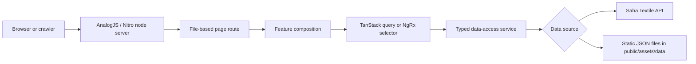

# Storefront orientation

The storefront is the public Saha Textile shop. It is an Angular 22 application hosted by AnalogJS and rendered on the server by Nitro. Routes are file-based, under `apps/storefront/src/app/pages`.

## Recommended reading sequence

1. [Application atlas](./application-atlas): see what exists and which parts are complete.
2. [Routing and rendering](./routing-and-rendering): how a URL becomes a rendered page.
3. [State and data ownership](./state-and-data): choose between TanStack Query, SignalStore, classic NgRx and local signals.
4. [Contributor recipes](./contributor-recipes): step-by-step checklists.

## Mental model

```mermaid
flowchart LR
    Browser["Browser or crawler"] --> Nitro["AnalogJS / Nitro node server"]
    Nitro --> Page["File-based page route"]
    Page --> Feature["Feature composition"]
    Feature --> Query["TanStack query or NgRx selector"]
    Query --> Service["Typed data-access service"]
    Service --> Source{"Data source"}
    Source --> API["Saha Textile API"]
    Source --> JSON["Static JSON files in public/assets/data"]
```

The page layer stays thin. A route identifies the customer journey and composes a feature. The feature owns presentation and interaction. Query and store layers own asynchronous or shared state. Services own transport.

## Capabilities

| Capability     | How it works                                                                                                                           |
| -------------- | -------------------------------------------------------------------------------------------------------------------------------------- |
| Routing        | About 40 page files, including dynamic slug and catch-all routes                                                                       |
| Rendering      | Dynamic server rendering through Nitro. Nothing is prerendered                                                                         |
| Locale URLs    | Every page is served under `/en/` or `/bn/`. The router base carries the locale                                                        |
| Catalogue      | Home, category pages, cards, product pages and redirects read `/catalog/*`                                                             |
| Search         | The search box calls `/catalog/search` and reports when search is unavailable                                                          |
| First paint    | The header menu renders on the server; product pages show a skeleton while loading                                                     |
| Purchase popup | `/catalog/recent-purchases` shows real sales from the last day, and stays hidden without any                                           |
| Product media  | Cards and the gallery use `ResolvedImage` with `srcset`, and banners use `<picture>`                                                   |
| Cart           | Classic NgRx state with browser persistence                                                                                            |
| Authentication | Verified signup, email or phone sign-in, social sign-in, recovery and guarded account routes                                           |
| Account        | Profile, addresses, sign-in methods, sessions and contact changes use the API                                                          |
| Stock alerts   | **Notify me** on a sold-out variant, with replay after sign-in                                                                         |
| Newsletter     | The popup opens on half-page scroll, after 30 seconds or on desktop exit intent, and never on cart, checkout, account or sign-in pages |
| SEO            | Canonical and `hreflang` tags, `/sitemap.xml`, `/robots.txt`, redirects and `410` answers                                              |

## Installable app

A production build is an installable app on Android, desktop Chrome and Edge, and iPhone and iPad through Add to Home Screen.

- **Manifest.** `/manifest.webmanifest` is built by `src/server/middleware/web-manifest.ts` from the Brand Kit, so a shop's name and icons change without a rebuild. It finds the API through `src/server/api-url.ts`, which reads `SAHA_TEXTILE_PUBLIC_CONFIG`, because Nitro handlers never run Angular's start-up and the shared `environment` keeps its localhost default there. Each language has its own `start_url`, and `id` stays the same, so a browser sees one app. Built-in icons in `public/assets/images/app-icon-*.png` cover a shop with no seal yet.
- **Service worker.** `src/service-worker/sw.ts` builds to `/sw.js` in production only. It has no `fetch` listener, so no request passes through it and nothing is cached.
- **Updates.** `core/pwa/app-update.ts` registers the worker after the page loads and checks for a new build hourly. When one is live, the next in-app link becomes a normal page load. A long-open page that asks for a file the new build removed reloads the same way.
- **Get the App.** The top bar and the footer's Customer Service list share `shared/ui/modal/install-help-modal/install-app.ts`. A browser that has offered to install gets its own prompt, and any other browser gets the how-to popup, with steps for iPhone and iPad, Safari on a Mac, or anything else. The offer's default is left alone, so Android Chrome still shows its install bar. Nothing appears until a shopper clicks, and nothing is stored. Both links carry `hide-when-installed`, a CSS rule on `display-mode: standalone`, so they never flash inside the installed app.
- **Offline work.** New offline features go in `sw.ts` as their own routes. They must never cache API responses, auth, account, cart or checkout data, signed URLs or `/config.json`. Once the worker serves files, revisit taking over at once with `skipWaiting`, because a page could then mix files from two builds.

## Directory ownership

| Directory                | Owns                                                | Should not own                   |
| ------------------------ | --------------------------------------------------- | -------------------------------- |
| `pages/`                 | URL entry points, route metadata, composition       | Business logic or transport code |
| `features/`              | Customer journeys and feature presentation          | Raw HTTP construction            |
| `data-access/queries/`   | Server-state keys, caching and invalidation         | Reusable visual components       |
| `data-access/services/`  | HTTP calls and response typing                      | Cross-page UI state              |
| `core/catalog/`          | Mapping API catalogue responses to view models      | Page presentation                |
| `core/state/`            | Application-wide client state and effects           | Copies of remote data            |
| `layout/`                | Header, footer and page shells                      | Catalogue or checkout rules      |
| `shared/ui/`             | Reusable presentational components                  | Feature-specific orchestration   |
| `shared/util/`           | Pure helpers                                        | Angular component state          |
| `src/server/middleware/` | Locale redirects, old addresses, sitemap and robots | Page rendering                   |

## Before making a storefront change

- Identify the URL or feature that owns the behaviour.
- Check whether the data is server-owned, browser-owned or component-local.
- Check whether the service reads the API or a JSON file.
- Keep server rendering safe: browser globals need a platform guard.
- Validate external data at the boundary.
- Add tests and update the portal in the same change.

## Limitations

- The cart is client-side. It does not call the cart API, and its totals are not authoritative.
- Checkout renders forms and totals but does not place an order or take a payment.
- Order history, refunds, wallet, points, notifications, wishlist and compare read JSON files or client state.
- The newsletter form has no subscribe endpoint.
- Offline catalogue, offline cart and image caching are planned. The service worker has no `fetch` listener until then.

:::warning A finished-looking screen may not be connected
A polished screen can be JSON-backed or have no write path. Check the [state and data page](./state-and-data#data-sources) before you depend on it.
:::
