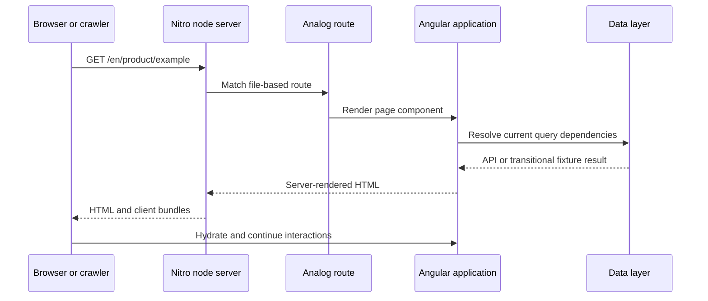

# Storefront routing and rendering

The storefront does not maintain a central Angular `Routes` array. AnalogJS discovers page entry points from filenames below `src/app/pages`, and `provideFileRouter()` installs those generated routes.

## From filename to URL

| File shape                             | URL shape            | Example               |
| -------------------------------------- | -------------------- | --------------------- |
| `index.page.ts`                        | `/`                  | Home                  |
| `cart.page.ts`                         | `/cart`              | Cart                  |
| `account/addresses.page.ts`            | `/account/addresses` | Saved addresses       |
| `blog/[slug].page.ts`                  | `/blog/:slug`        | Blog detail           |
| `en/product/[slug].page.ts`            | `/en/product/:slug`  | Product detail        |
| `en/collections/[...category].page.ts` | `/en/collections/**` | Nested category route |
| `[...not-found].page.ts`               | Catch-all            | Unknown URL fallback  |

Brackets create dynamic parameters. Three dots create a catch-all parameter. The `.page.ts` suffix marks a routable page.

## A page should be an adapter, not a feature dump

A healthy page entry does four small jobs:

1. Imports the feature component.
2. Declares route metadata or guards when needed.
3. Supplies route-derived inputs when appropriate.
4. Exports the feature as the default route component.

```ts title="Conceptual route entry"
import { ScrollPositionGuard } from '@core/guards/scroll-position.guard';
import { Collections } from '@features/shop/collection/collection';

export const routeMeta = { canActivate: [ScrollPositionGuard] };
export default Collections;
```

Keep querying, filtering, mutation, and presentation orchestration inside the appropriate feature/data layer.

## Rendering mode



Current configuration:

- SSR is enabled.
- Static-site generation is disabled.
- No routes are prerendered.
- Nitro targets a Node server.
- Link crawling during prerender is disabled.

## Browser-only safety

Code executed during SSR cannot assume `window`, `document`, browser storage, media APIs, or DOM-dependent libraries exist.

Use an explicit guard at the narrowest possible boundary:

```ts
if (isPlatformBrowser(this.platformId)) {
	// Browser-only library or DOM behavior.
}
```

Prefer rendering a stable server-safe structure and enhancing it in the browser. Avoid returning entirely different markup unless the feature genuinely cannot render on the server.

## Current SSR caveat

The storefront server interceptor returns an empty placeholder response for intercepted HTTP requests during server rendering. That is a transitional seam, not a final data-loading architecture. Until it is replaced, verify both:

- direct SSR navigation; and
- client-side navigation after hydration.

## Adding a route safely

1. Choose the correct URL and filename.
2. Reuse or create a feature component outside `pages/`.
3. Add guards through `routeMeta` only when the route needs them.
4. Read dynamic parameters through the established Angular/Analog route API.
5. Test direct navigation, client navigation, refresh, unknown parameters, and mobile layout.
6. Update this portal when the route introduces a new ownership or data boundary.
