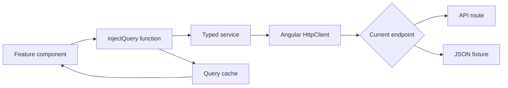
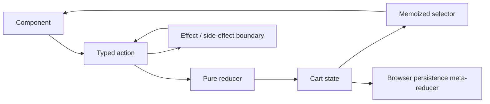

# Storefront state and data ownership

The storefront intentionally uses more than one state tool. The correct question is not “Which library do we use?” It is “Who owns this value, how does it change, and how long should it live?”

## Decision table

| State shape                        | Default owner              | Current examples                                           |
| ---------------------------------- | -------------------------- | ---------------------------------------------------------- |
| Server-owned records and lists     | TanStack Angular Query     | Products, categories, countries, orders, reviews           |
| Small application or feature state | NgRx SignalStore           | Authentication seam, account, settings, site configuration |
| Heavily mutated browser workflow   | Classic NgRx store/effects | Cart, wishlist, compare                                    |
| One-component interaction          | Local signal/form state    | Expanded panel, selected tab, local form field             |
| HTTP construction                  | Typed service              | Product, order, page, notification services                |

## Server-state path

Query functions own keys, enablement, cache duration, selection, and invalidation. Services own URLs and response types. Components consume query state and should not reconstruct cache keys ad hoc.

## Classic NgRx path

The current cart needs explicit events and derived state because customers can add, remove, increment, decrement, replace, persist, and optimistically update items from many surfaces.

Do not describe this as a server cart. IDs and totals can still originate from browser-owned development behavior, and authoritative price/stock validation belongs to the backend.

## SignalStore path

SignalStore is appropriate when a compact state object and colocated methods make a feature or shell easier to understand. Current examples include auth, account, loader, settings, and site configuration.

Use it when:

- the browser owns the state;
- several components need reactive reads;
- methods form a small, coherent state API; and
- classic event/effect ceremony would add no clarity.

## Runtime configuration

The API base URL is not compiled into the bundle. `core/config/runtime-config.ts` loads `public/config.json` at boot (via `provideAppInitializer`) and fills a mutable `runtimeConfig` singleton plus the legacy `environment` object that services read for `apiUrl`. Only non-secret values live there; deployments overwrite the file. The auth interceptor sends `withCredentials: true` for the cookie session and echoes the readable `st_csrf` cookie as `x-csrf-token` on unsafe methods; the browser holds no reusable credential. Session state comes from `/auth/storefront/me`, resolved by an app initializer before routing and never persisted to browser storage. The account adapter maps that authenticated customer into the existing account view model; profile name, address CRUD, login methods, sessions, and contact changes use authenticated endpoints rather than a static account payload. `@saha-textile/http-transport` supplies per-tab refresh single-flight, audience-specific Web Locks across tabs, fresh-CSRF replay, loop prevention, request-id/error mapping, and stable handling for unrecoverable session refusals. Repository lint guards reject bearer, browser-token and cross-audience gateway regressions.

## Catalogue source boundary

`ProductService` exposes two materially different paths:

- a JSON-backed full-product list used by product-detail and adjacent readers; and
- an API-backed catalogue response used by the collection flow.

Before editing a product experience, trace the exact query and service method. Never generalize one working API request into “products are migrated.”

## Cache ownership rules

- Query keys are public contracts inside the frontend. Keep them stable and structured.
- Invalidate the narrowest affected query after a successful write.
- Do not mirror query results into SignalStore solely to make them globally accessible.
- Do not cache personalized or security-sensitive data indefinitely.
- Do not persist authoritative prices without server revalidation.
- SSR and browser query behavior must be verified separately while the server interceptor remains transitional.

## When the real API replaces a fixture

1. Define or reuse the zod contract in `packages/contracts`.
2. Update the typed service method.
3. Keep the query key stable unless the resource identity changes.
4. Map contract output into a UI-specific view model only when presentation needs it.
5. Add error, empty, retry, and loading coverage.
6. Remove the obsolete fixture path and update atlas evidence.
