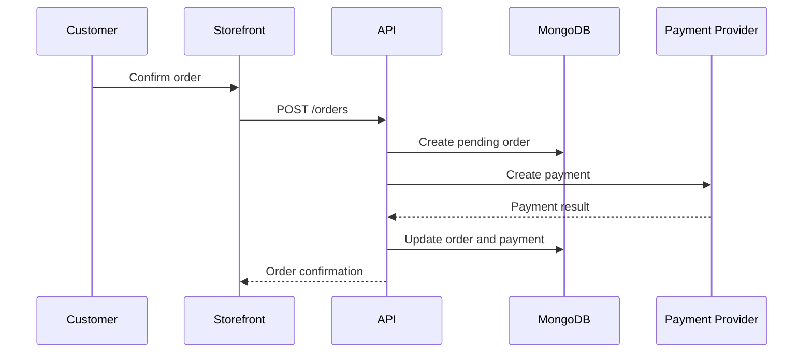

Yes—I understand the package you want: **a private, visually rich developer portal that could let another developer operate and maintain the entire platform without reverse-engineering the codebase first.**

## Correct tool architecture

**Do not use Storybook as the consolidated documentation system.**

Use:

- **Docusaurus** as the central private developer portal.
- **Storybook** inside that ecosystem for storefront/admin UI documentation.
- **NestJS OpenAPI generation** for the API contract.
- **Swagger UI** for interactive API testing.
- **Redoc Community Edition** for a cleaner API reference view.
- **Generated JSON Schema documentation** for MongoDB collections.
- **Mermaid** for architecture, business-flow, sequence and database-relationship diagrams.
- **Pagefind** for completely local, private full-text search.
- **TypeDoc** optionally for shared TypeScript packages.

Docusaurus supports MDX, React components, structured navigation, documentation versioning and Mermaid diagrams, making it much more appropriate as the umbrella portal. ([docusaurus.io](https://docusaurus.io/docs?utm_source=chatgpt.com))

---

# Proposed private developer portal

Host it at something like:

```text id="ekhg7j"
https://developers.client-domain.com
```

Its navigation should look like:

```text id="oe3hni"
Developer Portal
├── Getting Started
├── System Architecture
├── Business Processes
├── Storefront
│   ├── Business Flows
│   ├── Developer Architecture
│   ├── Routes and Pages
│   ├── State and Data Flow
│   └── Storybook Components
├── Admin Panel
│   ├── Business Workflows
│   ├── Developer Architecture
│   ├── Roles and Permissions
│   ├── State and Data Flow
│   └── Storybook Components
├── API
│   ├── API Concepts
│   ├── Authentication
│   ├── Swagger Console
│   └── Redoc Reference
├── Database
│   ├── Data Model Overview
│   ├── Collection Catalogue
│   ├── Relationships
│   ├── Indexes
│   └── Schema Evolution
├── Deployment and Operations
├── Troubleshooting
├── Architecture Decisions
└── Maintenance and Upgrades
```

Everything remains in the monorepo and is reviewed, versioned and deployed together with the application.

---

# Storybook’s actual role

> **Angular note:** Storybook stays — use the **`@storybook/angular`** framework adapter (instead of the React/Next adapter). Stories are written for Angular standalone components (Bootstrap 5 + ng-bootstrap, built to replicate Fastkart's look). Docusaurus itself remains a React app — that's irrelevant, it's just the docs site, not part of our storefront/admin.

Storybook is suitable for:

- Individual UI components.
- Component props and variants.
- Page sections.
- Form validation states.
- Empty, loading and error states.
- Mobile and desktop variants.
- Difficult-to-reproduce UI states.
- Mocked backend responses.
- Interaction examples.
- Component-level implementation notes.
- Design-system documentation.

Storybook supports both automatically generated component documentation and custom MDX pages containing prose, examples and live component stories. ([storybook.js.org](https://storybook.js.org/docs/writing-docs/mdx?utm_source=chatgpt.com))

Storybook **can technically contain flow explanations**, but it should not become the home for:

- MongoDB schemas.
- Deployment documentation.
- Infrastructure architecture.
- Full API reference.
- Operational runbooks.
- Cross-application business processes.
- Backup and disaster-recovery instructions.

Those belong in Docusaurus, with links into the relevant Storybook components.

## Example cross-referencing

A Docusaurus page for the checkout process could contain:

1. Business explanation.
2. Mermaid customer-flow diagram.
3. Link to the checkout Storybook page.
4. Link to the cart NgRx (hybrid) documentation.
5. Link to the checkout API operation.
6. Link to the `orders`, `payments` and `carts` collections.
7. Error and recovery behaviour.
8. Relevant automated tests.

That is the “well-fed knowledge base” model you are describing.

---

# Storefront documentation

Maintain two distinct areas.

## Storefront business documentation

Document:

- Customer registration.
- Login and account recovery.
- Product discovery.
- Search and filtering.
- Product-details flow.
- Cart behaviour.
- Checkout.
- Payment processing.
- Order placement.
- Order tracking.
- Cancellation.
- Returns and refunds.
- Wishlist.
- Coupons and promotions.
- SEO and structured-data behaviour.

Each flow should show:

```text id="xqo4qi"
User action
→ Angular route
→ Angular component
→ NgRx (hybrid) / @tanstack/angular-query operation
→ API endpoint
→ MongoDB collection
→ Result shown to user
```

## Storefront developer documentation

Document:

- Route tree.
- SSR/prerender vs client-rendered routes (Angular hydration).
- Rendering strategy.
- Caching and revalidation.
- @tanstack/angular-query keys and invalidation rules.
- NgRx (hybrid) stores.
- Form and validation architecture.
- Authentication/session handling.
- Error boundaries.
- Image optimisation.
- SEO metadata.
- JSON-LD implementation.
- Shared packages.
- Component hierarchy.
- Testing strategy.

Storybook handles the interactive component portion; Docusaurus handles the architectural explanation.

---

# Admin-panel documentation

Again, separate business and developer views.

## Admin business workflows

Document:

- Product creation and editing.
- Category and brand management.
- Variant and inventory management.
- Pricing and discounts.
- Order processing.
- Shipment updates.
- Cancellation approval.
- Returns and refunds.
- Customer management.
- Coupon management.
- Homepage/banner management.
- Role and permission administration.
- Audit-log review.

## Admin developer documentation

Document:

- Admin route map.
- Authentication and authorization.
- Role-permission matrix.
- Route guards.
- Table architecture.
- Forms and validation.
- State stores.
- API-query definitions.
- Upload workflow.
- Error and retry handling.
- Audit-event generation.
- Shared storefront/admin components.

Storybook should have separate navigation groups such as:

```text id="rzdfay"
Shared
Storefront
Admin
Design Tokens
Layouts
Forms
Tables
Business Components
```

---

# API documentation

Use `@nestjs/swagger` to generate an OpenAPI document from NestJS controllers, DTOs and decorators. NestJS supports serializing that OpenAPI document to JSON or YAML rather than requiring the documentation page to be served dynamically by the API. ([docs.nestjs.com](https://docs.nestjs.com/openapi/introduction?utm_source=chatgpt.com))

Provide two views:

## Swagger UI

Use it as the internal API console:

- Browse endpoints.
- View request DTOs.
- View response DTOs.
- Inspect authentication requirements.
- Enter parameters.
- Execute requests against development or staging.
- View validation and error responses.

## Redoc

Use Redoc Community Edition for the polished reading/reference interface:

- Three-column API layout.
- Navigation by API tags.
- Request and response schemas.
- Examples.
- Authentication information.
- Cleaner long-form reading than Swagger UI.

Redoc Community Edition can generate self-hosted web documentation or standalone HTML from the OpenAPI specification and remains available as an open-source option. ([redocly.com](https://redocly.com/docs/redoc?utm_source=chatgpt.com))

Recommended routes:

```text id="but2ik"
/api/reference   → Redoc
/api/console     → Swagger UI
/api/openapi.json
```

## API documentation completeness

Every endpoint should document:

- Purpose.
- Authentication.
- Authorization/roles.
- Path and query parameters.
- Request DTO.
- Response DTO.
- HTTP status codes.
- Validation failures.
- Business-rule failures.
- Rate-limit behaviour.
- Pagination.
- Sorting/filtering.
- Idempotency where applicable.
- Sanitised request/response examples.
- Collections modified.
- Events or side effects produced.

---

# MongoDB documentation

You are correct: MongoDB Compass is not the documentation system.

Your database documentation should be a **generated data catalogue inside Docusaurus**.

## One page per collection

For example:

```text id="qdfuvz"
Database
├── users
├── products
├── productVariants
├── categories
├── inventories
├── carts
├── orders
├── payments
├── shipments
├── returns
├── refunds
├── coupons
└── auditLogs
```

Each collection page should contain:

- Collection name.
- Domain purpose.
- Owning backend module.
- Complete field table.
- BSON/TypeScript type.
- Required or optional status.
- Default value.
- Enum values.
- Validation rules.
- Nullable behaviour.
- Nested objects.
- Array element structure.
- References to other collections.
- Embedded versus referenced modelling decision.
- Unique indexes.
- Compound indexes.
- TTL indexes.
- Text/search indexes.
- Example sanitised document.
- Read paths.
- Write paths.
- API DTO mappings.
- Status lifecycle.
- Retention/deletion policy.
- Migration history.
- Sensitive fields.
- Fields excluded from API responses.

MongoDB supports `$jsonSchema` rules for defining required fields, data types and other validation constraints on collections. ([mongodb.com](https://www.mongodb.com/docs/manual/core/schema-validation/specify-json-schema/?utm_source=chatgpt.com))

## Generate it instead of manually duplicating it

Create a script such as:

```text id="2g7qru"
scripts/generate-database-docs.ts
```

It should:

1. Import all database schemas.
2. Export machine-readable JSON Schema.
3. Generate MDX field tables.
4. Generate example document structures.
5. Generate collection index tables.
6. Place generated pages in the Docusaurus database section.

When using Mongoose, current Mongoose schemas can produce JSON Schema or BSON-aware JSON Schema using `schema.toJSONSchema({ useBsonType: true })`. Mongoose schemas map to MongoDB collections and define document shapes, making them an appropriate source for generated collection documentation. ([mongoosejs.com](https://mongoosejs.com/docs/api/schema.html?utm_source=chatgpt.com))

Do not manually maintain three separate copies of:

- Mongoose schema.
- MongoDB validator.
- Documentation field table.

Generate the latter two where practical from the schema source.

## DTOs versus database schemas

Keep these conceptually separate:

- **Database schema:** How the document is persisted.
- **Create/update DTO:** What the API accepts.
- **Response DTO:** What the API returns.
- **Frontend type:** What the UI consumes.

A `User` database document might contain password hashes, internal flags and audit metadata that must never appear in `UserResponseDto`.

The database page should show a mapping table:

```text id="lirrvt"
Database field       Create DTO       Update DTO       Response DTO
email                Yes              Limited          Yes
passwordHash         No               No               Never
role                  Admin only       Admin only        Yes
internalFlags         No               No               No
createdAt             Generated        No               Yes
```

---

# Visual documentation

Use Mermaid directly in Docusaurus for:

- System architecture diagrams.
- Container/deployment topology.
- Checkout sequence diagrams.
- Authentication flows.
- Payment flows.
- Order-state diagrams.
- Admin approval workflows.
- MongoDB collection relationships.
- Data-flow diagrams.
- Request lifecycles.
- Failure and retry paths.

Docusaurus officially supports Mermaid diagrams in Markdown/MDX code blocks. ([docusaurus.io](https://docusaurus.io/docs/markdown-features/diagrams?utm_source=chatgpt.com))

Example documentation flow:



---

# Source-code documentation

Use TypeDoc selectively for:

- Shared domain packages.
- Shared TypeScript types.
- API-client package.
- Validation utilities.
- Pricing engine.
- Cart calculations.
- Permission library.
- Common helper packages.

TypeDoc generates documentation from exported TypeScript declarations and documentation comments. ([typedoc.org](https://typedoc.org/?utm_source=chatgpt.com))

Do not generate TypeDoc for every internal function. That produces noise. Reserve it for reusable packages and public internal interfaces.

---

# Private search

Add Pagefind after the Docusaurus static build.

Pagefind creates a static browser-side search index and does not require a search server or external hosted infrastructure. It works against generated static HTML and adds its search bundle to the built site. ([pagefind.app](https://pagefind.app/?utm_source=chatgpt.com))

This provides private search across:

- Architecture pages.
- Business flows.
- Collection names.
- Field names.
- API concepts.
- Troubleshooting pages.
- Deployment runbooks.
- ADRs.

No Algolia account or public crawler is required.

---

# Hosting without another Droplet

Build all documentation statically in GitHub Actions:

```text id="9o8nzm"
Docusaurus build
Storybook static build
OpenAPI generation
Redoc static build
Database MDX generation
TypeDoc generation
Pagefind indexing
```

Combine the outputs into:

```text id="3360za"
developer-portal-build/
├── index.html
├── storefront-storybook/
├── admin-storybook/
├── api/
│   ├── reference/
│   ├── console/
│   └── openapi.json
├── database/
└── typedoc/
```

Then use the **same Nginx reverse proxy already running on the DigitalOcean Droplet** to serve those static files.

Consequences:

- No second Droplet.
- No database for documentation.
- No long-running Node.js documentation server.
- No additional paid hosting service.
- No separate documentation deployment workflow.
- Documentation deploys through the same GitHub Actions pipeline.
- Runtime resource usage is essentially limited to Nginx serving static files and the storage occupied by the generated assets.

Nginx serves static files via a `server` block with `root` + `try_files` (or `location` + `alias`).

---

# Private authentication

For one developer, use Nginx’s built-in `auth_basic` protection over HTTPS.

- Username and hashed password.
- No additional authentication service.
- No separate container.
- No subscription.
- Can support another developer account during handover.
- Apply authentication to the complete developer-docs subdomain.

Nginx’s `auth_basic` + `auth_basic_user_file` (htpasswd, bcrypt-hashed) protects a location using usernames and hashed passwords; serve it over HTTPS only (never plain HTTP).

Example conceptual setup:

```text id="sdxdi3"
developers.client-domain.com
    → HTTPS
    → Nginx auth_basic authentication
    → static developer portal files
```

Add:

- `X-Robots-Tag: noindex, nofollow`
- A restrictive `robots.txt`
- No links from the public storefront
- Strong generated password
- Rate limiting at the proxy/firewall level

Authentication—not `robots.txt`—is what actually keeps it private.

---

# Recommended repository structure

```text id="ep2hiu"
apps/
├── storefront/
├── admin/
├── api/
└── developer-portal/

packages/
├── ui/
├── database/
│   ├── schemas/
│   ├── models/
│   ├── indexes/
│   └── migrations/
├── contracts/
│   ├── request-dtos/
│   ├── response-dtos/
│   └── events/
├── api-client/
├── auth/
└── shared/

docs/
├── getting-started/
├── architecture/
├── business-flows/
├── storefront/
├── admin/
├── api/
├── database/
├── deployment/
├── operations/
├── troubleshooting/
├── security/
├── maintenance/
└── decisions/

scripts/
├── generate-openapi.ts
├── generate-database-docs.ts
├── generate-index-docs.ts
├── build-developer-portal.ts
└── validate-documentation.ts
```

---

# Handover package contents

For a genuinely complete maintenance handover, include:

- Local development setup.
- Required software versions.
- Monorepo package map.
- Architecture overview.
- Domain glossary.
- Storefront business flows.
- Admin workflows.
- Component documentation.
- API documentation.
- Database catalogue.
- Environment-variable catalogue without secret values.
- Authentication and authorization design.
- Deployment process.
- Rollback process.
- Backup and restore process.
- MongoDB migration procedure.
- Monitoring and logging.
- Common production failures.
- Troubleshooting decision trees.
- Third-party service list.
- Payment-provider integration.
- Email/SMS integration.
- Security considerations.
- Dependency-upgrade procedure.
- Release checklist.
- Incident-response procedure.
- Architecture Decision Records.
- Known limitations and technical debt.

## Final selection

- **Central portal:** Docusaurus.
- **UI catalogue:** Storybook.
- **Business and technical flows:** Docusaurus + Mermaid.
- **Interactive API testing:** Swagger UI.
- **Readable API reference:** Redoc CE.
- **MongoDB catalogue:** Generated MDX from JSON Schema/Mongoose schemas.
- **Shared TypeScript APIs:** TypeDoc.
- **Private full-text search:** Pagefind.
- **Private access:** Nginx `auth_basic` over HTTPS.
- **Hosting:** Static output served by the existing Nginx container on the existing Droplet.
- **Additional software cost:** **₹0**, assuming everything is self-hosted as described.
